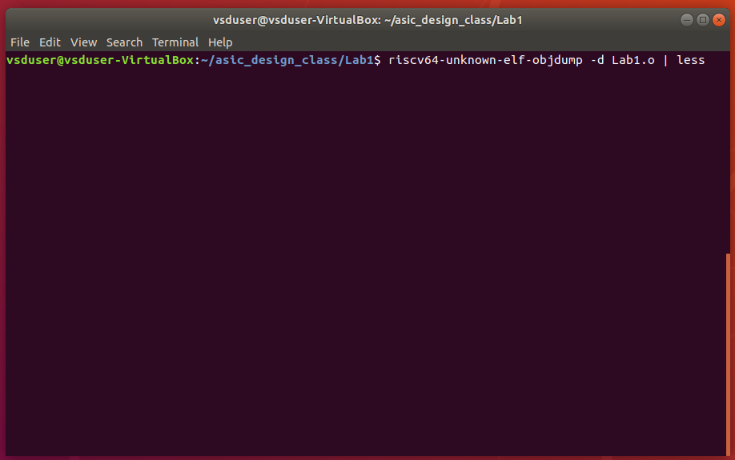
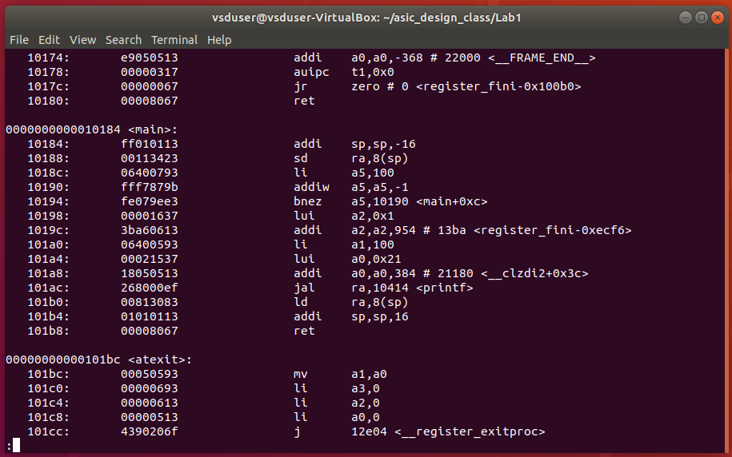
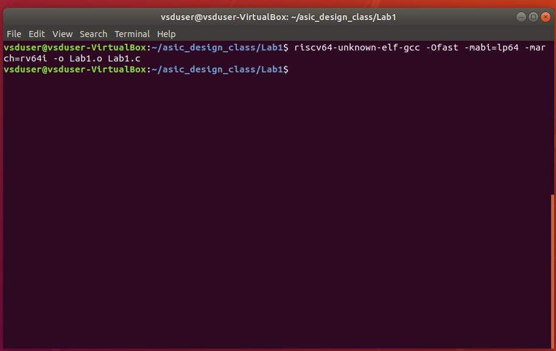
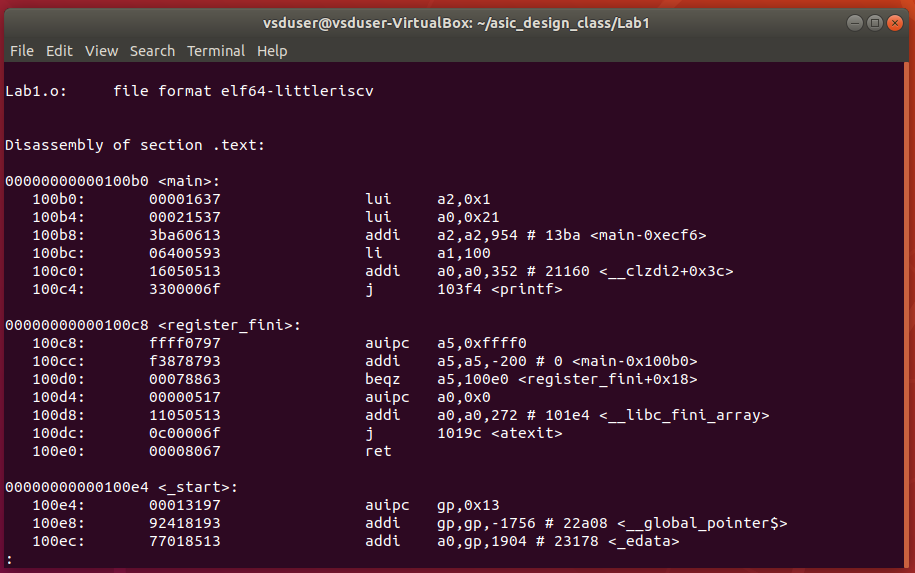

# ASIC Design Class

## Lab 1: Create a small C program to count from 1 to n and compile it using gcc compiler. Verify the output of the C program after execution.

### Step 1:
Create a new your_file.c file in the desired directory in Linux environment. 
Here, I am using the nano text editor from Ubuntu.

 

Write and save your C program in the text editor.

It is a very simple C program to do the sum total of numbers from 1 to n where n is set to 100 in the code.

 

### Step 2:
Compile your code using gcc compiler in the terminal window of Ubuntu enivronment and make sure there are no errors during compilation.

 

### Step 3:
After compilation, the executable will be generated. Run the executable in terminal window to see the ouput.

 

### Final Output:
In the below image we can observe the C code and the output together.

 

---

## Lab 2: Compile the same C program created as a part of Lab1.

### Step 1:
Compile the C code with riscv gcc compiler using the command shown below in the picture.
Here we are using the compiler flag as **-O1**.

 

### Step 2:
To see the dump of generated object file in assembly language, use the command shown below in the figure.

 

We can see the assembly language dump in the below screenshot.

 

For the "main" section, we can calculate the number of instructions either by counting each individual instruction or we can subtract the address of the first instruction in the next section with the first instruction of the main section and divide the difference with 4 since it is a byte addressable memory, so 4 memory block form one instruction

E.g.: No. of instruction in main block = (0x101bc - 0x10184)/4 = 0x38/4 = 0xE = 14 instructions.

### Step 3:
We will try to compile the code again with the compiler flag set as **-Ofast** and try to observe the generated assembly code.

 

Below is the screen shot of the assembly code generated with **-Ofast** compiler flag.

 

Here we can observe that the number of instructions are reduced to 6 as compared to 14 in the previous case.

### **Note:** Difference between **-O1** and **-Ofast** compiler flags:

- -O1 is moderate in it's code optimization while -Ofast is highly aggressive to achieve highest possible performance.
- -O1 maintains strict adherence to standards while -Ofast may violate some standards to achieve better performance.
- -O1 has shorter compilation time while -Ofast may have higher compilation time due to complex and many optimizations.
  
---