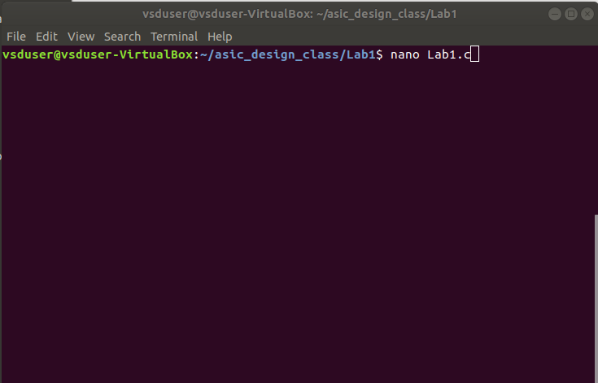
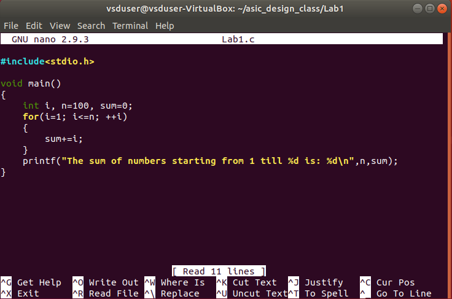
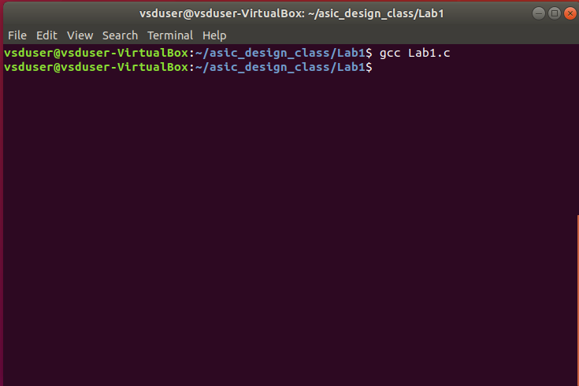
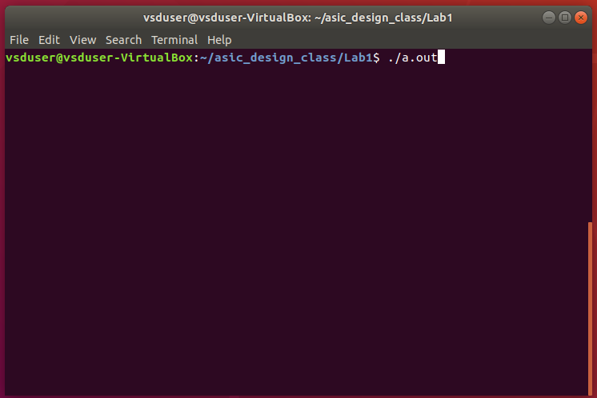
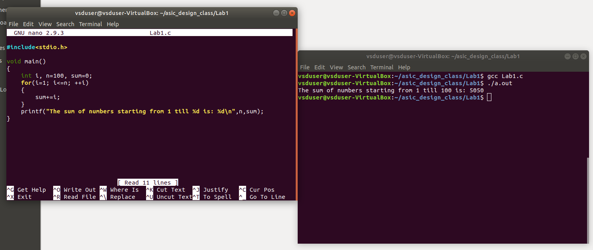

# ASIC Design Class

## Lab 1: Create a small C program and compile it using gcc compiler. Verify the output of the C program after execution.

### Step 1:
Create a new your_file.c file in the desired directory in Linux environment. 
Here, I am using the nano text editor from Ubuntu.

 

Write and save your C program in the text editor.

 

### Step 2:
Compile your code using gcc compiler in the terminal window of Ubuntu enivronment and make sure there are no errors during compilation.

 

### Step 3:
After compilation, the executable will be generated. Run the executable in terminal window to see the ouput.

 

### Final Output:
In the below image we can observe the C code and the output together.

 

---