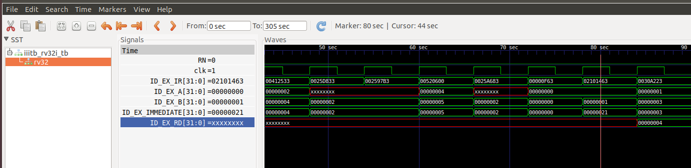

# ASIC Design Class

# Table of contents
1. [Compilation of C code in GCC compiler](#Lab1A)
2. [Compilation of C code in RISC-V GCC compiler](#Lab1B)
3. [Execution of the output object file of RISC-V GCC compiler in Spike Simulator](#Lab2)
4. [Identify the various RISC-V instruction types and their 32-bit instruction codes](#Lab3)
5. [Execute the RISC-V ISA in the reference verilog code and get the output waveform](#Lab4)
6. [Create a C program for Caesar's data encryption and decryption algorithm. Execute the same in GCC and RISC-V GCC compiler.](#Lab5)

---
<a name="Lab1A"></a>

## Lab 1A: Create a small C program to count from 1 to n and compile it using GCC compiler.

### Creation of a C program
Create a new your_file.c file in the desired directory in Linux environment.<br>
Here, I am using the nano text editor from Ubuntu.

<br>

Write and save your C program in the text editor.

It is a very simple C program to do the sum total of numbers from 1 to n where n is set to 100 in the code.

```
#include<stdio.h>

void main()
{
    int i, n = 100, sum = 0;
    for(i = 1; i<=n; ++i)
    {
        sum+=i;
    }
    printf("The sum of numbers starting from 1 till %d is: %d\n",n,sum);
}
```

<br>

### Compilation of C code using GCC compiler
Compile your code using gcc compiler in the terminal window of Ubuntu enivronment and make sure there are no errors during compilation.

```
gcc Lab1.c
```

<br>

### Step 3:
After compilation, the executable will be generated. Run the executable in terminal window to see the ouput.
```
./a.out
```

<br>

### Execution of the output file and result verification
In the below image we can observe the C code and the output together.

<br><br>

---

<a name="Lab1B"></a>

## Lab 1B: Compile the same C program created as a part of Lab1A in RISC-V GCC compiler.

### Introduction to RISC-V GCC

RISC-V GCC is a version of GCC that has been modified to support the RISC-V architecture.<br>The RISC-V architecture is an open standard instruction set architecture (ISA) based on established reduced instruction set computing (RISC) principles.

### Code Compilation using RISC-V GCC compiler
Compile the C code with riscv gcc compiler using the command shown below.
Here we are using the compiler flag as **-O1**.

```
riscv64-unknown-elf-gcc -O1 -mabi=lp64 -march=rv64i -o Lab1.o Lab1.c
```
Breaking dowm each of the parameters in the above command:

- riscv64: It specifies the target architecture (64 bit RISC-V)
- unknown: It is usually used to denote an unspecified vendor.
- elf: It specifies the target binary format.
- O1: It is the optimizaation flag.
- mabi=lp64: Is specifies application binary interface. lp64 means long and pointer are 64 bits wide in size.
- march=rv64i: ndicates the base RISC-V 64-bit integer instruction set.
- o Lab1.o: This specifies what should be the output object file name.
- Lab1.c : This is name of the C file which needs to be compiled.<br><br>


<br>

### Observe the assembly code generated in the object file post compilation
To see the dump of generated object file in assembly language, use the below command.

```
riscv64-unkown-elf-objdump -d Lab1.o | less
```

<br>

We can see the assembly language dump in the below screenshot.

<br>

For the "main" section, we can calculate the number of instructions either by counting each individual instruction in the main block.

 We can also subtract the address of the first instruction in the next section with the first instruction of the main section and divide the difference with 4 since it is a byte addressable memory, so 4 memory block form one instruction

E.g.: No. of instruction in main block = (0x101bc - 0x10184)/4 = 0x38/4 = 0xE = 14 instructions.

### Code Compilation using RISC-V GCC compiler with a different optimization flag (Ofast)
We will try to compile the code again with the compiler flag set as **-Ofast** and try to observe the generated assembly code.

```
riscv64-unknown-elf-gcc -Ofast -mabi=lp64 -march=rv64i -o Lab1.o Lab1.c
```

<br>

Below is the screen shot of the assembly code generated with **-Ofast** compiler flag.

<br>

Here we can observe that the number of instructions are reduced to 6 as compared to 14 in the previous case.

---

### **Note:** Difference between **-O1** and **-Ofast** compiler flags:

- -O1 is moderate in it's code optimization while -Ofast is highly aggressive to achieve highest possible performance.
- -O1 maintains strict adherence to standards while -Ofast may violate some standards to achieve better performance.
- -O1 has shorter compilation time while -Ofast may have higher compilation time due to complex and many optimizations.
  
---

<a name="Lab2"></a>

## Lab 2: Execution of the object file created by the RISC-V GCC compiler using Spike Simulator.

### Introduction to Spike Simulator

Spike is an Instruction Set Simulator(ISS). It serves as a starting point for running software on a RISC-V target. Below are the few main features of Spike:

- Supports multiple ISAs
- Multiple memory models
- Single-step debugging with support for viewing memory/register contents.
- Multiple CPU support
- JTAG support
- Highly extensible

### Execution of the object file using Spike simulator

To execute an object file created by the RISC-V GCC compiler, use the following command.

```
spike pk Lab1.o
```
Here in the above command, "pk" means proxy kernel.<br> The proxy kernel(pk) is a lightweight runtime environment for RISC-V programs, acting as a minimal operating system that provides essential services like system calls.<br> It helps to bridge the gap between simulator and application.

<br>

We can observe from the above screenshot that the output from the GCC compiler and output from the RISC-V GCC compiler is same after executing the object files.

### Debugging using spike simulator

We can also debug the assembly code generated in the object file in using the spike.<br>Use the following command to go into debugging mode using spike:

```
spike -d pk Lab1.c
```

<br>

To jump to begining of the "main" section, following command can be used:

```
until sp 0 0x100b0
```

'sp' denotes the stack pointer.<br><br> Using this command we are telling the debugger to execute the code starting from address 0 till address 0x100b0 which is the adress of the first instruction in the "main" section.<br>

<br>

When the 'sp' is pointing to the first instruction of "main", we can start with line by line debugging and can try to check the register values.

Before we jump to next instruction, lets check the value of register $A2 since our 'sp' is pointing a operation where the value stored in $A2 register will be modified.<br>

To check any register value, following command can be used:

```
reg 0 a2
```
Here the '0' denotes the core.

<br>

Now, to execute the current instruction pointed by 'sp' and come to the next instruction, "Enter" button can be pressed to go to next instruction.

<br>

After coming to the next instruction, let's verify whether the "lui" operation changed the value stored in $A2 register.

<br>

We can clearly observe that the value stored in $A2 register has changed after executing the "lui" operation.

---

### RISC-V 'LUI' ISA

'LUI' stands for Load Upper Immediate. It is a fundamental instruction used to load a 20-bit immediate value into the upper 20 bits of a 32-bit register, with the lower 12 bits set to zero. <br>

The LUI instruction format is:

```
LUI rd, imm
```

- rd: Destination register where the results will be stored.
- imm: The 20-bit immediate value to be loaded into the upper 20 bits of the destination register.

---

<a name="Lab3"></a>
## Lab 3: Identify the various RISC-V instruction types and their 32-bit instruction codes.
<!-- 
### RISC-V RV32I Instructions

- In the base RV32I ISA, there are four core instruction formats (R/I/S/U).
- All core instructions are fixed 32 bits in length.
- The instructions are aligned on a 4-byte boundary in memory.
--- -->

### Different types of RV32I instruction formats

### 1. R-type Instruction

<br>
Format for arithmetic and logical operations

R-type instructions are used for execution of operations between 2 registers.<br>

**rs1** is the source register 1 field. It is 5 bits wide.<br>
**rs2** is the source register 2 field. it is 5 bits wide.<br>
**rd** is the destination register field. It is 5 bits wide.<br>
The **opcode**(OP) value for R-Type instruction is **7'b0110011**.

| Instruction   | funct7 value | funct3 value |
| :-----------: | ------------ | ------------ |
|     ADD       | 7'b0000000   | 3'b000       |
|     SLT       | 7'b0000000   | 3'b010       |
|     SLTU      | 7'b0000000   | 3'b011       |
|     AND       | 7'b0000000   | 3'b111       |
|     OR        | 7'b0000000   | 3'b110       |
|     XOR       | 7'b0000000   | 3'b100       |
|     SLL       | 7'b0000000   | 3'b001       |
|     SRL       | 7'b0000000   | 3'b101       |
|     SRA       | 7'b0100000   | 3'b101       |
|     SUB       | 7'b0100000   | 3'b000       | 

---
### 2. I-type Instruction

<br>
Format for immediate operations

Operations use register and immediate values for execution.<br>
This instruction format is used in Immediate and Load operations.<br>
The opcode corresponding to the I-type instruction is named OP-IMM. It means immediate operation code.<br>
The immediate opcode OP-IMM is **7’b001_0011**.<br>

| Instruction   | funct3 value |
| :-----------: | ------------ |
|     ADDI      | 3'b000       |
|     SLTI      | 3'b010       |
|     SLTIU     | 3'b011       |
|     ANDI      | 3'b111       |
|     ORI       | 3'b110       |
|     XORI      | 3'b100       |

<br>
Format for shift operations

| Instruction   | funct3 value |
| :-----------: | ------------ |
|     SLLI      | 3'b001       |
|     SRLI      | 3'b101       |
|     SRAI      | 3'b101       |

---
### 3. S-type Instruction

<br>

In S-type instruction, 'S' stands for 'store'.<br>
It is store type instruction that helps to store the value of a register into the memory.<br>
In S-type instruction, there is no rd, i.e. destination register.<br>

The immediate field is divided into two parts, first part is in bits 11:5, and the second part is in bits 4:0.<br>

It stores a 32-bit value from register rs2 to memory, the effective address is obtained by adding register rs1 to the sign-extended 12-bit offset.

---
### 4. B-type Instruction

<br>

In B-type instruction, 'B' stand for 'branching' which means it is mainly used for branching based on certain conditions.<br>

The instruction does not include rd register and funct7, but contains rs1, rs2, funct3 and immediate.<br>

There are two source registers rs1 and rs2 on which various operations are performed based on certain conditions, and those conditions are defined by func3 field.<br>

The immediate is divided into two areas.<br>
The 12-bit B-immediate encodes signed
offsets in multiples of 2 bytes.<br>

The offset is sign-extended and added to the address of the branch
instruction to give the target address.

The conditional branch range is ±4 KiB.<br>

---
### 32-bit format for various different instructions

```
ADD r7, r8, r9
```
> - R Type instruction since it's a register-register operation.
> - Adds the registers r8 and r9, stores the result in r7.
> - funct7 value for ADD operation is **7'b0000000**<br>
> rs1 = r8 = **5b'01000**<br>
> rs2 = r9 = **5b'01001**<br>
> funct3 value for ADD operation is **3b'000**<br>
> rd = r7 = **5b'00111**<br>
> Opcode for ADD is **7'b0110011** since it's an R-type instruction.<br>

#### 32 bits instruction : ```0000000_01001_01000_000_00111_0110011```
---
<br>

```
SUB r9, r7, r8
```
> - R Type instruction since it's a register-register operation.
> - Subtracts the registers r7 and r8, stores the result in r9.
> - funct7 value for SUB operation is **7'b0100000**<br>
> rs1 = r7 = **5b'00111**<br>
> rs2 = r8 = **5b'01000**<br>
> funct3 value for SUB operation is **3b'000**<br>
> rd = r9 = **5b'01001**<br>
> Opcode for SUB is **7'b0110011** since it's an R-type instruction.<br>

#### 32 bits instruction : ```0100000_01000_00111_000_01001_0110011```
---
<br>

```
AND r8, r7, r9
```
> - R Type instruction since it's a register-register operation.
> - Performs bitwise AND operation between the registers r7 and r9, stores the result in r8.
> - funct7 value for AND operation is **7'b0000000**<br>
> rs1 = r7 = **5b'00111**<br>
> rs2 = r9 = **5b'01001**<br>
> funct3 value for AND operation is **3b'111**<br>
> rd = r8 = **5b'01000**<br>
> Opcode for AND is **7'b0110011** since it's an R-type instruction.<br>

#### 32 bits instruction : ```0000000_01001_00111_111_01000_0110011```
---
<br>

```
OR r8, r8, r5
```
> - R Type instruction since it's a register-register operation.
> - Performs bitwise OR operation between the registers r8 and r5, stores the result in r8.
> - funct7 value for AND operation is **7'b0000000**<br>
> rs1 = r8 = **5b'01000**<br>
> rs2 = r5 = **5b'00101**<br>
> funct3 value for AND operation is **3b'110**<br>
> rd = r8 = **5b'01000**<br>
> Opcode for OR is **7'b0110011** since it's an R-type instruction.<br>

#### 32 bits instruction : ```0000000_00101_01000_110_01000_0110011```
---

<br>

```
XOR r8, r7, r4
```
> - R Type instruction since it's a register-register operation.
> - Performs bitwise XOR operation between the registers r7 and r4, stores the result in r8.
> - funct7 value for AND operation is **7'b0000000**<br>
> rs1 = r7 = **5b'00111**<br>
> rs2 = r4 = **5b'00100**<br>
> funct3 value for AND operation is **3b'100**<br>
> rd = r8 = **5b'01000**<br>
> Opcode for XOR is **7'b0110011** since it's an R-type instruction.<br>

#### 32 bits instruction : ```0000000_00100_00111_100_01000_0110011```
---

<br>

```
SLT r10, r2, r4
```
> - R Type instruction since it's a register-register operation.
> - Place '1' in r10 register if r4 is less than r2, else place 0 in r10. Values in both r2 and r4 are treated as signed numbers.
> - funct7 value for AND operation is **7'b0000000**<br>
> rs1 = r2 = **5b'00010**<br>
> rs2 = r4 = **5b'00100**<br>
> funct3 value for SLT operation is **3b'010**<br>
> rd = r10 = **5b'01010**<br>
> Opcode for SLT is **7'b0110011** since it's an R-type instruction.<br>

#### 32 bits instruction : ```0000000_00100_00010_010_01010_0110011```
---

<br>

```
ADDI r12, r3, 5
```
> - I Type instruction since it's a register-immediate value operation.
> - Add r3 with immediate value(5), store in r12 register.
> - Immediate value = 5 = 12b'000000000101
> rs1 = r3 = **5b'00011**<br>
> funct3 value for ADDI operation is **3b'000**<br>
> rd = r12 = **5b'01100**<br>
> Opcode for ADDI is **7’b001_0011** since it's an I-type instruction.<br>

#### 32 bits instruction : ```000000000101_00011_000_01100_0010011```
---

<br>

```
SW r3, r1, 4
```
> - S Type instruction since it's a store operation
> - The source register is r3. Address will be obtained by adding immediate address value 4 with the address located in register r1.
> - Immediate value[11:0] = 4 = 12b'000000000100<br>
> rs2 = r3 = **5b'00011**<br>
> rs1 = r1 = **5b'00001**<br>
> funct3 value for SW operation is **3b'010**<br>
> Opcode for SW is **7’b010_0011** since it's an S-type instruction.<br>

#### 32 bits instruction : ```0000000_00011_00001_010_00100_0100011```
---

<br>

```
SRL r16, r11, r2
```
> - R Type instruction since it's a register-register operation.
> - Value in r11 register will be logical right shifted by the value stored in r2, result will be stored in r16 
> - funct7 value for ADD operation is **7'b0000000**<br>
> rs2 = r2 = **5b'00010**<br>
> rs1 = r11 = **5b'01011**<br>
> funct3 value for SRL operation is **3b'101**<br>
> rd = r16 = **5b'10000**<br>
> Opcode for SRL is **7'b0110011** since it's an R-type instruction.<br>

#### 32 bits instruction : ```0000000_00010_01011_101_10000_0110011```
---

<br>

```
BNE r0,r1,20
```
> - Since it's a branch operation, so B-type instruction.
> - If the register r0 and r1 are not equal, then take the branch.
> - if(r0 != r1) PC = PC + immediate = PC + 20
> - else PC = PC + 4
> - immediate = 20 = 000000010100
> rs1 = r0 = **5b'00000**<br>
> rs2 = r1 = **5b'00001**<br>
> imm[12] = 0 <br>
> imm[10:5] = 000001 <br>
> imm[11] = 0 <br>
> imm[4:1] 0100
> funct3 value for BNE operation is **3b'001**<br>
> Opcode for BNE is **7'b1100011** since it's an B-type instruction.<br>

#### 32 bits instruction : ```0_000001_00001_00000_001_0100_0_1100011```
---

<br>

```
BEQ r0,r0,15
```
> - Since it's a branch operation, so B-type instruction.
> - If the register r0 and r0 are equal, then take the branch.
> - if(r0 == r0) PC = PC + immediate = PC + 15
> - else PC = PC + 4
> - immediate = 15 = 000000001111
> rs1 = r0 = **5b'00000**<br>
> rs2 = r0 = **5b'00000**<br>
> imm[12] = 0 <br>
> imm[10:5] = 000000 <br>
> imm[11] = 0 <br>
> imm[4:1] 1111
> funct3 value for BEQ operation is **3b'000**<br>
> Opcode for BEQ is **7'b1100011** since it's an B-type instruction.<br>

#### 32 bits instruction : ```0_000000_00000_00000_000_1111_0_1100011```
---

<br>

```
LW r13, r11, 2
```
> - I-type instruction, since it's a load word operation 
> - Load the data from address stored in r11 plus offset added and store it in r13.
> - immediate = 2 = 000000000010
> rs1 = r11 = **5b'01011**<br>
> rd = r13 = **5b'01101**<br>
> funct3 value for LW operation is **3b'010**<br>
> Opcode for BEQ is **7'b0000011** since it's an I-type instruction.<br>

#### 32 bits instruction : ```000000000010_01011_010_01101_0000011```
---

<br>

```
SLL r15, r11, r2
```
> - R Type instruction since it's a register-register operation.
> - Value in r11 register will be logical right shifted by the value stored in r2, result will be stored in r15
> - funct7 value for ADD operation is **7'b0000000**<br>
> rs2 = r2 = **5b'00010**<br>
> rs1 = r11 = **5b'01011**<br>
> funct3 value for ADD operation is **3b'001**<br>
> rd = r7 = **5b'01111**<br>
> Opcode for ADD is **7'b0110011** since it's an R-type instruction.<br>

#### 32 bits instruction : ```0000000_00010_01011_001_01111_0110011```
---

<a name="Lab4"></a>
## Lab 4: Execute the RISC-V ISA in the reference verilog code and get the output waveform

Below table shows the different instructions present in the reference verilog code:

|Operation	     | ISA          |             Bit Pattern                 |
|----------------|--------------|-----------------------------------------|
|ADD R6, R2, R1	 |32'h02208300  | 0000001 00010 00001 000 00110 0000000   |
|SUB R7, R1, R2	 |32'h02209380  | 0000001 00010 00001 001 00111 0000000   |
|AND R8, R1, R3	 |32'h0230a400  | 0000001 00011 00001 010 01000 0000000   |
|OR R9, R2, R5	 |32'h02513480  | 0000001 00101 00010 011 01001 0000000   |
|XOR R10, R1, R4 |32'h0240c500  | 0000001 00100 00001 100 01010 0000000   |
|SLT R1, R2, R4	 |32'h02415580  | 0000001 00100 00010 101 01011 0000000   |
|SRL R16, R14, R2|32'h00271803  | 0000000 00010 01110 001 10000 0000011   |
|SLL R15, R1, R2 |32'h00208783  | 0000000 00010 00001 000 01111 0000011   |
|ADDI R12, R4, 5 |32'h00520600  | 0000000000101 00100 000 01100 0000000   |
|LW R13, R1, 2	 |32'h00208681  | 0000000 00010 00001 000 01101 0000001   |
|BEQ R0, R0, 15	 |32'h00f00002  | 0 000000 01111 00000 000 0000 0 0000010 |
|SW R3, R1, 2	 |32'h00209181  | 0000000 00010 00001 001 00011 0000001   |

Below table shows different instructions listed in the previous task and their bit patters:

|Operation	     | ISA          |             Bit Pattern                 |
|----------------|--------------|-----------------------------------------|
|ADD R7, R8, R9	 |32'h009403B3  | 0000000 01001 01000 000 00111 0110011   |
|SUB R9, R7, R8	 |32'h408384B3  | 0100000 01000 00111 000 01001 0110011   |
|AND R8, R7, R9	 |32'h0093F433  | 0000000 01001 00111 111 01000 0110011   |
|OR R8, R8, R5	 |32'h00546433  | 0000000 00101 01000 110 01000 0110011   |
|XOR R8, R7, R4  |32'h0043C433  | 0000000 00100 00111 100 01000 0110011   |
|SLT R10, R2, R4 |32'h00412533  | 0000000 00100 00010 010 01010 0110011   |
|SRL R16, R11, R2|32'h0025D833  | 0000000 00010 01011 101 10000 0110011   |
|SLL R15, R11, R2|32'h002597B3  | 0000000 00010 01011 001 01111 0110011   |
|ADDI R12, R3, 5 |32'h00520600  | 0000000000101 00011 000 01100 0010011   |
|LW R13, R11, 2	 |32'h0025A683  | 0000000000010 01011 010 01101 0000011   |
|BEQ R0, R0, 15	 |32'h00000f63  | 0 000000 00000 00000 000 1111 0 1100011 |
|BNE R0, R1, 20	 |32'h02101463  | 0 000001 00001 00000 001 0100 0 1100011 |
|SW R3, R1, 2	 |32'h0030A223  | 0000000 00011 00001 010 00100 0100011   |


If we compare the above tables, we can observe that there are many differences between the bit pattern of different instruction formats.

For R-type format, we can observe differences in the opcode, funct7 and funct3 values.

For example, consider ADD operation:

Hardcoded: ADD R6, R2, R1: 0000001 00010 00001 000 00110 0000000
Standard RISC-V: ADD R7, R8, R9: 0000000 01001 01000 000 00111 0110011

We can observe that the bit pattern is different for **opcode**, **funct3** and **funct7**.

For other instructions, we can see similar differences in the standard RISC-V ISA bit pattern and the hardcoded ISA in the verilog code.

So, even if we try to execute our operations using the same verilog code, we may not get appropriate output as we would also need to modify the opcode, funct3 and funct7 values in the verilog code.

 ---

 ### Verilog output of the various RISC-V operations using the reference Verilog code

 Here, we will try to execute our list of operations in the reference verilog code by modifying the operation setting with those of our own operations.

  ---

 #### **Icarus Verilog and Gtkwave**

 Icarus Verilog, commonly referred to as IVerilog, is an open-source hardware description language (HDL) simulator used for the design and verification of digital circuits.

 GTKWave is a waveform viewer used in the design and verification of digital circuits.

 ---

 #### **Output waveform without any changes in the verilog code.**

 Below is the screenshot where we can observe the output waveform for different operations.

 <br>

 ---

 #### **Modifications to operation lists in the verilog code.**

 Below, we can observe the modification in the operations in the verilog code.

 <br>

 Left side is the non-modified verilog code, while in the right side, we have set our own operations.

#### 1. ADD r7, r8, r9

Operation : 32'h009403B3

<br>

#### 2. SUB r9, r7, r8

Operation : 32'h408384B3

<br>

#### 3. AND r8, r7, r9

Operation : 32'h0093F433

<br>

#### 4. OR r8, r8, r5

Operation : 32'h00546433

<br>

#### 5. XOR R8, R7, R4

Operation : 32'h0043C433

<br>

#### 6. SLT R10, R2, R4

Operation : 32'h00412533

<br>

#### 7. SRL R16, R11, R2

Operation : 32'h0025D833

<br>

#### 8. SLL R15, R11, R2

Operation : 32'h002597B3

<br>

#### 9. ADDI R12, R3, 5

Operation : 32'h00520600

<br>

#### 10. LW R13, R11, 2

Operation : 32'h0025A683

<br>

#### 11. BEQ R0, R0, 15

Operation : 32'h00000f63

<br>

#### 12. BNE R0, R1, 20

Operation : 32'h02101463

<br>

#### 13. SW R3, R1, 2

Operation : 32'h0030A223

<br>

---

<a name="Lab5"></a>
## Lab 5: Create a C program for Caesar's data encryption and decryption algorithm. Execute the same in GCC and RISC-V GCC compiler.

### Caesar's encryption algorithm

The Caesar Cipher is one of the simplest and oldest methods of encrypting messages. This technique involves shifting the letters of the alphabet by a fixed number of places.

Despite its simplicity, the Caesar Cipher formed the groundwork for modern cryptographic techniques.

### Code for Caesar's encryption and decryption algorithm

```
#include<stdio.h>
#include<string.h>

// Function to encrypt the input string.
void Encrypt(char text[], int shift)
{
    for(int i =0; i < strlen(text); i++)
    {
        if(text[i] >= 'a' && text[i] <= 'z')
        {
            text[i] = ((text[i] - 'a' + shift) % 26) + 'a';
        }
        if(text[i] >= 'A' && text[i] <= 'Z')
        {
            text[i] = ((text[i] - 'A' + shift) % 26) + 'A';
        }
    }
}

// Function to decrypt the encrypted string.
void Decrypt(char text[], int shift)
{
    Encrypt(text, 26 - shift);
}

int main(void)
{
    char text[100] = "HelloWorld";
    int shift = 4;

    printf("Message before encryption: %s\n",text);

    Encrypt(text,shift);
    printf("Message after encryption: %s\n",text);

    Decrypt(text,shift);
    printf("Message after decryption: %s\n",text);

    return 0;
}
```

### Output for Caesar's Algorithm program from GCC compiler

In the below screenshot, we can observe the output of the Caesar Algorithm C program using GCC compiler.


<br>

### Output for Caesar's Algorithm program from RISC-V GCC compiler

In the below screenshot, we can observe the output of the Caesar Algorithm C program using RISC-V GCC compiler.

<br>

### Results

If we compare the output from both GCC and RISC-V compilers, we can observe the same output from both which is expected.

---

### Assembly instructions for Caesar's algorithm from RISC-V GCC compiler.

Below snippet shows the assembly instruction for the **Encrypt** function

<br>

Below snippet shows the assembly instruction for the **Decrypt** function

<br>

Below snippet shows the assembly instruction for the **main** function

<br>

**Note** : All the instructions have been generated by compiling in the RISC-V compiler using the 'O1' flag.

---