# ASIC Design Class

# Table of contents
1. [Compilation of C code in GCC compiler](#Lab1A)
2. [Compilation of C code in RISC-V GCC compiler](#Lab1B)
3. [Execution of the output object file of RISC-V GCC compiler in Spike Simulator](#Lab2)
4. [Identify the various RISC-V instruction types and their 32-bit instruction codes](#Lab3)
5. [Execute the RISC-V ISA in the reference verilog code and get the output waveform](#Lab4)
6. [Create a C program for Caesar's data encryption and decryption algorithm. Execute the same in GCC and RISC-V GCC compiler.](#Lab5)
7. [Makerchip Platform and Digital Logic with TL-Verilog.](#Lab6)
8. [A basic micro-architecture for RISC-V CPU](#Lab7)
9. [3-Cycle Pipelined RISC-V CPU](#Lab8)
10. [Conversion of RISC-V CPU tlv code to verilog code](#Lab9)
11. [Tool Installation and BabySoC Simulation](#Lab10)
12. [RTL Design using Verilog and SKY130 Technology](#Lab11)
    1. [Introduction to Synthesis and Yosys](#Lab11_1)
    2. [RTL to netlist conversion using Yosys](#Lab11_2)
    3. [Introduction to SKY130 library file](#Lab11_3)
    4. [Hierarchial vs Flat Synthesis](#Lab11_4)
    5. [Flop Coding Styles and Optimizations](#Lab11_5)
    6. [Combinational and Sequential Optimizations](#Lab11_6)
    7. [GLS, Blocking v/s Non-Blocking and Synthesis-Simulation Mismatch](#Lab11_7)
13. [Risc-V Core Synthesis using Yosys and Post Synthesis BabySoc Simulation](#Lab12)
14. [Static Timing Analysis for Synthesized VSDBabySoC using OpenSTA](#Lab13)
15. [PVT Corner Analysis for Synthesized VSDBabySoC using OpenSTA](#Lab14)
16. [Advanced Physical Design using OpenLane](#Lab15)

---
<a name="Lab1A"></a>

<details>
<summary>
Lab 1A: Create a small C program to count from 1 to n and compile it using GCC compiler.
</summary>

### Creation of a C program
Create a new your_file.c file in the desired directory in Linux environment.<br>
Here, I am using the nano text editor from Ubuntu.

<br>

Write and save your C program in the text editor.

It is a very simple C program to do the sum total of numbers from 1 to n where n is set to 100 in the code.

```
#include<stdio.h>

void main()
{
    int i, n = 100, sum = 0;
    for(i = 1; i<=n; ++i)
    {
        sum+=i;
    }
    printf("The sum of numbers starting from 1 till %d is: %d\n",n,sum);
}
```

<br>

### Compilation of C code using GCC compiler
Compile your code using gcc compiler in the terminal window of Ubuntu enivronment and make sure there are no errors during compilation.

```
gcc Lab1.c
```

<br>

### Step 3:
After compilation, the executable will be generated. Run the executable in terminal window to see the ouput.
```
./a.out
```

<br>

### Execution of the output file and result verification
In the below image we can observe the C code and the output together.

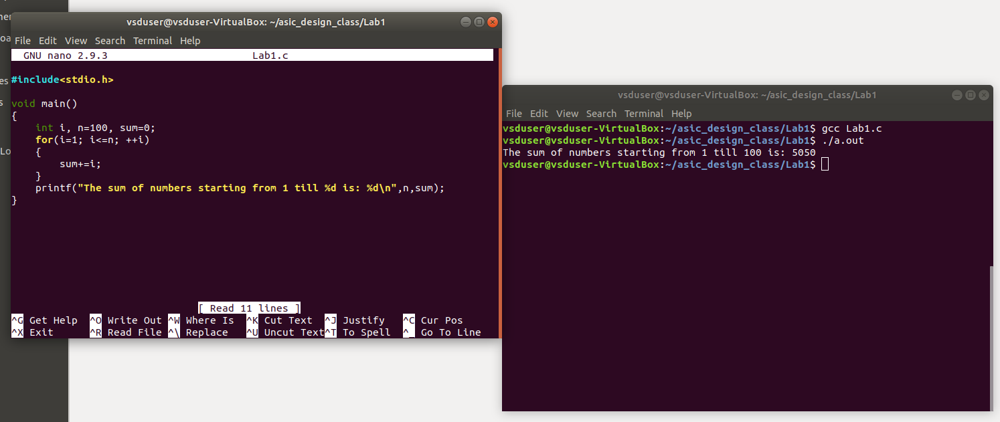<br><br>
</details>

---

<a name="Lab1B"></a>

<details>
<summary>
Lab 1B: Compile the same C program created as a part of Lab1A in RISC-V GCC compiler.
</summary>

### Introduction to RISC-V GCC

RISC-V GCC is a version of GCC that has been modified to support the RISC-V architecture.<br>The RISC-V architecture is an open standard instruction set architecture (ISA) based on established reduced instruction set computing (RISC) principles.

### Code Compilation using RISC-V GCC compiler
Compile the C code with riscv gcc compiler using the command shown below.
Here we are using the compiler flag as **-O1**.

```
riscv64-unknown-elf-gcc -O1 -mabi=lp64 -march=rv64i -o Lab1.o Lab1.c
```
Breaking dowm each of the parameters in the above command:

- riscv64: It specifies the target architecture (64 bit RISC-V)
- unknown: It is usually used to denote an unspecified vendor.
- elf: It specifies the target binary format.
- O1: It is the optimizaation flag.
- mabi=lp64: Is specifies application binary interface. lp64 means long and pointer are 64 bits wide in size.
- march=rv64i: ndicates the base RISC-V 64-bit integer instruction set.
- o Lab1.o: This specifies what should be the output object file name.
- Lab1.c : This is name of the C file which needs to be compiled.<br><br>


<br>

### Observe the assembly code generated in the object file post compilation
To see the dump of generated object file in assembly language, use the below command.

```
riscv64-unkown-elf-objdump -d Lab1.o | less
```

<br>

We can see the assembly language dump in the below screenshot.

<br>

For the "main" section, we can calculate the number of instructions either by counting each individual instruction in the main block.

 We can also subtract the address of the first instruction in the next section with the first instruction of the main section and divide the difference with 4 since it is a byte addressable memory, so 4 memory block form one instruction

E.g.: No. of instruction in main block = (0x101bc - 0x10184)/4 = 0x38/4 = 0xE = 14 instructions.

### Code Compilation using RISC-V GCC compiler with a different optimization flag (Ofast)
We will try to compile the code again with the compiler flag set as **-Ofast** and try to observe the generated assembly code.

```
riscv64-unknown-elf-gcc -Ofast -mabi=lp64 -march=rv64i -o Lab1.o Lab1.c
```

<br>

Below is the screen shot of the assembly code generated with **-Ofast** compiler flag.

<br>

Here we can observe that the number of instructions are reduced to 6 as compared to 14 in the previous case.

---

### **Note:** Difference between **-O1** and **-Ofast** compiler flags:

- -O1 is moderate in it's code optimization while -Ofast is highly aggressive to achieve highest possible performance.
- -O1 maintains strict adherence to standards while -Ofast may violate some standards to achieve better performance.
- -O1 has shorter compilation time while -Ofast may have higher compilation time due to complex and many optimizations.
  
</details>

---

<a name="Lab2"></a>

<details>
<summary>
Lab 2: Execution of the object file created by the RISC-V GCC compiler using Spike Simulator.
</summary>

### Introduction to Spike Simulator

Spike is an Instruction Set Simulator(ISS). It serves as a starting point for running software on a RISC-V target. Below are the few main features of Spike:

- Supports multiple ISAs
- Multiple memory models
- Single-step debugging with support for viewing memory/register contents.
- Multiple CPU support
- JTAG support
- Highly extensible

### Execution of the object file using Spike simulator

To execute an object file created by the RISC-V GCC compiler, use the following command.

```
spike pk Lab1.o
```
Here in the above command, "pk" means proxy kernel.<br> The proxy kernel(pk) is a lightweight runtime environment for RISC-V programs, acting as a minimal operating system that provides essential services like system calls.<br> It helps to bridge the gap between simulator and application.

<br>

We can observe from the above screenshot that the output from the GCC compiler and output from the RISC-V GCC compiler is same after executing the object files.

### Debugging using spike simulator

We can also debug the assembly code generated in the object file in using the spike.<br>Use the following command to go into debugging mode using spike:

```
spike -d pk Lab1.c
```

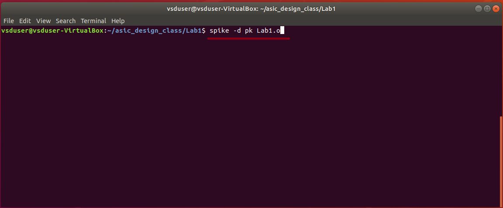<br>

To jump to begining of the "main" section, following command can be used:

```
until sp 0 0x100b0
```

'sp' denotes the stack pointer.<br><br> Using this command we are telling the debugger to execute the code starting from address 0 till address 0x100b0 which is the adress of the first instruction in the "main" section.<br>

<br>

When the 'sp' is pointing to the first instruction of "main", we can start with line by line debugging and can try to check the register values.

Before we jump to next instruction, lets check the value of register $A2 since our 'sp' is pointing a operation where the value stored in $A2 register will be modified.<br>

To check any register value, following command can be used:

```
reg 0 a2
```
Here the '0' denotes the core.

<br>

Now, to execute the current instruction pointed by 'sp' and come to the next instruction, "Enter" button can be pressed to go to next instruction.

<br>

After coming to the next instruction, let's verify whether the "lui" operation changed the value stored in $A2 register.

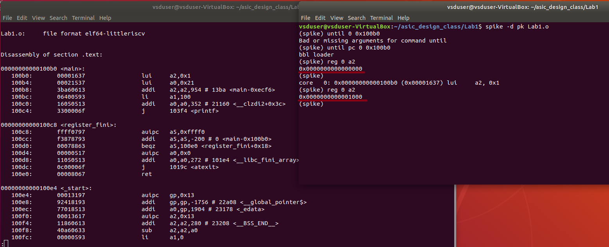<br>

We can clearly observe that the value stored in $A2 register has changed after executing the "lui" operation.

---

### RISC-V 'LUI' ISA

'LUI' stands for Load Upper Immediate. It is a fundamental instruction used to load a 20-bit immediate value into the upper 20 bits of a 32-bit register, with the lower 12 bits set to zero. <br>

The LUI instruction format is:

```
LUI rd, imm
```

- rd: Destination register where the results will be stored.
- imm: The 20-bit immediate value to be loaded into the upper 20 bits of the destination register.

</details>

---


<details>
<summary>
<a name="Lab3"></a>
Lab 3: Identify the various RISC-V instruction types and their 32-bit instruction codes.
</summary>

<!-- 
### RISC-V RV32I Instructions

- In the base RV32I ISA, there are four core instruction formats (R/I/S/U).
- All core instructions are fixed 32 bits in length.
- The instructions are aligned on a 4-byte boundary in memory.
--- -->

### Different types of RV32I instruction formats

### 1. R-type Instruction

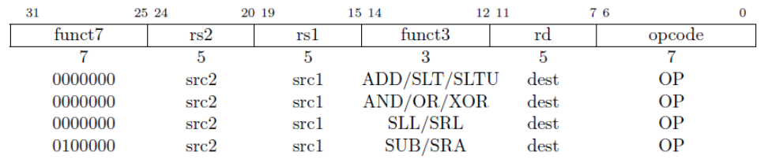<br>
Format for arithmetic and logical operations

R-type instructions are used for execution of operations between 2 registers.<br>

**rs1** is the source register 1 field. It is 5 bits wide.<br>
**rs2** is the source register 2 field. it is 5 bits wide.<br>
**rd** is the destination register field. It is 5 bits wide.<br>
The **opcode**(OP) value for R-Type instruction is **7'b0110011**.

| Instruction   | funct7 value | funct3 value |
| :-----------: | ------------ | ------------ |
|     ADD       | 7'b0000000   | 3'b000       |
|     SLT       | 7'b0000000   | 3'b010       |
|     SLTU      | 7'b0000000   | 3'b011       |
|     AND       | 7'b0000000   | 3'b111       |
|     OR        | 7'b0000000   | 3'b110       |
|     XOR       | 7'b0000000   | 3'b100       |
|     SLL       | 7'b0000000   | 3'b001       |
|     SRL       | 7'b0000000   | 3'b101       |
|     SRA       | 7'b0100000   | 3'b101       |
|     SUB       | 7'b0100000   | 3'b000       | 

---
### 2. I-type Instruction

<br>
Format for immediate operations

Operations use register and immediate values for execution.<br>
This instruction format is used in Immediate and Load operations.<br>
The opcode corresponding to the I-type instruction is named OP-IMM. It means immediate operation code.<br>
The immediate opcode OP-IMM is **7’b001_0011**.<br>

| Instruction   | funct3 value |
| :-----------: | ------------ |
|     ADDI      | 3'b000       |
|     SLTI      | 3'b010       |
|     SLTIU     | 3'b011       |
|     ANDI      | 3'b111       |
|     ORI       | 3'b110       |
|     XORI      | 3'b100       |

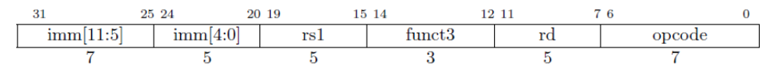<br>
Format for shift operations

| Instruction   | funct3 value |
| :-----------: | ------------ |
|     SLLI      | 3'b001       |
|     SRLI      | 3'b101       |
|     SRAI      | 3'b101       |

---
### 3. S-type Instruction

<br>

In S-type instruction, 'S' stands for 'store'.<br>
It is store type instruction that helps to store the value of a register into the memory.<br>
In S-type instruction, there is no rd, i.e. destination register.<br>

The immediate field is divided into two parts, first part is in bits 11:5, and the second part is in bits 4:0.<br>

It stores a 32-bit value from register rs2 to memory, the effective address is obtained by adding register rs1 to the sign-extended 12-bit offset.

---
### 4. B-type Instruction

<br>

In B-type instruction, 'B' stand for 'branching' which means it is mainly used for branching based on certain conditions.<br>

The instruction does not include rd register and funct7, but contains rs1, rs2, funct3 and immediate.<br>

There are two source registers rs1 and rs2 on which various operations are performed based on certain conditions, and those conditions are defined by func3 field.<br>

The immediate is divided into two areas.<br>
The 12-bit B-immediate encodes signed
offsets in multiples of 2 bytes.<br>

The offset is sign-extended and added to the address of the branch
instruction to give the target address.

The conditional branch range is ±4 KiB.<br>

---
### 32-bit format for various different instructions

```
ADD r7, r8, r9
```
> - R Type instruction since it's a register-register operation.
> - Adds the registers r8 and r9, stores the result in r7.
> - funct7 value for ADD operation is **7'b0000000**<br>
> rs1 = r8 = **5b'01000**<br>
> rs2 = r9 = **5b'01001**<br>
> funct3 value for ADD operation is **3b'000**<br>
> rd = r7 = **5b'00111**<br>
> Opcode for ADD is **7'b0110011** since it's an R-type instruction.<br>

#### 32 bits instruction : ```0000000_01001_01000_000_00111_0110011```
---
<br>

```
SUB r9, r7, r8
```
> - R Type instruction since it's a register-register operation.
> - Subtracts the registers r7 and r8, stores the result in r9.
> - funct7 value for SUB operation is **7'b0100000**<br>
> rs1 = r7 = **5b'00111**<br>
> rs2 = r8 = **5b'01000**<br>
> funct3 value for SUB operation is **3b'000**<br>
> rd = r9 = **5b'01001**<br>
> Opcode for SUB is **7'b0110011** since it's an R-type instruction.<br>

#### 32 bits instruction : ```0100000_01000_00111_000_01001_0110011```
---
<br>

```
AND r8, r7, r9
```
> - R Type instruction since it's a register-register operation.
> - Performs bitwise AND operation between the registers r7 and r9, stores the result in r8.
> - funct7 value for AND operation is **7'b0000000**<br>
> rs1 = r7 = **5b'00111**<br>
> rs2 = r9 = **5b'01001**<br>
> funct3 value for AND operation is **3b'111**<br>
> rd = r8 = **5b'01000**<br>
> Opcode for AND is **7'b0110011** since it's an R-type instruction.<br>

#### 32 bits instruction : ```0000000_01001_00111_111_01000_0110011```
---
<br>

```
OR r8, r8, r5
```
> - R Type instruction since it's a register-register operation.
> - Performs bitwise OR operation between the registers r8 and r5, stores the result in r8.
> - funct7 value for AND operation is **7'b0000000**<br>
> rs1 = r8 = **5b'01000**<br>
> rs2 = r5 = **5b'00101**<br>
> funct3 value for AND operation is **3b'110**<br>
> rd = r8 = **5b'01000**<br>
> Opcode for OR is **7'b0110011** since it's an R-type instruction.<br>

#### 32 bits instruction : ```0000000_00101_01000_110_01000_0110011```
---

<br>

```
XOR r8, r7, r4
```
> - R Type instruction since it's a register-register operation.
> - Performs bitwise XOR operation between the registers r7 and r4, stores the result in r8.
> - funct7 value for AND operation is **7'b0000000**<br>
> rs1 = r7 = **5b'00111**<br>
> rs2 = r4 = **5b'00100**<br>
> funct3 value for AND operation is **3b'100**<br>
> rd = r8 = **5b'01000**<br>
> Opcode for XOR is **7'b0110011** since it's an R-type instruction.<br>

#### 32 bits instruction : ```0000000_00100_00111_100_01000_0110011```
---

<br>

```
SLT r10, r2, r4
```
> - R Type instruction since it's a register-register operation.
> - Place '1' in r10 register if r4 is less than r2, else place 0 in r10. Values in both r2 and r4 are treated as signed numbers.
> - funct7 value for AND operation is **7'b0000000**<br>
> rs1 = r2 = **5b'00010**<br>
> rs2 = r4 = **5b'00100**<br>
> funct3 value for SLT operation is **3b'010**<br>
> rd = r10 = **5b'01010**<br>
> Opcode for SLT is **7'b0110011** since it's an R-type instruction.<br>

#### 32 bits instruction : ```0000000_00100_00010_010_01010_0110011```
---

<br>

```
ADDI r12, r3, 5
```
> - I Type instruction since it's a register-immediate value operation.
> - Add r3 with immediate value(5), store in r12 register.
> - Immediate value = 5 = 12b'000000000101
> rs1 = r3 = **5b'00011**<br>
> funct3 value for ADDI operation is **3b'000**<br>
> rd = r12 = **5b'01100**<br>
> Opcode for ADDI is **7’b001_0011** since it's an I-type instruction.<br>

#### 32 bits instruction : ```000000000101_00011_000_01100_0010011```
---

<br>

```
SW r3, r1, 4
```
> - S Type instruction since it's a store operation
> - The source register is r3. Address will be obtained by adding immediate address value 4 with the address located in register r1.
> - Immediate value[11:0] = 4 = 12b'000000000100<br>
> rs2 = r3 = **5b'00011**<br>
> rs1 = r1 = **5b'00001**<br>
> funct3 value for SW operation is **3b'010**<br>
> Opcode for SW is **7’b010_0011** since it's an S-type instruction.<br>

#### 32 bits instruction : ```0000000_00011_00001_010_00100_0100011```
---

<br>

```
SRL r16, r11, r2
```
> - R Type instruction since it's a register-register operation.
> - Value in r11 register will be logical right shifted by the value stored in r2, result will be stored in r16 
> - funct7 value for ADD operation is **7'b0000000**<br>
> rs2 = r2 = **5b'00010**<br>
> rs1 = r11 = **5b'01011**<br>
> funct3 value for SRL operation is **3b'101**<br>
> rd = r16 = **5b'10000**<br>
> Opcode for SRL is **7'b0110011** since it's an R-type instruction.<br>

#### 32 bits instruction : ```0000000_00010_01011_101_10000_0110011```
---

<br>

```
BNE r0,r1,20
```
> - Since it's a branch operation, so B-type instruction.
> - If the register r0 and r1 are not equal, then take the branch.
> - if(r0 != r1) PC = PC + immediate = PC + 20
> - else PC = PC + 4
> - immediate = 20 = 000000010100
> rs1 = r0 = **5b'00000**<br>
> rs2 = r1 = **5b'00001**<br>
> imm[12] = 0 <br>
> imm[10:5] = 000001 <br>
> imm[11] = 0 <br>
> imm[4:1] 0100
> funct3 value for BNE operation is **3b'001**<br>
> Opcode for BNE is **7'b1100011** since it's an B-type instruction.<br>

#### 32 bits instruction : ```0_000001_00001_00000_001_0100_0_1100011```
---

<br>

```
BEQ r0,r0,15
```
> - Since it's a branch operation, so B-type instruction.
> - If the register r0 and r0 are equal, then take the branch.
> - if(r0 == r0) PC = PC + immediate = PC + 15
> - else PC = PC + 4
> - immediate = 15 = 000000001111
> rs1 = r0 = **5b'00000**<br>
> rs2 = r0 = **5b'00000**<br>
> imm[12] = 0 <br>
> imm[10:5] = 000000 <br>
> imm[11] = 0 <br>
> imm[4:1] 1111
> funct3 value for BEQ operation is **3b'000**<br>
> Opcode for BEQ is **7'b1100011** since it's an B-type instruction.<br>

#### 32 bits instruction : ```0_000000_00000_00000_000_1111_0_1100011```
---

<br>

```
LW r13, r11, 2
```
> - I-type instruction, since it's a load word operation 
> - Load the data from address stored in r11 plus offset added and store it in r13.
> - immediate = 2 = 000000000010
> rs1 = r11 = **5b'01011**<br>
> rd = r13 = **5b'01101**<br>
> funct3 value for LW operation is **3b'010**<br>
> Opcode for BEQ is **7'b0000011** since it's an I-type instruction.<br>

#### 32 bits instruction : ```000000000010_01011_010_01101_0000011```
---

<br>

```
SLL r15, r11, r2
```
> - R Type instruction since it's a register-register operation.
> - Value in r11 register will be logical right shifted by the value stored in r2, result will be stored in r15
> - funct7 value for ADD operation is **7'b0000000**<br>
> rs2 = r2 = **5b'00010**<br>
> rs1 = r11 = **5b'01011**<br>
> funct3 value for ADD operation is **3b'001**<br>
> rd = r7 = **5b'01111**<br>
> Opcode for ADD is **7'b0110011** since it's an R-type instruction.<br>

#### 32 bits instruction : ```0000000_00010_01011_001_01111_0110011```

</details>

---

<a name="Lab4"></a>

<details>
<summary>
Lab 4: Execute the RISC-V ISA in the reference verilog code and get the output waveform
</summary>

Below table shows the different instructions present in the reference verilog code:

|Operation	     | ISA          |             Bit Pattern                 |
|----------------|--------------|-----------------------------------------|
|ADD R6, R2, R1	 |32'h02208300  | 0000001 00010 00001 000 00110 0000000   |
|SUB R7, R1, R2	 |32'h02209380  | 0000001 00010 00001 001 00111 0000000   |
|AND R8, R1, R3	 |32'h0230a400  | 0000001 00011 00001 010 01000 0000000   |
|OR R9, R2, R5	 |32'h02513480  | 0000001 00101 00010 011 01001 0000000   |
|XOR R10, R1, R4 |32'h0240c500  | 0000001 00100 00001 100 01010 0000000   |
|SLT R1, R2, R4	 |32'h02415580  | 0000001 00100 00010 101 01011 0000000   |
|SRL R16, R14, R2|32'h00271803  | 0000000 00010 01110 001 10000 0000011   |
|SLL R15, R1, R2 |32'h00208783  | 0000000 00010 00001 000 01111 0000011   |
|ADDI R12, R4, 5 |32'h00520600  | 0000000000101 00100 000 01100 0000000   |
|LW R13, R1, 2	 |32'h00208681  | 0000000 00010 00001 000 01101 0000001   |
|BEQ R0, R0, 15	 |32'h00f00002  | 0 000000 01111 00000 000 0000 0 0000010 |
|SW R3, R1, 2	 |32'h00209181  | 0000000 00010 00001 001 00011 0000001   |

Below table shows different instructions listed in the previous task and their bit patters:

|Operation	     | ISA          |             Bit Pattern                 |
|----------------|--------------|-----------------------------------------|
|ADD R7, R8, R9	 |32'h009403B3  | 0000000 01001 01000 000 00111 0110011   |
|SUB R9, R7, R8	 |32'h408384B3  | 0100000 01000 00111 000 01001 0110011   |
|AND R8, R7, R9	 |32'h0093F433  | 0000000 01001 00111 111 01000 0110011   |
|OR R8, R8, R5	 |32'h00546433  | 0000000 00101 01000 110 01000 0110011   |
|XOR R8, R7, R4  |32'h0043C433  | 0000000 00100 00111 100 01000 0110011   |
|SLT R10, R2, R4 |32'h00412533  | 0000000 00100 00010 010 01010 0110011   |
|SRL R16, R11, R2|32'h0025D833  | 0000000 00010 01011 101 10000 0110011   |
|SLL R15, R11, R2|32'h002597B3  | 0000000 00010 01011 001 01111 0110011   |
|ADDI R12, R3, 5 |32'h00520600  | 0000000000101 00011 000 01100 0010011   |
|LW R13, R11, 2	 |32'h0025A683  | 0000000000010 01011 010 01101 0000011   |
|BEQ R0, R0, 15	 |32'h00000f63  | 0 000000 00000 00000 000 1111 0 1100011 |
|BNE R0, R1, 20	 |32'h02101463  | 0 000001 00001 00000 001 0100 0 1100011 |
|SW R3, R1, 2	 |32'h0030A223  | 0000000 00011 00001 010 00100 0100011   |


If we compare the above tables, we can observe that there are many differences between the bit pattern of different instruction formats.

For R-type format, we can observe differences in the opcode, funct7 and funct3 values.

For example, consider ADD operation:

Hardcoded: ADD R6, R2, R1: 0000001 00010 00001 000 00110 0000000
Standard RISC-V: ADD R7, R8, R9: 0000000 01001 01000 000 00111 0110011

We can observe that the bit pattern is different for **opcode**, **funct3** and **funct7**.

For other instructions, we can see similar differences in the standard RISC-V ISA bit pattern and the hardcoded ISA in the verilog code.

So, even if we try to execute our operations using the same verilog code, we may not get appropriate output as we would also need to modify the opcode, funct3 and funct7 values in the verilog code.

 ---

 ### Verilog output of the various RISC-V operations using the reference Verilog code

 Here, we will try to execute our list of operations in the reference verilog code by modifying the operation setting with those of our own operations.

  ---

 #### **Icarus Verilog and Gtkwave**

 Icarus Verilog, commonly referred to as IVerilog, is an open-source hardware description language (HDL) simulator used for the design and verification of digital circuits.

 GTKWave is a waveform viewer used in the design and verification of digital circuits.

 ---

 #### **Output waveform without any changes in the verilog code.**

 Below is the screenshot where we can observe the output waveform for different operations.

 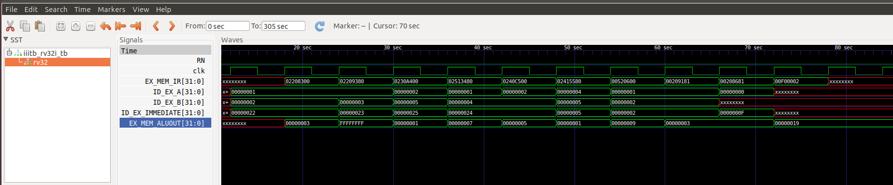<br>

 ---

 #### **Modifications to operation lists in the verilog code.**

 Below, we can observe the modification in the operations in the verilog code.

 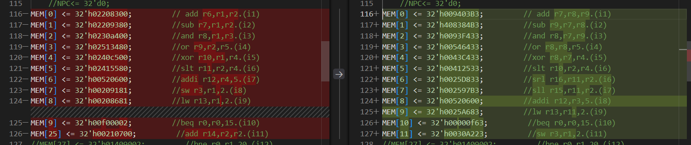<br>

 Left side is the non-modified verilog code, while in the right side, we have set our own operations.

#### 1. ADD r7, r8, r9

Operation : 32'h009403B3

<br>

#### 2. SUB r9, r7, r8

Operation : 32'h408384B3

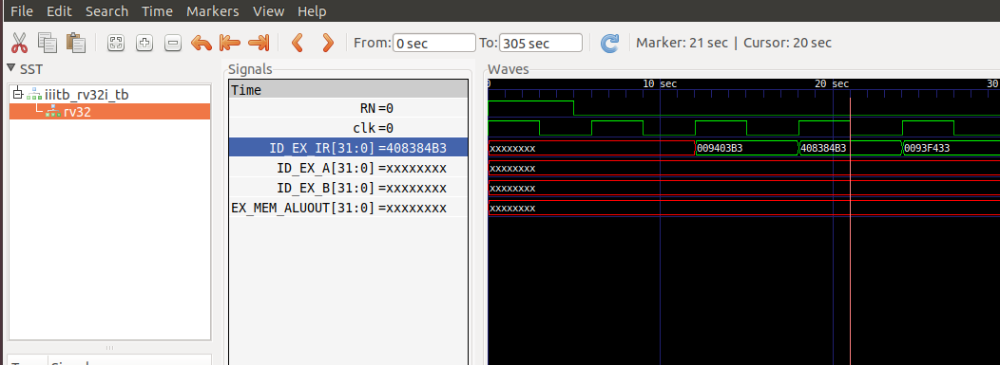<br>

#### 3. AND r8, r7, r9

Operation : 32'h0093F433

<br>

#### 4. OR r8, r8, r5

Operation : 32'h00546433

<br>

#### 5. XOR R8, R7, R4

Operation : 32'h0043C433

<br>

#### 6. SLT R10, R2, R4

Operation : 32'h00412533

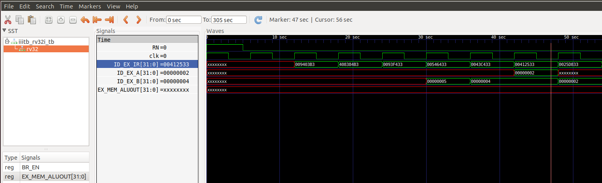<br>

#### 7. SRL R16, R11, R2

Operation : 32'h0025D833

<br>

#### 8. SLL R15, R11, R2

Operation : 32'h002597B3

<br>

#### 9. ADDI R12, R3, 5

Operation : 32'h00520600

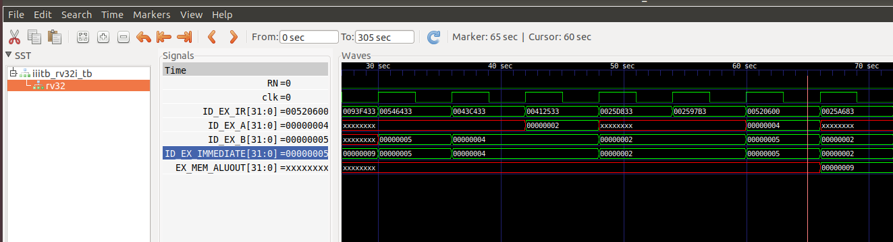<br>

#### 10. LW R13, R11, 2

Operation : 32'h0025A683

<br>

#### 11. BEQ R0, R0, 15

Operation : 32'h00000f63

<br>

#### 12. BNE R0, R1, 20

Operation : 32'h02101463

<br>

#### 13. SW R3, R1, 2

Operation : 32'h0030A223

<br>

</details>

---

<a name="Lab5"></a>

<details>
<summary>
Lab 5: Create a C program for Caesar's data encryption and decryption algorithm. Execute the same in GCC and RISC-V GCC compiler.
</summary>

### Caesar's encryption algorithm

The Caesar Cipher is one of the simplest and oldest methods of encrypting messages. This technique involves shifting the letters of the alphabet by a fixed number of places.

Despite its simplicity, the Caesar Cipher formed the groundwork for modern cryptographic techniques.

### Code for Caesar's encryption and decryption algorithm

```
#include<stdio.h>
#include<string.h>

// Function to encrypt the input string.
void Encrypt(char text[], int shift)
{
    for(int i =0; i < strlen(text); i++)
    {
        if(text[i] >= 'a' && text[i] <= 'z')
        {
            text[i] = ((text[i] - 'a' + shift) % 26) + 'a';
        }
        if(text[i] >= 'A' && text[i] <= 'Z')
        {
            text[i] = ((text[i] - 'A' + shift) % 26) + 'A';
        }
    }
}

// Function to decrypt the encrypted string.
void Decrypt(char text[], int shift)
{
    Encrypt(text, 26 - shift);
}

int main(void)
{
    char text[100] = "HelloWorld";
    int shift = 4;

    printf("Message before encryption: %s\n",text);

    Encrypt(text,shift);
    printf("Message after encryption: %s\n",text);

    Decrypt(text,shift);
    printf("Message after decryption: %s\n",text);

    return 0;
}
```

### Output for Caesar's Algorithm program from GCC compiler

In the below screenshot, we can observe the output of the Caesar Algorithm C program using GCC compiler.


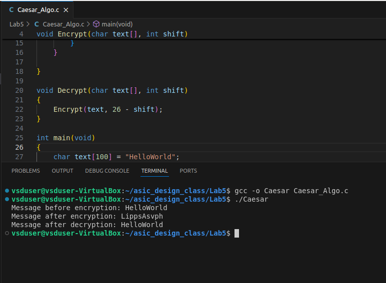<br>

### Output for Caesar's Algorithm program from RISC-V GCC compiler

In the below screenshot, we can observe the output of the Caesar Algorithm C program using RISC-V GCC compiler.

<br>

### Results

If we compare the output from both GCC and RISC-V compilers, we can observe the same output from both which is expected.

---

### Assembly instructions for Caesar's algorithm from RISC-V GCC compiler.

Below snippet shows the assembly instruction for the **Encrypt** function

<br>

Below snippet shows the assembly instruction for the **Decrypt** function

<br>

Below snippet shows the assembly instruction for the **main** function

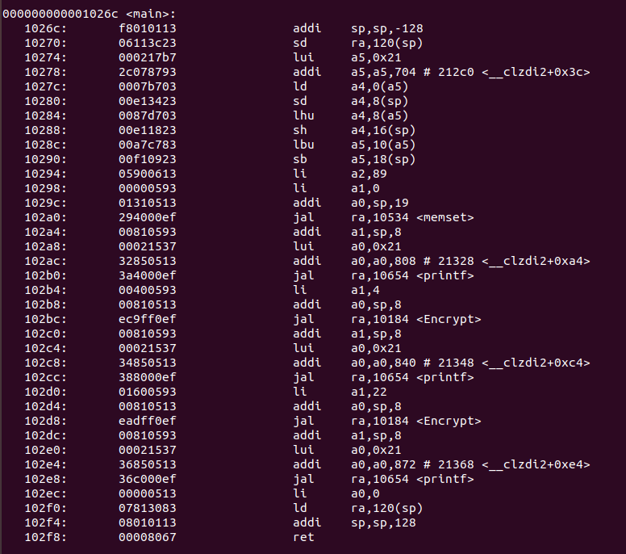<br>

**Note** : All the instructions have been generated by compiling in the RISC-V compiler using the 'O1' flag.

</details>

---
<a name="Lab6"></a>

<details>
<summary>
Lab 6: Makerchip Platform and Digital Logic with TL-Verilog.
</summary>
[Makerchip](https://www.makerchip.com) is a free online platform to develop digital electronic circuits. We can develop circuits using TL Verilog directly in the browser. All steps of compilation, coding, debugging, visualization can be done in the same browser window.

Makerchip supports the emerging Transaction-Level Verilog standard. Transaction-Level Verilog, or [TL-Verilog](https://www.tl-x.org/), represents a huge step forward, by eliminating the need for the legacy language features of Verilog and by introducing simpler syntax. At the same time, TL-Verilog adds powerful constructs for pipelines and transactions.

### [Combinational Logic](tl_verilog_code/Calculator.tlv)

Here, we have implemented a basic combinational calculator. Below code snippet is the TL-Verilog code to implement the calculator on the Makerchip platform.

```
$val1[31:0] = $rand1[3:0];
   $val2[31:0] = $rand2[3:0];
   
   $sum[31:0] =  $val1[31:0] +  $val2[31:0];
   $diff[31:0] =  $val1[31:0] -  $val2[31:0];
   $prod[31:0] =  $val1[31:0] *  $val2[31:0];
   $quot[31:0] =  $val1[31:0] /  $val2[31:0];
   
   $out[31:0] = $sel[1] ? ($sel[0] ? $quot[31:0] : $prod[31:0])
                        : ($sel[0] ? $diff[31:0] : $sum[31:0]);
```


Below is a screenshot of the implementation of the above code for a basic combinational circuit in Makerchip platfrom. We can also observe the generated block diagram as well as the waveform for the simulation of our circuit.

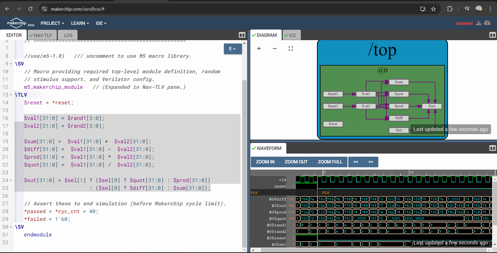<br>

### [Sequential Logic](tl_verilog_code/Counter.tlv)

Here, we are introduced to a new operation ```>>?```. It is ahead of operator which will provide the value of that signal some clock cycles prior.

Below is the snippet for a free runnning up counter implemented in TL-Verilog on the maker chip platform.

We have a reset signal which will reset the output to 0 when it is pulled high.

```
$num[15:0] = *reset ? 0             // 0 if reset
                    : >>1$num + 1;  // otherwise add previous and 1
```

Below screenshot shows the implementation of the above counter logic on makerchip platform. We can also observe and verify the working of the logic using the generated waveform.

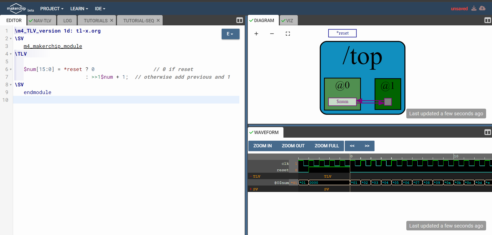<br>

### [Pipelined Logic](tl_verilog_code/Pipeline_Calc.tlv)

Below code snippet shows a Calculator logic implemented using TL-Verilog. It follows a pipelined design so that the circuit can be operated at higher clock frequencies.

The multiplexer to select the operation is shifted to the next clock cycle so that the calculator logic can operate at higher frequencies.

```
|calc
      @1
         $reset = *reset;
   
         $val1[31:0] = >>2$out[31:0];
         $val2[31:0] = $rand2[3:0];
         $sel[1:0] = $rand3[1:0];
   
         $sum[31:0] = $val1[31:0] + $val2[31:0];
         $diff[31:0] = $val1[31:0] - $val2[31:0];
         $prod[31:0] = $val1[31:0] * $val2[31:0];
         $quot[31:0] = $val1[31:0] / $val2[31:0];
            
         $count = $reset ? 0 : >>1$count + 1;
         
      @2
         $valid = !$count;
         $calc_reset = $reset | $valid;
         $out[31:0] = $calc_reset ? 32'b0
                                  : ($sel[1] ? ($sel[0] ? $quot[31:0] 
                                                        : $prod[31:0])
                                             : ($sel[0] ? $diff[31:0] 
                                                        : $sum[31:0]));
```

Below screenshot shows the implementation of above logic in MakerChip platform.

<br>

### [Validity](tl_verilog_code/Validity_Calculator.tlv)

Validity in TL-verilog means signal indicates validity of transaction and described as "when" scope else it will work as don't care. Denoted as ```?$valid```. Validity provides easier debug, cleaner design, better error checking, automated clock gating.

Below code snippet is a logic for 2-cycle calculator with validity,

```
|calc
      @0
         $reset = *reset;
      @1
         $valid = $reset ? 0 : >>1$valid + 1;
         $valid_or_reset = $valid || $reset; 
   
      ?$valid_or_reset
         @1   
            $val1[31:0] = >>2$out[31:0];
            $val2[31:0] = $rand2[3:0];
            $sel[1:0] = $rand3[1:0];
            
            $sum[31:0] = $val1[31:0] + $val2[31:0];
            $diff[31:0] = $val1[31:0] - $val2[31:0];
            $prod[31:0] = $val1[31:0] * $val2[31:0];
            $quot[31:0] = $val1[31:0] / $val2[31:0];
            
            $count = $reset ? 0 : >>1$count + 1;
         
         @2
            $out[31:0] = $reset ? 32'b0
                                : ($sel[1] ? ($sel[0] ? $quot[31:0] 
                                                      : $prod[31:0])
                                           : ($sel[0] ? $diff[31:0] 
                                                      : $sum[31:0]));
```

Below screenshot depicts the implementation of the above logic in MakerChip platform.

<br>

### [2-Cycle Validity Calculator with Memory](tl_verilog_code/Memory_Calculator.tlv)

Below is the code snippet for the calculator with memory,

<details>
<summary>2-Cycle Calculator with Memory</summary>
<pre>
|calc
      @0
         $reset = *reset;
      @1
         $valid = $reset ? 0 : >>1$valid+1;
         $valid_or_reset = $valid || $reset; 
   
      ?$valid_or_reset
         @1   
            $val1[31:0] = >>2$out[31:0];
            $val2[31:0] = $rand2[3:0];
            $sel[2:0] = $rand3[2:0];
            
            $sum[31:0] = $val1[31:0] + $val2[31:0];
            $diff[31:0] = $val1[31:0] - $val2[31:0];  
            $prod[31:0] = $val1[31:0] * $val2[31:0];
            $quot[31:0] = $val1[31:0] / $val2[31:0];
            
         
         @2
            $mem[31:0] = $reset ? '0 : ($sel == 3'd5) ? >>2$out[31:0]
                                                      : >>2$mem[31:0];
            $recall[31:0] = >>2$mem[31:0];
            
            $out[31:0] = $reset ? '0 : ($sel == 3'd0) ? $sum[31:0]
                                     : ($sel == 3'd1) ? $diff[31:0]
                                     : ($sel == 3'd2) ? $prod[31:0]
                                     : ($sel == 3'd3) ? $quot[31:0]
                                     : ($sel == 3'd4) ? $recall[31:0]
                                     : '0;
</pre>
</details>
<br>
In the below screenshot, we can see the implementation of our code on the MakerChip platform,

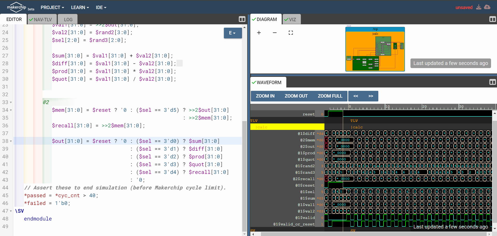<br>

</details>

---

<a name="Lab7"></a>

<details>
<summary>
Lab 7: A basic micro-architecture for RISC-V CPU
</summary>

### [Fetch](tl_verilog_code/fetch.tlv)

In the fetch stage, the CPU will fetch the next instruction to be executed from the instruction memory. 

The address from where the instruction will be fetched is provided by the program counter(PC).

Below code represents the logic to implement a program counter(PC) and how to fetch an instruction from the instruction memory.

```
|cpu
      @0
         $reset = *reset;
         
         $pc[31:0] = $reset ? '0 : >>1$pc + 32'd4;
         
         $imem_rd_en = !$reset ? 1 : 0;
         $imem_rd_addr[31:0] = $pc[M4_IMEM_INDEX_CNT+1:2];

      @1
         $instr[31:0] = $imem_rd_data[31:0];
```

Here, if the reset signal is high, then the program counter will be reset to value 0, otherwise when the program counter will increment by 4 since the address of each instruction is 32 bits wide.

The PC value will be fed as an input to the instruction memory to fetch the instruction from that particular address location.

Below is the screenshot where we can observe the implementation of the **Fetch** logic in MakerChip platform.

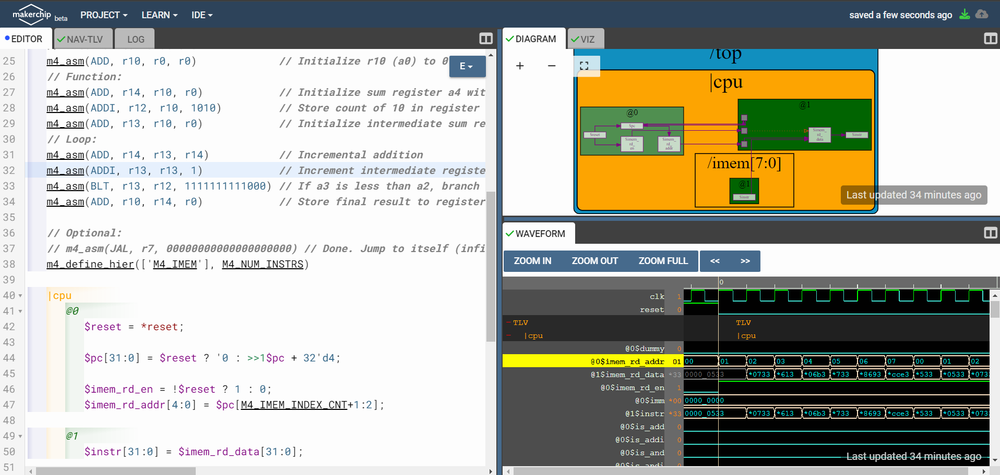<br>

### [Decode](tl_verilog_code/decode.tlv)

In decode stage, we try to get the various infomation about an instruction from the fetch stage instruction read output.

The information what we try to decode is which instruction set it belongs to, what is the immediate value if it is present, the register values etc.

Below code snippet shows the logic used for the decode stage,

<details>
<summary>Decode Logic</summary>
<pre>
$instr[31:0] = $imem_rd_data[31:0];
         
         $is_i_instr = $instr[6:2] ==? 5'b0000x ||
                       $instr[6:2] ==? 5'b001x0 ||
                       $instr[6:2] ==  5'b11001;
         
         $is_r_instr = $instr[6:2] ==  5'b01011 ||
                       $instr[6:2] ==? 5'b011x0 ||
                       $instr[6:2] ==  5'b10100;
         
         $is_s_instr = $instr[6:2] ==? 5'b0100x;
         
         $is_b_instr = $instr[6:2] ==  5'b11000;
         
         $is_j_instr = $instr[6:2] ==  5'b11011;
         
         $is_u_instr = $instr[6:2] ==?  5'b0x101;
         
         $imm[31:0] = $is_i_instr ? {{21{$instr[31]}}, $instr[30:20]} :
                      $is_s_instr ? {{21{$instr[31]}}, $instr[30:25], $instr[11:7]} :
                      $is_b_instr ? {{20{$instr[31]}}, $instr[7], $instr[30:25], $instr[11:8], 1'b0}:
                      $is_u_instr ? {$instr[31], $instr[30:20], $instr[19:12], 12'b0} :
                      $is_j_instr ? {{12{$instr[31]}}, $instr[19:12], $instr[20], $instr[30:21], 1'b0} :
                      32'b0;
         
         $rs2_valid = $is_r_instr || $is_s_instr || $is_b_instr;
         $rs1_valid = $is_r_instr || $is_s_instr || $is_i_instr || $is_b_instr;
         $rd_valid = $is_r_instr || $is_i_instr || $is_u_instr || $is_j_instr;
         $funct3_valid = $is_r_instr || $is_i_instr || $is_s_instr || $is_b_instr;
         $funct7_valid = $is_r_instr;
         
         ?$rs2_valid
            $rs2[4:0] = $instr[24:20];
         
         ?$rs1_valid
            $rs1[4:0] = $instr[19:15];
         
         ?$rd_valid
            $rd[4:0] = $instr[11:7];
         
         ?$funct3_valid
            $funct3[2:0] = $instr[14:12];
         
         ?$funct7_valid
            $funct7[6:0] = $instr[31:25];
         
         $opcode[6:0] = $instr[6:0];
         
         $dec_bits[10:0] = {$funct7[5],$funct3,$opcode};
         
         $is_beq  = $dec_bits ==? 11'bx0001100011;
         $is_bne  = $dec_bits ==? 11'bx0011100011;
         $is_blt  = $dec_bits ==? 11'bx1001100011;
         $is_bge  = $dec_bits ==? 11'bx1011100011;
         $is_bltu = $dec_bits ==? 11'bx1101100011;
         $is_bgeu = $dec_bits ==? 11'bx1111100011;
         $is_addi = $dec_bits ==? 11'bx0000010011;
         $is_add  = $dec_bits ==  11'b00000110011;
</pre>
</details>

<br>
Below code shows the implementation of decode stage in the MakerChip platform,

<br>

### [Register Read and Write](tl_verilog_code/reg_file_read_write.tlv)

Here the Register file is having 2 read line, 1 write line means 2 read and 1 write operation can happen simultanously.

Inputs:
  * Read_Enable   - Enable signal to perform read operation
  * Read_Address1 - Address1 from where data has to be read 
  * Read_Address2 - Address2 from where data has to be read 
  * Write_Enable  - Enable signal to perform write operation
  * Write_Address - Address where data has to be written
  * Write_Data    - Data to be written at Write_Address

Outputs:
  * Read_Data1    - Data from Read_Address1
  * Read_Data2    - Data from Read_Address2

Below snippet shows the logic for Register read and write functionality.

<details>
<summary>Register File Read and Write Logic</summary>
<pre>
// Register File Read Logic
         
         ?$rs1_valid
            $rf_rd_en1 = $rs1_valid;
            $rf_rd_index1[4:0] = $rs1[4:0];
         
         ?$rs2_valid
            $rf_rd_en2 = $rs2_valid;
            $rf_rd_index2[4:0] = $rs2[4:0];
         
         $src1_value[31:0] = $rf_rd_data1[31:0];
         $src2_value[31:0] = $rf_rd_data2[31:0];
         
         //ALU
         
         $result[31:0] = $is_addi ? $src1_value + $imm :
                         $is_add  ? $src1_value + $src2_value :
                         32'bx;
         
         // Register File Write
         $rf_wr_en = ($rd == 5'b0) ? 1'b0 : $rd_valid;
         
         ?$rd_valid
            $rf_wr_index[4:0] = $rd[4:0];
         
         $rf_wr_data[31:0] = $result[31:0];
</pre>
</details>
<br>
Here, an ALU has also been designed with initially two operations, i.e, ADD and ADDI.

Below snippet shows the implementation of the above logic in the MakerChip platform,

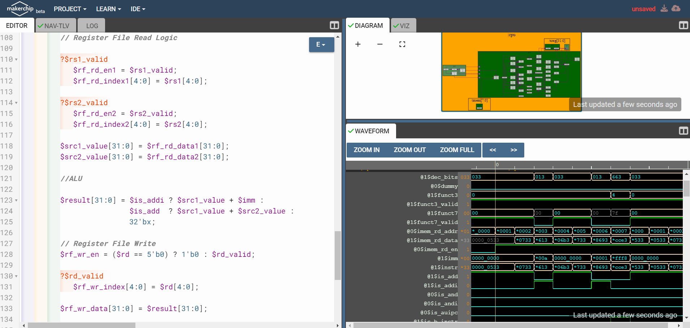<br>

### [Conditional/Branch Logic](tl_verilog_code/Branch.tlv)

Here, we are calculating the program counter value for a branch instruction, by adding the immediate value to the current program counter. This branch program counter value is fed into the instruction fetch stage incase it is a branch instruction.

Below snippet shows the logic for the Branch Logic,

<details>
<summary>
Branch Logic
</summary>
<pre>
//Branch Instructions
         $taken_br = $is_beq ? ($src1_value == $src2_value) :
                     $is_bne ? ($src1_value != $src2_value) :
                     $is_blt ? (($src1_value < $src2_value) ^ ($src1_value[31] != $src2_value[31])) :
                     $is_bge ? (($src1_value >= $src2_value) ^ ($src1_value[31] != $src2_value[31])) :
                     $is_bltu ? ($src1_value < $src2_value) :
                     $is_bgeu ? ($src1_value >= $src2_value) : 1'b0;
         
         $br_tgt_pc[31:0] = $pc + $imm;
</pre>
</details>
<br>

Below screenshot we can see the implementation of the branch logic in MakerChip platform,

<br>

---
</details>

---

<a name="Lab8"></a>

<details>
<summary>
Lab 8: 3-Cycle Pipelined RISC-V CPU
</summary>

Here, we have implemented a 3-cycle RISC-V CPU by distributing the single cycle architecture into multiple cycle architecture. Also, all the possible pipelining hazards have been taken care of.

### [Complete Pipelined CPU](tl_verilog_code/Pipelined_CPU.tlv)

In the below screenshot, we can observe the output of the sum 1 to 9 program as register r10 = 45.

<br>

Here, it can be observed that the CPU took 56 cycles to execute the program to calculate sum of numbers from 1 to 9.

<br>


### [Load and Store Operations](tl_verilog_code/Load_Store_Pipeline_CPU.tlv)

Inputs:
  * Read_Enable - Enable signal to perform read operation from the memory
  * Write_Enable - Enable signal to perform write operation to the memory
  * Address - Address specified whether to read/write from
  * Write_Data - Data to be written on Address (Store)

Output: 
  * Read_Data - Data to be read from Address (Load)

Added test case to check functionality of load/store.
Stored the summation of 1 to 9 on address 4 of Data Memory and loaded value from Data Memory to r15 register.

Below screenshot shows the output of the load and store operations testcase implemented on MakerChip platform,

<br>

### [Final Complete RISC-V CPU](tl_verilog_code/Final_CPU.tlv)

Added support for the jump instructions and added almost all the ALU operations support.

Below screenshots shows the final implementation and simulations on MakerChip Platform.

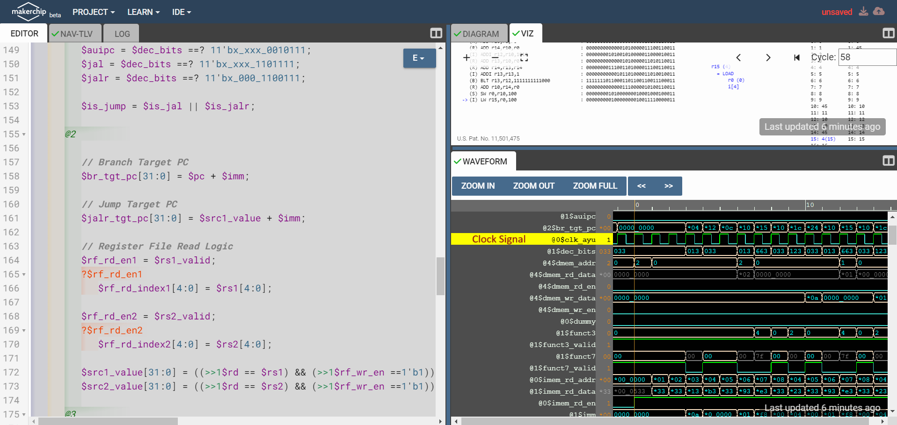<br>

The above image shows the clock signal of our RISC-V CPU.

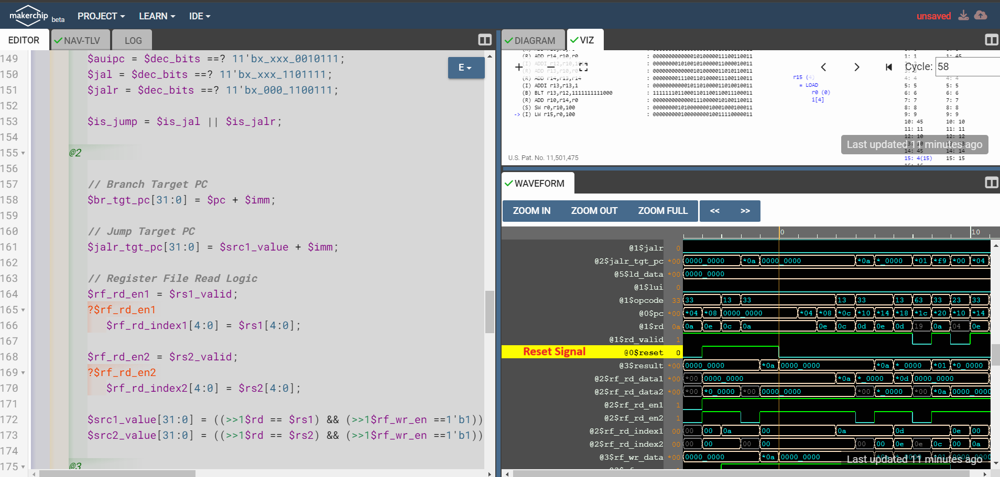<br>

The above image shows the reset signal of our RISC-V CPU.

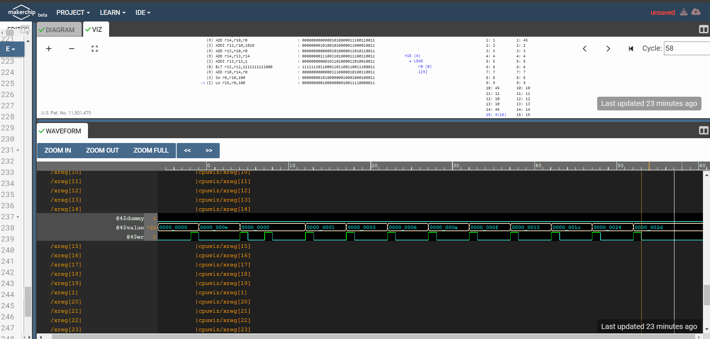<br>

In the above screenshot, we can observe the gradual addition of the sum from 1 to 9 being accumulated in the R14 register. The entire program takes 58 cycles to complete including the load and store operations.

</details>

---

<a name="Lab9"></a>

<details>
<summary>
Lab 9: Conversion of RISC-V CPU tlv code to verilog code
</summary>

In this lab, we will convert our tlv code to verilog code using the python's sandpiper-saas library.

Later, post conversion to verilog code, we will also be writing a verilog testbench and compare the waveforms obtained from MakerChip platform and the verilog code output.

Following are the necessary steps to convert the tlv code to verilog code,

### Installation of necessary tools

To install the necessary tools for this activity, execute the following command in the Linux terminal window.

```
sudo apt install make python python3 python3-pip git iverilog gtkwave python3-venv
```

### Conversion to verilog code

We will convert our tlv code to verilog format by creating a python virtual environment.

Here, python's virtual environment is used so that when we add additional python libraries, it doesn't affects anything in the entire system.

To create a virtual environment using python, use the following command

```
python -m venv .venv 
```

Use the following command to download the python's **sandpiper-saas** module.

```
pip3 install sandpiper-saas
```

We will use the sandpiper-saas library to convert our tlv code to verilog code. Use the below command for conversion to verilog code.

```
sandpiper-saas -i ./tlv_code/Final_CPU.tlv -o RV_CPU.v --bestsv --noline -p verilog --outdir ./src/module/
```

Verify that the conversion is correct and we don't have any errros.

### Creation of testbench and simulation of the verilog code.

Now, to simulate our verilog code of the RISC-V CPU, we need to write a testbench.

Once the testbench is ready, use the following command to compile the verilog code.

```
iverilog -o output/RV_CPU.out src/module/RV_CPU_tb.v -I src/include -I src/module
```

Once the verilog code is compiled successfully, execute the out file to obtain the .vcd file to observe the waveforms using gtkwave

```
cd output
./RV_CPU.out
gtkwave RV_CPU_tb.vcd
```

### Simulation Results

In this section, we can observe the clk, reset and the 10-bit out signals. The out signal contains the sum of numbers from 1 to 9.

Following are the waveforms from the Makerchip Platform for the tlv code,

<br>

<br>

<br>

Following is the waveform obtained after simulation of our generated verilog code,

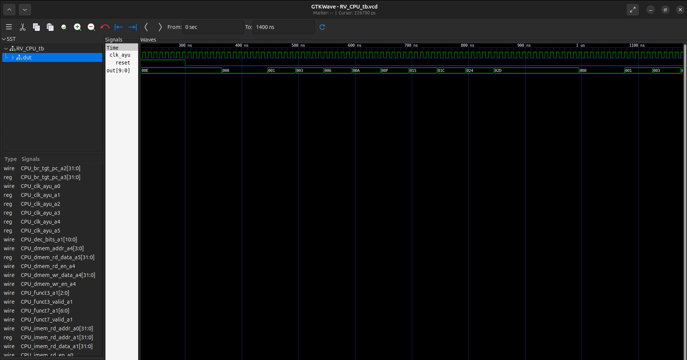<br>

### Results

If we compare the above waveforms, we can see that the result is same for the simulation of tlv code with that of simulation of the converted verilog code.

**clk_ayu** signal represents the clk signal used by our RV-CPU.

**reset** signal is used to reset the CPU whenever required.

**out** is the 10-bit output signal where we can observe the sum of numbers from 1 to 9 happening gradually.

</details>

---

<a name="Lab10"></a>

<details>
<summary>
Lab 10: Tools Installation and BabySoC Simulation
</summary>

### Tools Installation

Commands to install Yosys in Linux:
```
    $ git clone https://github.com/YosysHQ/yosys.git
    $ cd yosys
    $ sudo apt install make (If make is not installed) 
    $ sudo apt-get install build-essential clang bison flex \
        libreadline-dev gawk tcl-dev libffi-dev git \
        graphviz xdot pkg-config python3 libboost-system-dev \
        libboost-python-dev libboost-filesystem-dev zlib1g-dev
    $ make config-gcc
    $ make 
    $ sudo make install
```

To verify the installation of yosys, type yosys in terminal window
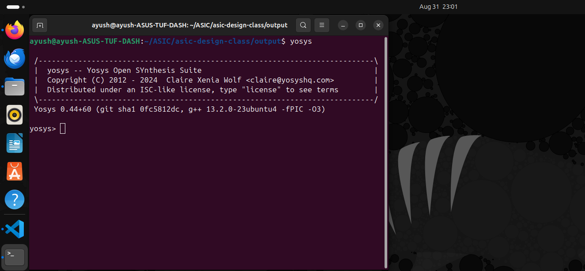<br>

Commands to install iverilog in Linux:

```
    sudo apt-get install iverilog
```

Below screenshot verifies the installation of iverilog in the system,


<br>

Commands to install gtkwave in Linux:

```
    sudo apt update
    sudo apt install gtkwave
```

Below screenshot verifies the installation of gtkwave in the system,


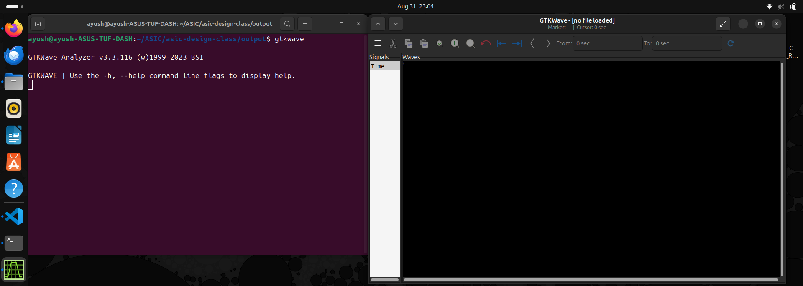<br>

For installation of Open STA, please follow the build instructions on the below link,

https://github.com/The-OpenROAD-Project/OpenSTA

---

### BabySoC Simulation

Here, it is a quite complex task to develop and simulate the entire micro-architecture of a RISC-V CPU.

Therefore, we will only consider to add only two IPs for now, that is **PLL** and **DAC** .

---
#### **Phase-Locked-Loop (PLL)**

A Phase-Locked Loop (PLL) is an electronic circuit that synchronizes an output signal's phase and frequency with a reference signal.  It typically consists of three main components:

1.    Phase Detector: Compares the phase of the reference signal with the output signal and generates an error signal based on the difference.

2.    Loop Filter: Processes the error signal to smooth it out, reducing noise and improving stability.
    
3.    Voltage-Controlled Oscillator (VCO): Adjusts its output frequency based on the filtered error signal to minimize the phase difference.

The PLL is widely used in applications such as clock generation, frequency synthesis, and data recovery in communication systems.

#### **Digital-to-Analog Converter (DAC)**

A Digital-to-Analog Converter (DAC) is an electronic device that converts digital signals (typically binary) into analog signals (such as voltage or current). 

This conversion is crucial in systems where digital data needs to be interpreted by analog devices or for output to be perceived by humans, like in audio and video equipment. 

DACs are commonly used in applications like audio playback, video display, and signal processing.

---


#### Files required for BabySoC simulation


* src/module - contains all RTL files and testbench.v used for simulating our BabySoC design.
* src/include - contains RTL files used in `include define in  main RTL files in src/module.

**Note** : These above files except the RV_CPU.v have been taken from the below reference repo,
https://github.com/Subhasis-Sahu/BabySoC_Simulation

#### To run the functional simulation,

* ` iverilog -o output/RV_CPU.out src/module/testbench.v -I src/include -I src/module `
* ` ./RV_CPU.out `
* ` gtkwave dump.out `

In the below screenshot, the output of the sum 1 to 9 can be observed after simulation,

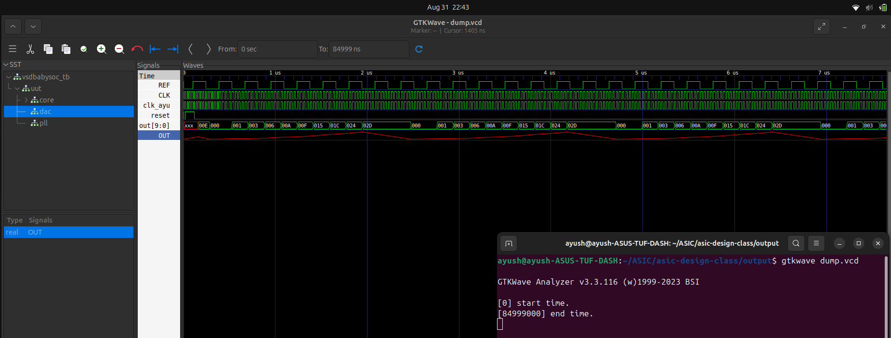<br>


* **REF** is the input clk reference signal to the PLL module.
* **CLK** is the output clk signal from the PLL module.
* **clk_ayu** is the clock used by the RISC-V CPU for the operations.
* **reset** is the reset signal for the RISC-V CPU.
* **out** is the ouput signal from the RISC-V CPU. Here we can observe the sum value from 1 to 9 over multiple clock cycles.
* **OUT** is the DAC output signal.

Below is the zoomed out version of the same above waveform screenshot,

<br>

</details>

---


<a name="Lab11"></a>

<details>
<summary>
Lab 11: RTL Design using Verilog and SKY130 Technology
</summary>


## Introduction to iverilog and gtkwave

Below is the command to simulate the RTL design for a 2 input MUX along with it's testbench using iverilog,

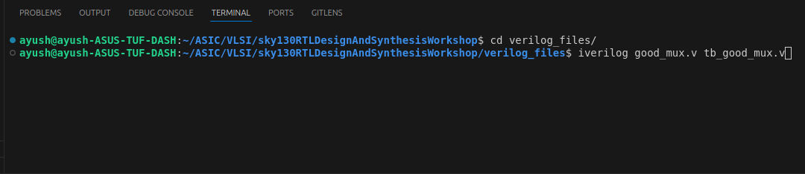<br>

Once, the compilation happens, an executable is generated. This executable can be run to observe the output with variations in input signal specified by the testbench.

<br>

To observe the output, we use the gtkwave to open the generated vcd file,

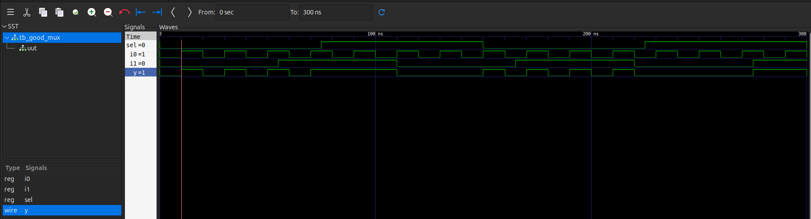<br>

<a name="Lab11_1"></a>

## Introduction to Synthesis and Yosys

### What is Synthesis ?

The process of conversion of an RTL behavioural design into a gate level netlist is known as Synthesis.

### What is Synthesizer?

The tool used to convert the RTL design to netlist is known as Synthesizer. In our course, **Yosys** is the Synthesizer.

Below image briefly depicts the flow of Synthesis,

<br>

The **.lib** or the **Front End Library** contains a collection of logical modules. It includes basic gates such as AND, OR, NOT etc. It can have gates with different number of inputs, having different speeds.

To satisfy the requirements for Setup and Hold time, we require gate with different speeds.

Often we need to guide the Synthesizer to select the appropriate gate sizes for the implementation of the logic.

If we use more faster cells, then the circuit may violate the hold time requirements and the circuit may be bad in terms of Power and Area.

If more slower cells are used, then the designed circuit may become sluggish and it may not meet the design requirements.

This guidance is often provided to the Synthesizer as a Constraint.

<a name="Lab11_2"></a>

## RTL to netlist conversion using Yosys

First, we need to read the SKY130 library file in yosys. Below is the command used,

```
read_liberty -lib lib/sky130_fd_sc_hd__tt_025C_1v80.lib
```

To read the verilog file into Yosys, use the below command. Make sure that there is no error once the Verilog file is loaded.

```
read_verilog verilog_files/good_mux.v
```

Below is the command to start the Synthesis project,

```
synth -top good_mux
```

Following is the result, after the process of Synthesis,

<br>

To generate the netlist, following command needs to executed

```
abc -liberty lib/sky130_fd_sc_hd__tt_025C_1v80.lib
```


Below is the output for the above command to generate the netlist,

<br>

To observe the implementation in a graphical manner, run the following command,

```
show
```

Below the visual representation of the netlist,

<br>

To dump the verilog code for the netlist with minimal information, use the command below

```
write_verilog -noattr verilog_files/good_mux_netlist.v
```

Below is the generated netlist for a 2:1 MUX,

<details>
<summary>
2:1 MUX netlist
</summary>

```
/* Generated by Yosys 0.44+60 (git sha1 0fc5812dc, g++ 13.2.0-23ubuntu4 -fPIC -O3) */

module good_mux(i0, i1, sel, y);
  wire _0_;
  wire _1_;
  wire _2_;
  wire _3_;
  input i0;
  wire i0;
  input i1;
  wire i1;
  input sel;
  wire sel;
  output y;
  wire y;
  sky130_fd_sc_hd__mux2_1 _4_ (
    .A0(_0_),
    .A1(_1_),
    .S(_2_),
    .X(_3_)
  );
  assign _0_ = i0;
  assign _1_ = i1;
  assign _2_ = sel;
  assign y = _3_;
endmodule
```

</details>

<a name="Lab11_3"></a>

## Introduction to SKY130 library file

The name of the library file is **sky130_fd_sc_hd__tt_025C_1v80**

* It is a 130 nm library
* **tt** stands for typical
* **025C** denotes the temperature
* **1v8** indicates the voltage

Any library would contain information about,

* **Process**: It defines characteristics of the chip to be designed using the particular library due to variations in fabrication
* **Voltage**: This defines the behaviour of the Sillicon with respect to variations in voltage.
* **Temperature**: Defines the optimal temperature at which the library is defined.


Further, if we explore the library we can observe the following information,

* The technology used in this library is **cmos**
* Delay model is **table_lookup**.
* Time unit is **nano Seconds**
* Current unit is **milli Amperes**
* Power unit is **milli Watts**
* Resistance unit is **KOhms**
* Capacitance unit is **picoFarads**
* Operating Conditions is mentioned in terms of **PVT** as **tt_025C_1v80**

### Standard Cell Information

We know that a library file contains a collection of standard cells.

Below screenshot shows the information about one of the cells present in the library files,

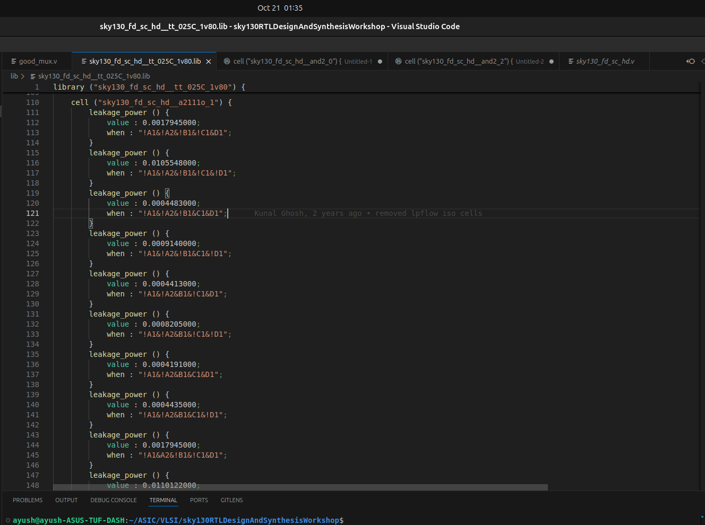<br>

The behaviour of the particular cell can be described as follows,

```
X = ((A1 & A2) | B1 | C1 | D1)
```

So, a total of 32 input combinations possible. So the cell information will contain the details about the Power and Delay for all such 32 input combinations.

Later, if we inspect the information about the cell, we can further information,

* Details about Area
* Details abput Power Pins
* Details of Input pins like the Capacitance, Power, Transition information etc.

### Comparison of AND2_0 gate and AND2_2 gate variants

Below image shows a side by side comparison of the AND2_0 gate and AND2_2 gate variants,

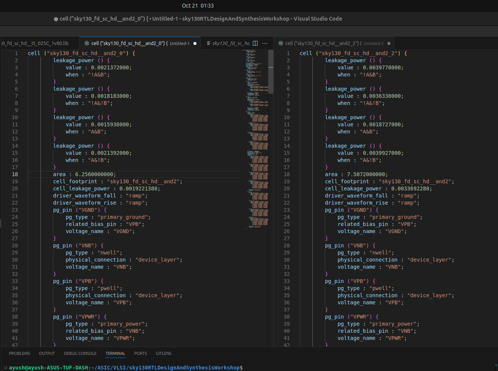<br>

Here, if we look closely at the **Area** information, we can observe AND2_2 has more area than AND2_0, which means that wider transistors are used to implement AND2_2.

Also, if we look at the power information, we can see that AND2_2 uses more power as it is using wider transistors.

### Lookup table Delay Model

The delay model in such files typically relies on lookup tables (LUTs) based on different signal conditions. The table_lookup is used to model delays based on input conditions such as:

* Input Slew (transition time at the input)
* Output Load (the capacitance at the output pin)
* Voltage and Temperature (for different operating conditions)

The idea is that the delay (or transition time) is not fixed, but varies according to these input conditions. The delay is pre-characterized for different combinations of slew rates and load capacitances, and these values are stored in a multi-dimensional table (hence the lookup). When the timing engine calculates delays, it uses interpolation to derive the delay from these tables.

<a name="Lab11_4"></a>

## Hierarchial vs Flat Synthesis

### Hierarchial Synthesis

We will synthesize the **multiple_mocdules.v** file.

<details>
<summary>
multiple_modules.v
</summary>

```
module sub_module2 (input a, input b, output y);
	assign y = a | b;
endmodule

module sub_module1 (input a, input b, output y);
	assign y = a&b;
endmodule


module multiple_modules (input a, input b, input c , output y);
	wire net1;
	sub_module1 u1(.a(a),.b(b),.y(net1));  //net1 = a&b
	sub_module2 u2(.a(net1),.b(c),.y(y));  //y = net1|c ,ie y = a&b + c;
endmodule
```

</details>

We will try to synthesize it using the following command,

```
synth -top multiple_modules
```

Below is the synthesis output report,

<br>

We see that 1 AND and 1 OR gate cell will be used to design the circuit.

Let's check the design if we run the following command to show the design,

```
show multiple_modules
```

<br>

Here, we can observe that we don't see the AND and OR gate which we expected. Instead we see the instances of sub_module1 and sub_module2.

This is known as **Hierarchial Synthesis** since the hierachy of the design getting preserved.


Below is how the netlist would look, if the following command is executed,

```
write_verilog -noattr verilog_files/multiple_modules_hier.v
```

<details>
<summary>
multiple_modules Hierarchial Synthesis Netlist
</summary>

/* Generated by Yosys 0.44+60 (git sha1 0fc5812dc, g++ 13.2.0-23ubuntu4 -fPIC -O3) */

module multiple_modules(a, b, c, y);
  input a;
  wire a;
  input b;
  wire b;
  input c;
  wire c;
  wire net1;
  output y;
  wire y;
  sub_module1 u1 (
    .a(a),
    .b(b),
    .y(net1)
  );
  sub_module2 u2 (
    .a(net1),
    .b(c),
    .y(y)
  );
endmodule

module sub_module1(a, b, y);
  wire _0_;
  wire _1_;
  wire _2_;
  input a;
  wire a;
  input b;
  wire b;
  output y;
  wire y;
  sky130_fd_sc_hd__and2_0 _3_ (
    .A(_1_),
    .B(_0_),
    .X(_2_)
  );
  assign _1_ = b;
  assign _0_ = a;
  assign y = _2_;
endmodule

module sub_module2(a, b, y);
  wire _0_;
  wire _1_;
  wire _2_;
  input a;
  wire a;
  input b;
  wire b;
  output y;
  wire y;
  sky130_fd_sc_hd__or2_0 _3_ (
    .A(_1_),
    .B(_0_),
    .X(_2_)
  );
  assign _1_ = b;
  assign _0_ = a;
  assign y = _2_;
endmodule

</details>

<br>
From the netlist, we can observe as well that the hierarchy is getting preserved if we use the **synth -top** command during Synthesis.

### Flat Synthesis

We will now use the following command to let go of the hierarchy,

```
flatten
```

Below is the graphical representation of the design after running the **flatten** command,

<br>

We can now observe that the design is now implemented using basic gates, it is no longer maintaining the hierarchy.

Below is the generated netlist post running the **flatten** command,

<details>
<summary>
multiple_modules Flat Synthesis Netlist
</summary>

/* Generated by Yosys 0.44+60 (git sha1 0fc5812dc, g++ 13.2.0-23ubuntu4 -fPIC -O3) */

/* Generated by Yosys 0.44+60 (git sha1 0fc5812dc, g++ 13.2.0-23ubuntu4 -fPIC -O3) */

module multiple_modules(a, b, c, y);
  wire _0_;
  wire _1_;
  wire _2_;
  wire _3_;
  wire _4_;
  wire _5_;
  input a;
  wire a;
  input b;
  wire b;
  input c;
  wire c;
  wire net1;
  wire \u1.a ;
  wire \u1.b ;
  wire \u1.y ;
  wire \u2.a ;
  wire \u2.b ;
  wire \u2.y ;
  output y;
  wire y;
  sky130_fd_sc_hd__and2_0 _6_ (
    .A(_1_),
    .B(_0_),
    .X(_2_)
  );
  sky130_fd_sc_hd__or2_0 _7_ (
    .A(_4_),
    .B(_3_),
    .X(_5_)
  );
  assign _4_ = \u2.b ;
  assign _3_ = \u2.a ;
  assign \u2.y  = _5_;
  assign \u2.a  = net1;
  assign \u2.b  = c;
  assign y = \u2.y ;
  assign _1_ = \u1.b ;
  assign _0_ = \u1.a ;
  assign \u1.y  = _2_;
  assign \u1.a  = a;
  assign \u1.b  = b;
  assign net1 = \u1.y ;
endmodule

</details>

<br>
From the netlist, we can see that there is direct instantiation of the AND and OR gates. The hierarchy is no longer preserved.

### When do we do Sub-Module level Synthesis?

* When there is repetition in the instantiation of the same sub-module many times, then we can synthesis that particular sub-module once and then replicate it elsewhere.

* If the design is quite massive, then we use the divide and conquer approach. We synthesis by passing sub-modules one at a time in series since running the synthesis on the whole big design may not be a good idea since the tool may not perform very well.

<a name="Lab11_5"></a>

## Flop Coding Styles and Optimizations

### D Flip-flop with Asynchronous Reset

Let's simulate the D Flip-flop with Asynchronous Reset in iverilog.

To compile the verilog code, following is the command

```
iverilog verilog_files/dff_asyncres.v verilog_files/tb_dff_asyncres.v
```

To execute the generated out file, following is the command,
```
./a.out
```

Finally, to observe the waveform with variations in inputs defined in the inputs, following is the command,
```
gtkwave tb_dff_asyncres.vcd
```

Below is how the waveform looks for a D flip-flop with asynchronous reset

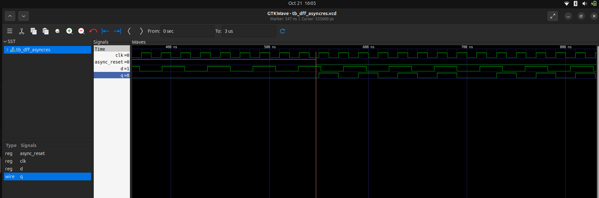<br>

We can clearly see that as soon as reset signal goes from high to low, the output q starts following input d.

#### Synthesis using Yosys

To synthesize the D flip-flop, use the following command, 

```
read_liberty -lib lib/sky130_fd_sc_hd__tt_025C_1v80.lib
read_verilog verilog_files/dff_asyncres.v
synth -top dff_asyncres
dfflibmap -liberty lib/sky130_fd_sc_hd__tt_025C_1v80.lib
abc -liberty lib/sky130_fd_sc_hd__tt_025C_1v80.lib
show
```

Below is the graphical representation of the synthesized design,
<br>

### D Flip-flop with Asynchronous Set

To compile the verilog code, following is the command

```
iverilog verilog_files/dff_async_set.v verilog_files/tb_dff_async_set.v 
```

To execute the generated out file, following is the command,
```
./a.out
```

Finally, to observe the waveform with variations in inputs defined in the inputs, following is the command,
```
gtkwave tb_dff_async_set.vcd
```

Below is how the waveform looks for a D flip-flop with asynchronous set

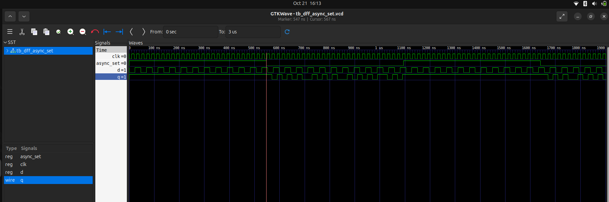<br>

We can clearly see that as soon as set signal goes from low to high, the output q is set to 1 irrespective of the clock's active edge.

#### Synthesis using Yosys

Below is the graphical representation of the synthesized design,
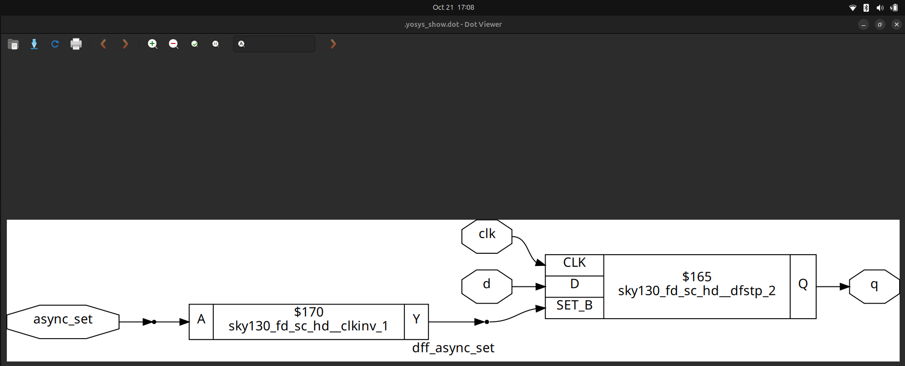<br>

### D Flip-flop with Synchronous Reset

To compile the verilog code, following is the command

```
iverilog verilog_files/dff_syncres.v verilog_files/tb_dff_syncres.v
```

To execute the generated out file, following is the command,
```
./a.out
```

Finally, to observe the waveform with variations in inputs defined in the inputs, following is the command,
```
gtkwave tb_dff_syncres.vcd
```

Below is how the waveform looks for a D flip-flop with Synchronous Reset

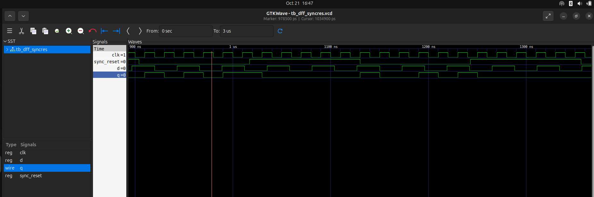<br>

We can clearly see that as soon as reset signal goes from low to high, the output q is set to 0 at the next active clock edge.

#### Synthesis using Yosys

Below is the graphical representation of the synthesized design,
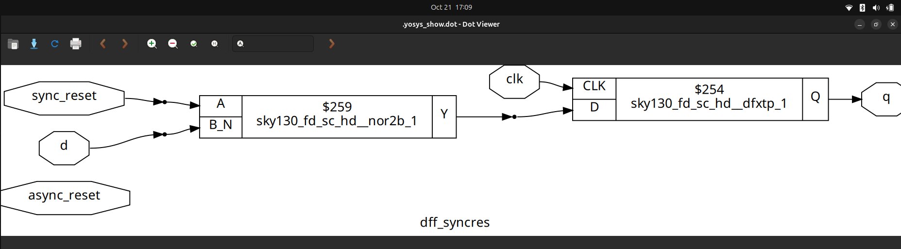<br>

### Optimizations for mult_2.v and mult_8.v

#### mult2.v

If we compare the input and output combinations, we observe that we don't any sort of extra cells. We just need to assign one more wire to obtain the output.

We can also observe that there are no cells being used,
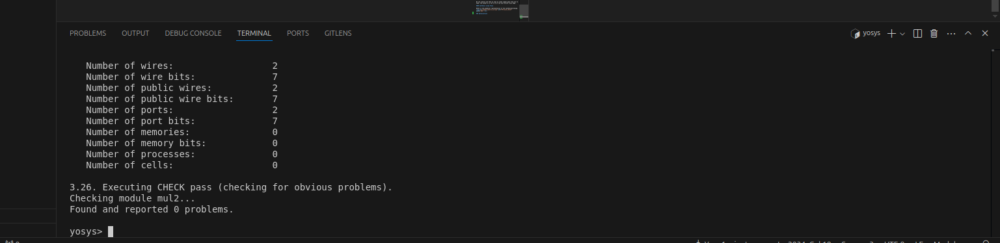<br>

Following shows the graphical representation post synthesis,
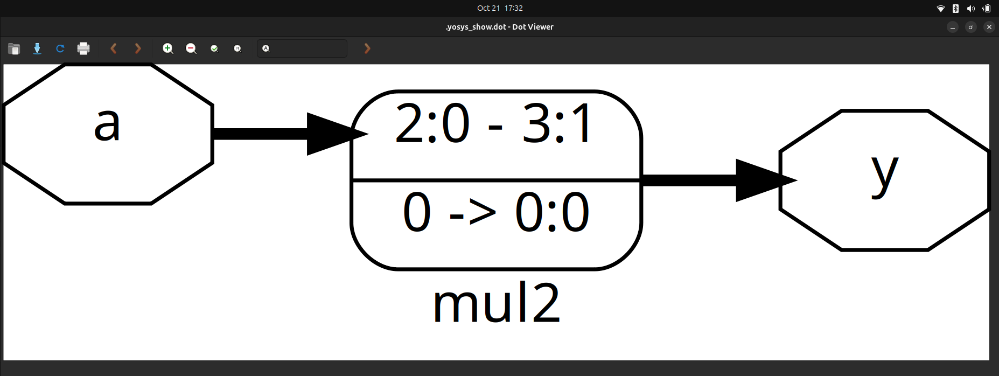<br>

<details>
<summary>
Verilog Netlist for mult2 Synthesis
</summary>

```
/* Generated by Yosys 0.44+60 (git sha1 0fc5812dc, g++ 13.2.0-23ubuntu4 -fPIC -O3) */

module mul2(a, y);
  input [2:0] a;
  wire [2:0] a;
  output [3:0] y;
  wire [3:0] y;
  assign y = { a, 1'h0 };
endmodule
```

</details>

#### mult8.v

If we compare the input and output combinations, we observe that we don't any sort of extra cells.

For the output, only the 3 bit input is getting copied two times and output is of 6 bits.

We can also observe that there are no cells being used,
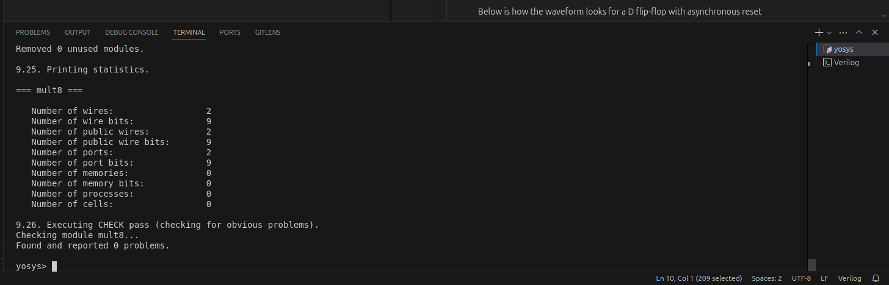<br>

Following shows the graphical representation post synthesis,
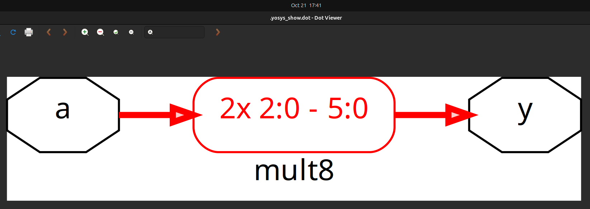<br>

<details>
<summary>
Verilog Netlist for mult8 Synthesis
</summary>

```
/* Generated by Yosys 0.44+60 (git sha1 0fc5812dc, g++ 13.2.0-23ubuntu4 -fPIC -O3) */

module mult8(a, y);
  input [2:0] a;
  wire [2:0] a;
  output [5:0] y;
  wire [5:0] y;
  assign y = { a, a };
endmodule
```
</details>

<a name="Lab11_6"></a>

## Combinational and Sequential Optimizations


### Combinational Optimizations

#### Why Combinational Optimization?

* To squeeze the logic to get the most optimized design to achieve area and power savings

#### Techniques for optimization

* Constant Propagation
* Boolean Logic Optimization

#### opt_check.v

Below is the simulation of the behaviour design using iverilog and gtkwave,
<br>

Following is the post synthesis report for the same design,
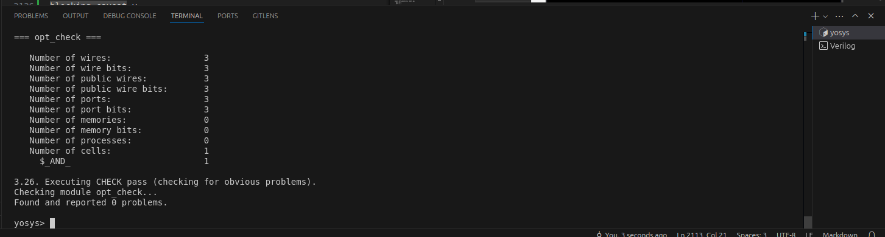<br>

In the below screenshot, we can observe the graphical representation of the synthesized design,
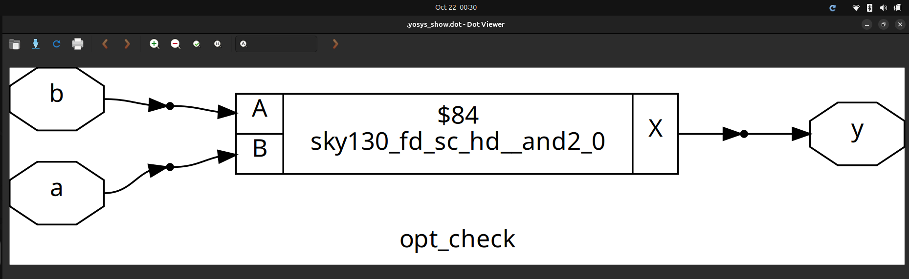<br>

<details>
<summary>
opt_check.v
</summary>

```
/* Generated by Yosys 0.44+60 (git sha1 0fc5812dc, g++ 13.2.0-23ubuntu4 -fPIC -O3) */

module opt_check(a, b, y);
  wire _0_;
  wire _1_;
  wire _2_;
  input a;
  wire a;
  input b;
  wire b;
  output y;
  wire y;
  sky130_fd_sc_hd__and2_0 _3_ (
    .A(_1_),
    .B(_0_),
    .X(_2_)
  );
  assign _1_ = b;
  assign _0_ = a;
  assign y = _2_;
endmodule
```
</details>

#### opt_check2.v

Below is the simulation of the behaviour design using iverilog and gtkwave,
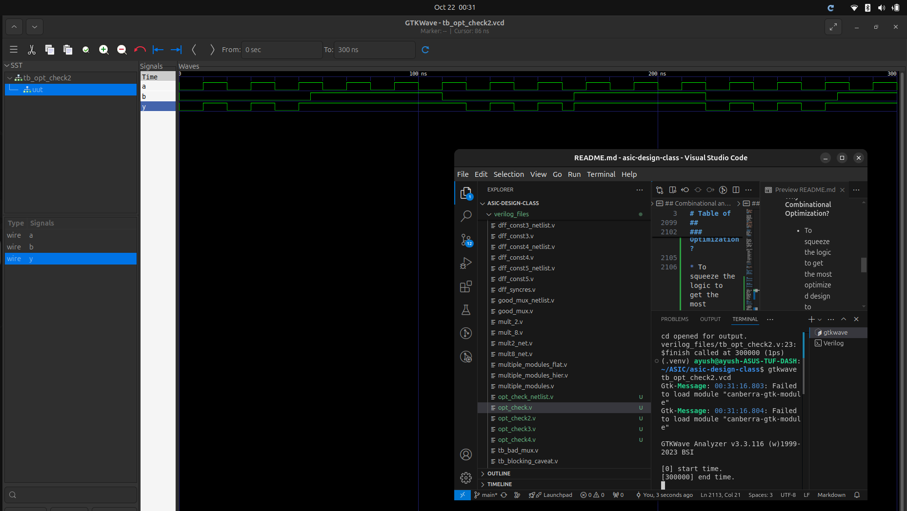<br>

Following is the post synthesis report for the same design,
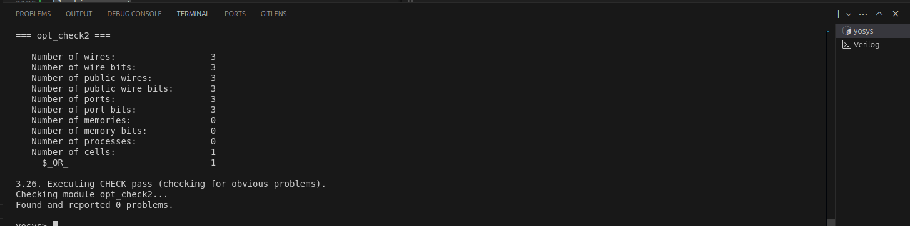<br>

In the below screenshot, we can observe the graphical representation of the synthesized design,
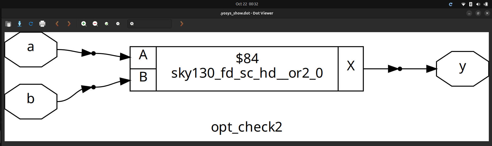<br>

<details>
<summary>
opt_check2.v
</summary>

```
/* Generated by Yosys 0.44+60 (git sha1 0fc5812dc, g++ 13.2.0-23ubuntu4 -fPIC -O3) */

module opt_check2(a, b, y);
  wire _0_;
  wire _1_;
  wire _2_;
  input a;
  wire a;
  input b;
  wire b;
  output y;
  wire y;
  sky130_fd_sc_hd__or2_0 _3_ (
    .A(_0_),
    .B(_1_),
    .X(_2_)
  );
  assign _0_ = a;
  assign _1_ = b;
  assign y = _2_;
endmodule
```
</details>

#### opt_check3.v

Below is the simulation of the behaviour design using iverilog and gtkwave,
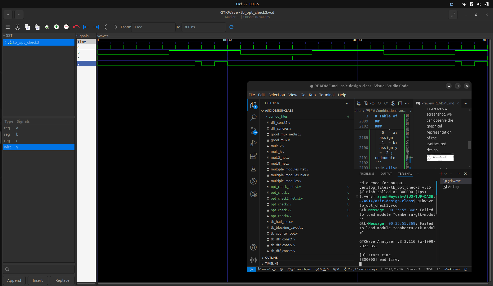<br>

Following is the post synthesis report for the same design,
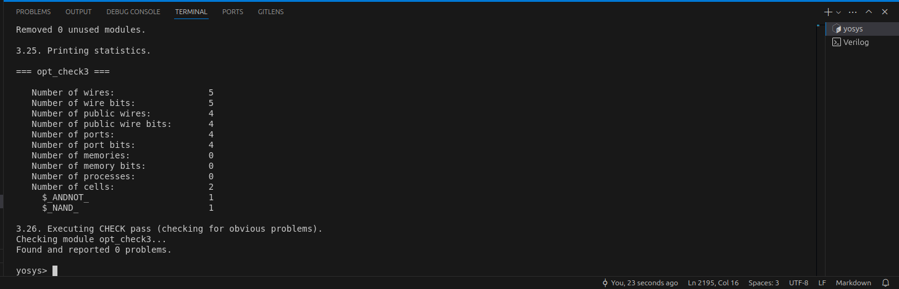<br>

In the below screenshot, we can observe the graphical representation of the synthesized design,
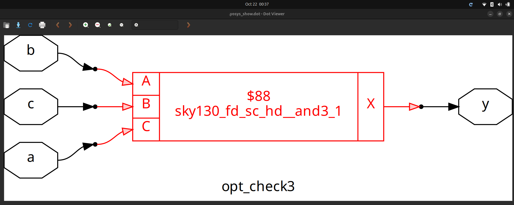<br>

<details>
<summary>
opt_check3.v
</summary>

```
/* Generated by Yosys 0.44+60 (git sha1 0fc5812dc, g++ 13.2.0-23ubuntu4 -fPIC -O3) */

module opt_check3(a, b, c, y);
  wire _0_;
  wire _1_;
  wire _2_;
  wire _3_;
  wire _4_;
  input a;
  wire a;
  input b;
  wire b;
  input c;
  wire c;
  output y;
  wire y;
  sky130_fd_sc_hd__and3_1 _5_ (
    .A(_2_),
    .B(_3_),
    .C(_1_),
    .X(_4_)
  );
  assign _2_ = b;
  assign _3_ = c;
  assign _1_ = a;
  assign y = _4_;
endmodule
```
</details>

#### opt_check4.v

Following is the post synthesis report for the same design,
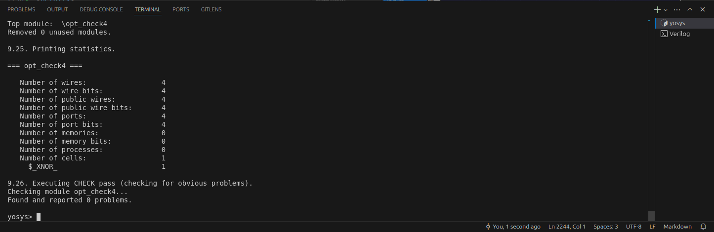<br>

In the below screenshot, we can observe the graphical representation of the synthesized design,
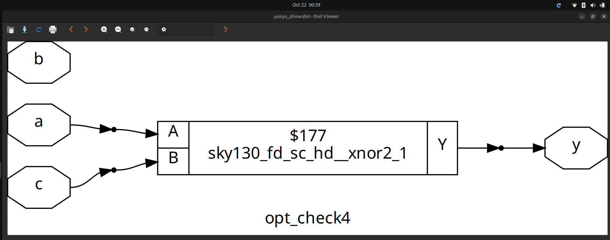<br>

<details>
<summary>
opt_check4.v
</summary>

```
/* Generated by Yosys 0.44+60 (git sha1 0fc5812dc, g++ 13.2.0-23ubuntu4 -fPIC -O3) */

module opt_check4(a, b, c, y);
  wire _0_;
  wire _1_;
  wire _2_;
  input a;
  wire a;
  input b;
  wire b;
  input c;
  wire c;
  output y;
  wire y;
  sky130_fd_sc_hd__xnor2_1 _3_ (
    .A(_0_),
    .B(_1_),
    .Y(_2_)
  );
  assign _0_ = a;
  assign _1_ = c;
  assign y = _2_;
endmodule
```
</details>

### Sequential Optimizations

#### dff_const1.v

To verify the working in iverilog and gtkwave, use the following commands,

```
iverilog verilog_files/dff_const1.v verilog_files/tb_dff_const1.v
./a.out
gtkwave tb_dff_const1.vcd
```
Below is the screenshot for the gtkwave window,

Following shows the graphical representation post synthesis,
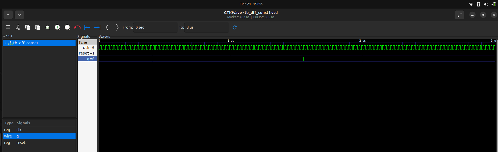<br>

Use the following commands to run the synthesis and get the netlist for the RTL design,

```
read_liberty -lib lib/sky130_fd_sc_hd__tt_025C_1v80.lib 
read_verilog verilog_files/dff_const1.v
synth -top dff_const1
dfflib -liberty lib/sky130_fd_sc_hd__tt_025C_1v80.lib
abc -liberty lib/sky130_fd_sc_hd__tt_025C_1v80.lib
show
write_verilog -noattr verilog_files/dff_const1_netlist.v
```

Post synthesis, following report shows which cells are being used to implement the RTL design,
Following shows the graphical representation post synthesis,
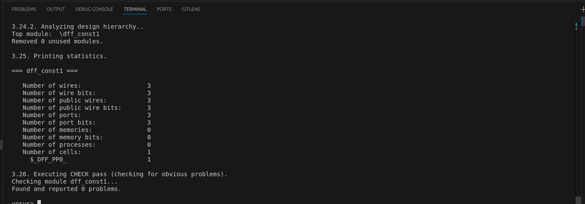<br>

Below screenshot shows the graphical representation of the synthesized design,
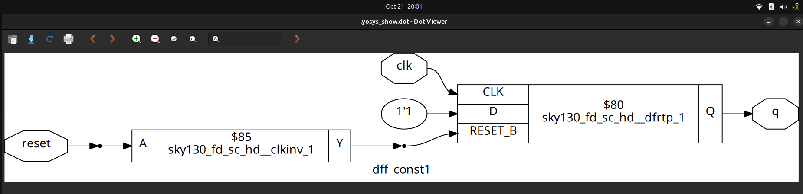<br>

Following is the generated netlist post successful synthesis,

<details>
<summary>
dff_const1_netlist.v
</summary>

```
/* Generated by Yosys 0.44+60 (git sha1 0fc5812dc, g++ 13.2.0-23ubuntu4 -fPIC -O3) */

module dff_const1(clk, reset, q);
  wire _0_;
  wire _1_;
  wire _2_;
  input clk;
  wire clk;
  output q;
  wire q;
  input reset;
  wire reset;
  sky130_fd_sc_hd__clkinv_1 _3_ (
    .A(_1_),
    .Y(_0_)
  );
  sky130_fd_sc_hd__dfrtp_1 _4_ (
    .CLK(clk),
    .D(1'h1),
    .Q(q),
    .RESET_B(_2_)
  );
  assign _1_ = reset;
  assign _2_ = _0_;
endmodule
```

</details>


#### dff_const2.v

To verify the working in iverilog and gtkwave, use the following commands,

```
iverilog verilog_files/dff_const2.v verilog_files/tb_dff_const2.v
./a.out
gtkwave tb_dff_const2.vcd
```
Below is the screenshot for the gtkwave window,

Following shows the graphical representation post synthesis,
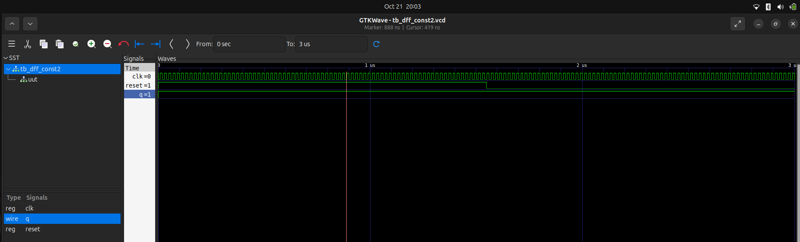<br>

Use the following commands to run the synthesis and get the netlist for the RTL design,

```
read_liberty -lib lib/sky130_fd_sc_hd__tt_025C_1v80.lib 
read_verilog verilog_files/dff_const2.v
synth -top dff_const2
dfflib -liberty lib/sky130_fd_sc_hd__tt_025C_1v80.lib
abc -liberty lib/sky130_fd_sc_hd__tt_025C_1v80.lib
show
write_verilog -noattr verilog_files/dff_const2_netlist.v
```

Post synthesis, following report shows which cells are being used to implement the RTL design,
Following shows the graphical representation post synthesis,
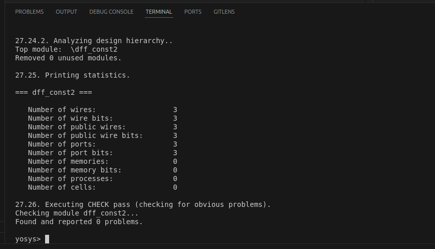<br>

Below screenshot shows the graphical representation of the synthesized design,
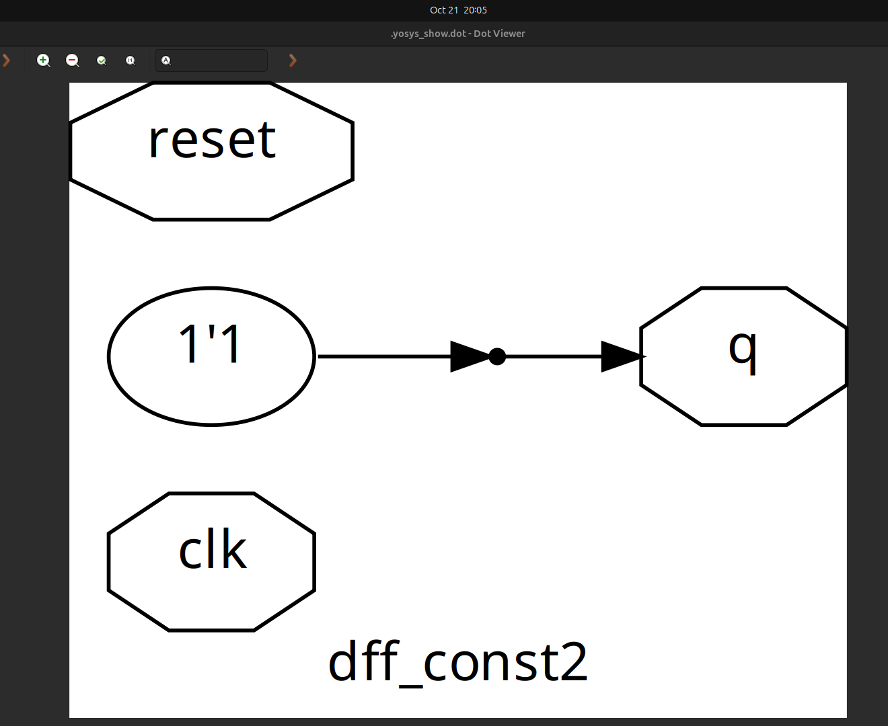<br>

Following is the generated netlist post successful synthesis,

<details>
<summary>
dff_const2_netlist.v
</summary>

```
/* Generated by Yosys 0.44+60 (git sha1 0fc5812dc, g++ 13.2.0-23ubuntu4 -fPIC -O3) */

module dff_const2(clk, reset, q);
  input clk;
  wire clk;
  output q;
  wire q;
  input reset;
  wire reset;
  assign q = 1'h1;
endmodule
```

</details>

#### dff_const3.v

To verify the working in iverilog and gtkwave, use the following commands,

```
iverilog verilog_files/dff_const3.v verilog_files/tb_dff_const3.v
./a.out
gtkwave tb_dff_const3.vcd
```
Below is the screenshot for the gtkwave window,

Following shows the graphical representation post synthesis,
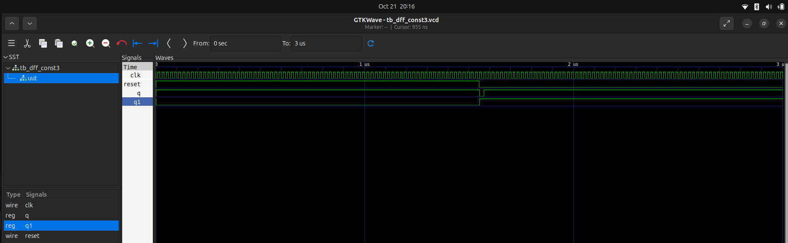<br>

Use the following commands to run the synthesis and get the netlist for the RTL design,

```
read_liberty -lib lib/sky130_fd_sc_hd__tt_025C_1v80.lib 
read_verilog verilog_files/dff_const3.v
synth -top dff_const3
dfflib -liberty lib/sky130_fd_sc_hd__tt_025C_1v80.lib
abc -liberty lib/sky130_fd_sc_hd__tt_025C_1v80.lib
show
write_verilog -noattr verilog_files/dff_const3_netlist.v
```

Post synthesis, following report shows which cells are being used to implement the RTL design,
Following shows the graphical representation post synthesis,
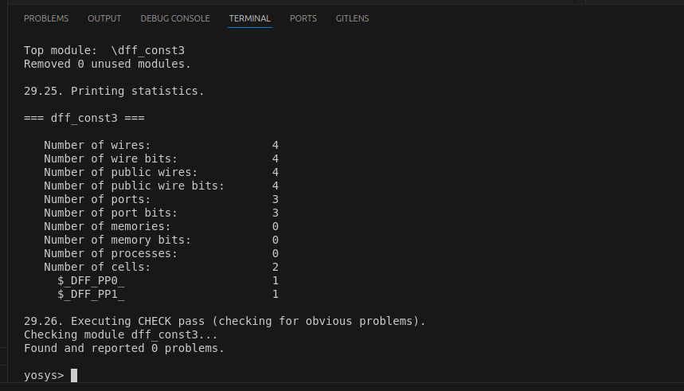<br>

Below screenshot shows the graphical representation of the synthesized design,
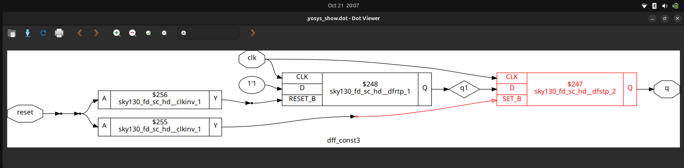<br>

Following is the generated netlist post successful synthesis,

<details>
<summary>
dff_const3_netlist.v
</summary>

```
/* Generated by Yosys 0.44+60 (git sha1 0fc5812dc, g++ 13.2.0-23ubuntu4 -fPIC -O3) */

module dff_const3(clk, reset, q);
  wire _0_;
  wire _1_;
  wire _2_;
  wire _3_;
  wire _4_;
  input clk;
  wire clk;
  output q;
  wire q;
  wire q1;
  input reset;
  wire reset;
  sky130_fd_sc_hd__clkinv_1 _5_ (
    .A(_2_),
    .Y(_0_)
  );
  sky130_fd_sc_hd__clkinv_1 _6_ (
    .A(_2_),
    .Y(_1_)
  );
  sky130_fd_sc_hd__dfstp_2 _7_ (
    .CLK(clk),
    .D(q1),
    .Q(q),
    .SET_B(_3_)
  );
  sky130_fd_sc_hd__dfrtp_1 _8_ (
    .CLK(clk),
    .D(1'h1),
    .Q(q1),
    .RESET_B(_4_)
  );
  assign _2_ = reset;
  assign _3_ = _0_;
  assign _4_ = _1_;
endmodule

```

</details>


#### dff_const4.v

To verify the working in iverilog and gtkwave, use the following commands,

```
iverilog verilog_files/dff_const4.v verilog_files/tb_dff_const4.v
./a.out
gtkwave tb_dff_const4.vcd
```
Below is the screenshot for the gtkwave window,

Following shows the graphical representation post synthesis,
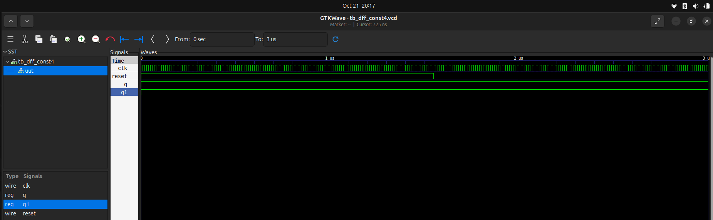<br>

Use the following commands to run the synthesis and get the netlist for the RTL design,

```
read_liberty -lib lib/sky130_fd_sc_hd__tt_025C_1v80.lib 
read_verilog verilog_files/dff_const4.v
synth -top dff_const4
dfflib -liberty lib/sky130_fd_sc_hd__tt_025C_1v80.lib
abc -liberty lib/sky130_fd_sc_hd__tt_025C_1v80.lib
show
write_verilog -noattr verilog_files/dff_const4_netlist.v
```

Post synthesis, following report shows which cells are being used to implement the RTL design,
Following shows the graphical representation post synthesis,
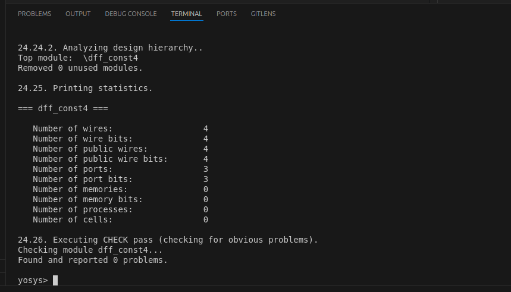<br>

Below screenshot shows the graphical representation of the synthesized design,
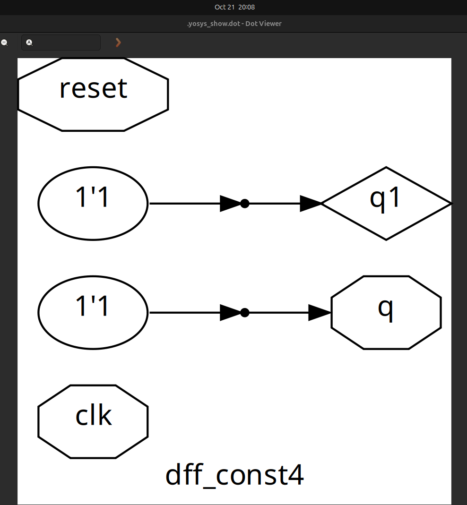<br>

Following is the generated netlist post successful synthesis,

<details>
<summary>
dff_const4_netlist.v
</summary>

```
/* Generated by Yosys 0.44+60 (git sha1 0fc5812dc, g++ 13.2.0-23ubuntu4 -fPIC -O3) */

module dff_const4(clk, reset, q);
  input clk;
  wire clk;
  output q;
  wire q;
  wire q1;
  input reset;
  wire reset;
  assign q = 1'h1;
  assign q1 = 1'h1;
endmodule
```

</details>

#### dff_const5.v

To verify the working in iverilog and gtkwave, use the following commands,

```
iverilog verilog_files/dff_const5.v verilog_files/tb_dff_const5.v
./a.out
gtkwave tb_dff_const5.vcd
```
Below is the screenshot for the gtkwave window,

Following shows the graphical representation post synthesis,
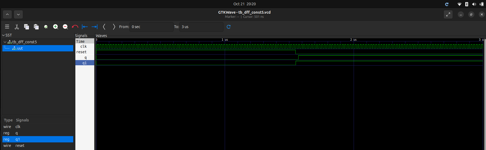<br>

Use the following commands to run the synthesis and get the netlist for the RTL design,

```
read_liberty -lib lib/sky130_fd_sc_hd__tt_025C_1v80.lib 
read_verilog verilog_files/dff_const5.v
synth -top dff_const5
dfflib -liberty lib/sky130_fd_sc_hd__tt_025C_1v80.lib
abc -liberty lib/sky130_fd_sc_hd__tt_025C_1v80.lib
show
write_verilog -noattr verilog_files/dff_const5_netlist.v
```

Post synthesis, following report shows which cells are being used to implement the RTL design,
Following shows the graphical representation post synthesis,
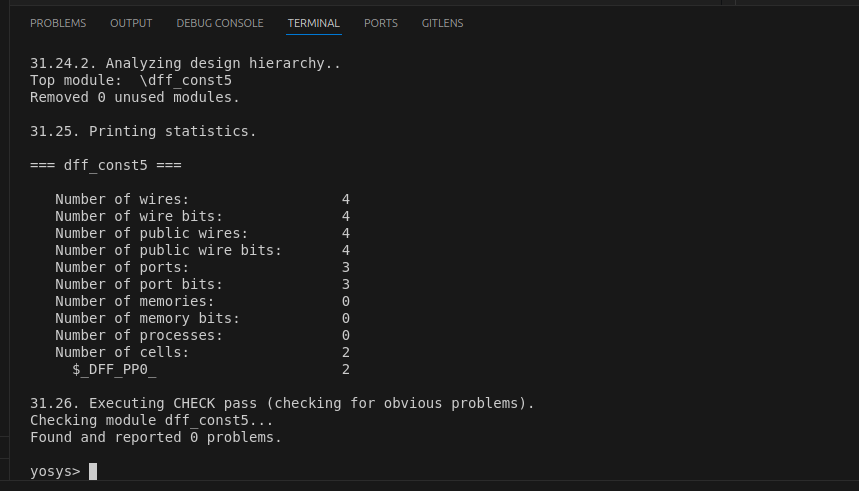<br>

Below screenshot shows the graphical representation of the synthesized design,
<br>

Following is the generated netlist post successful synthesis,

<details>
<summary>
dff_const5_netlist.v
</summary>

```
/* Generated by Yosys 0.44+60 (git sha1 0fc5812dc, g++ 13.2.0-23ubuntu4 -fPIC -O3) */

module dff_const5(clk, reset, q);
  wire _0_;
  wire _1_;
  wire _2_;
  wire _3_;
  wire _4_;
  input clk;
  wire clk;
  output q;
  wire q;
  wire q1;
  input reset;
  wire reset;
  sky130_fd_sc_hd__clkinv_1 _5_ (
    .A(_2_),
    .Y(_0_)
  );
  sky130_fd_sc_hd__clkinv_1 _6_ (
    .A(_2_),
    .Y(_1_)
  );
  sky130_fd_sc_hd__dfrtp_1 _7_ (
    .CLK(clk),
    .D(q1),
    .Q(q),
    .RESET_B(_3_)
  );
  sky130_fd_sc_hd__dfrtp_1 _8_ (
    .CLK(clk),
    .D(1'h1),
    .Q(q1),
    .RESET_B(_4_)
  );
  assign _2_ = reset;
  assign _3_ = _0_;
  assign _4_ = _1_;
endmodule
```

</details>

### Unused Output Optimizations

Unused Output Optimization involves strategies and techniques focused on minimizing or removing redundant or unnecessary outputs in processes, systems, or designs to improve efficiency and performance.

#### Synthesis of counter_opt.v

Below screenshot shows the synthesis report for the same,
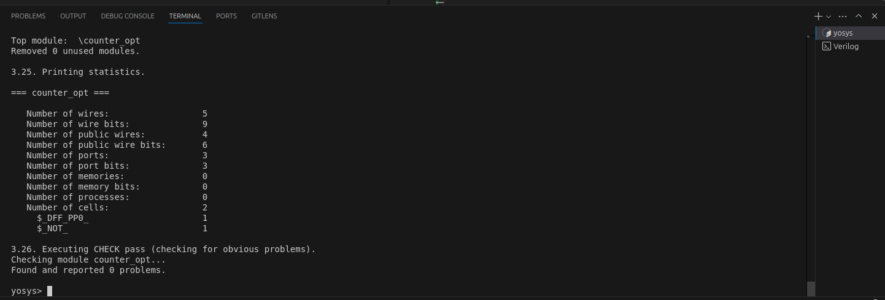<br>


Below screenshot shows the graphical representation of the synthesized design,
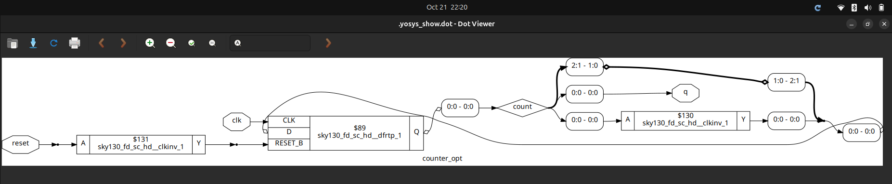<br>

<details>
<summary>
counter_opt_netlist.v
</summary>

```
/* Generated by Yosys 0.44+60 (git sha1 0fc5812dc, g++ 13.2.0-23ubuntu4 -fPIC -O3) */

module counter_opt(clk, reset, q);
  wire _0_;
  wire _1_;
  wire _2_;
  wire _3_;
  wire [2:0] _4_;
  wire _5_;
  input clk;
  wire clk;
  wire [2:0] count;
  output q;
  wire q;
  input reset;
  wire reset;
  sky130_fd_sc_hd__clkinv_1 _6_ (
    .A(_2_),
    .Y(_0_)
  );
  sky130_fd_sc_hd__clkinv_1 _7_ (
    .A(_3_),
    .Y(_1_)
  );
  sky130_fd_sc_hd__dfrtp_1 _8_ (
    .CLK(clk),
    .D(_4_[0]),
    .Q(count[0]),
    .RESET_B(_5_)
  );
  assign _4_[2:1] = count[2:1];
  assign q = count[0];
  assign _2_ = count[0];
  assign _4_[0] = _0_;
  assign _3_ = reset;
  assign _5_ = _1_;
endmodule
```

</details>


#### Synthesis of counter_opt2.v

Below screenshot shows the synthesis report for the same,
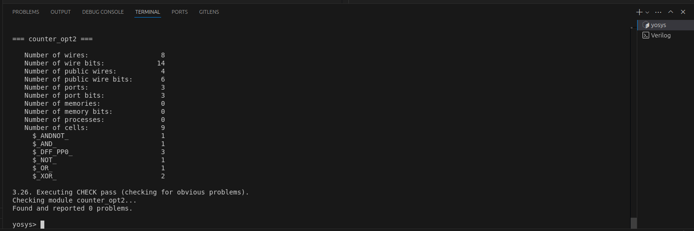<br>


Below screenshot shows the graphical representation of the synthesized design,
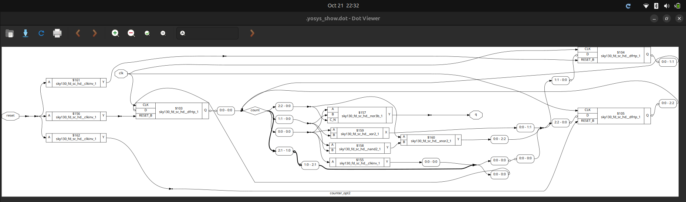<br>

<details>
<summary>
counter_opt2_netlist.v
</summary>

```
/* Generated by Yosys 0.44+60 (git sha1 0fc5812dc, g++ 13.2.0-23ubuntu4 -fPIC -O3) */

module counter_opt2(clk, reset, q);
  wire _00_;
  wire _01_;
  wire _02_;
  wire _03_;
  wire _04_;
  wire _05_;
  wire _06_;
  wire _07_;
  wire _08_;
  wire _09_;
  wire _10_;
  wire _11_;
  wire _12_;
  wire _13_;
  wire [2:0] _14_;
  wire [2:0] _15_;
  wire _16_;
  wire _17_;
  wire _18_;
  input clk;
  wire clk;
  wire [2:0] count;
  output q;
  wire q;
  input reset;
  wire reset;
  sky130_fd_sc_hd__clkinv_1 _19_ (
    .A(_08_),
    .Y(_02_)
  );
  sky130_fd_sc_hd__clkinv_1 _20_ (
    .A(_13_),
    .Y(_05_)
  );
  sky130_fd_sc_hd__nor3b_1 _21_ (
    .A(_08_),
    .B(_09_),
    .C_N(_10_),
    .Y(_12_)
  );
  sky130_fd_sc_hd__nand2_1 _22_ (
    .A(_08_),
    .B(_09_),
    .Y(_11_)
  );
  sky130_fd_sc_hd__xor2_1 _23_ (
    .A(_08_),
    .B(_09_),
    .X(_03_)
  );
  sky130_fd_sc_hd__xnor2_1 _24_ (
    .A(_10_),
    .B(_11_),
    .Y(_04_)
  );
  sky130_fd_sc_hd__clkinv_1 _25_ (
    .A(_13_),
    .Y(_06_)
  );
  sky130_fd_sc_hd__clkinv_1 _26_ (
    .A(_13_),
    .Y(_07_)
  );
  sky130_fd_sc_hd__dfrtp_1 _27_ (
    .CLK(clk),
    .D(_14_[0]),
    .Q(count[0]),
    .RESET_B(_16_)
  );
  sky130_fd_sc_hd__dfrtp_1 _28_ (
    .CLK(clk),
    .D(_15_[1]),
    .Q(count[1]),
    .RESET_B(_17_)
  );
  sky130_fd_sc_hd__dfrtp_1 _29_ (
    .CLK(clk),
    .D(_15_[2]),
    .Q(count[2]),
    .RESET_B(_18_)
  );
  assign _15_[0] = _14_[0];
  assign _14_[2:1] = count[2:1];
  assign _08_ = count[0];
  assign _14_[0] = _02_;
  assign _09_ = count[1];
  assign _10_ = count[2];
  assign q = _12_;
  assign _15_[1] = _03_;
  assign _15_[2] = _04_;
  assign _13_ = reset;
  assign _16_ = _05_;
  assign _17_ = _06_;
  assign _18_ = _07_;
endmodule
```

</details>

<a name="Lab11_7"></a>

## GLS, Blocking v/s Non-Blocking and Synthesis-Simulation Mismatch

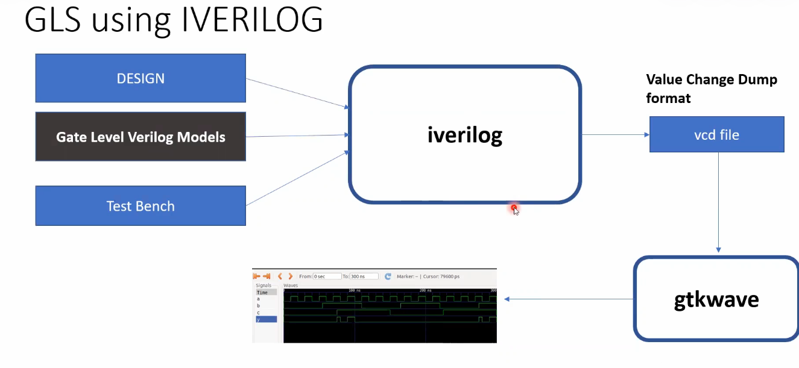<br>

### What is GLS?

* GLS stands for Gate Level Synthesis
* Use the same testbench with the synthesized gate level verilog code as the DUT.

### Why GLS?

* To verify logical correctness of the design post synthesis
* To ensure that the timing constraints are met

### Reasons for Synthesis Simulation Mismatch

* Missing Sensitivity List
* Blocking vs Non-blocking Assignments
* Non-standard verilog coding


### Synthesis Simulation Mismatch

#### ternary_operator_mux.v

Below is the simulation of the behaviour design using iverilog and gtkwave,

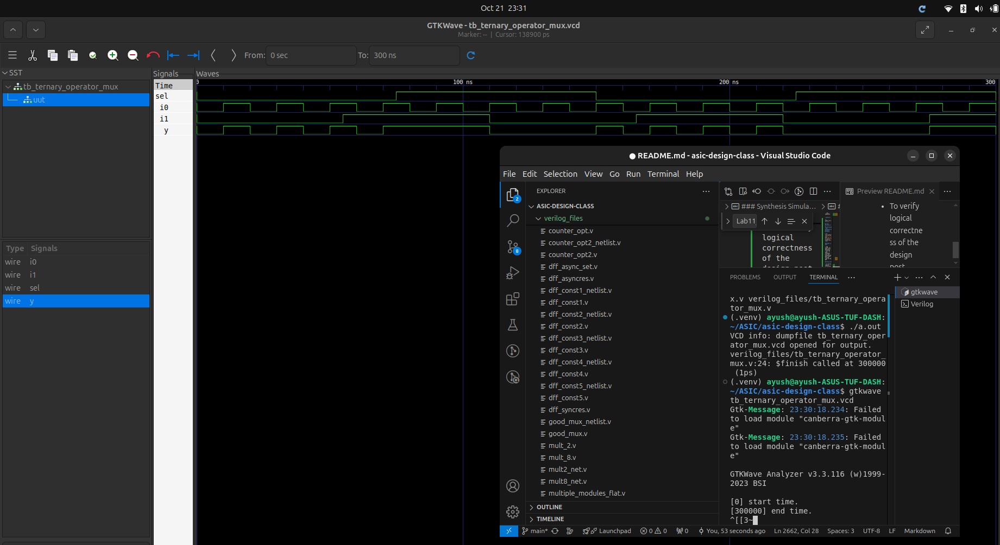<br>

Follow the below commands for Synthesis,

```
read_liberty -lib lib/sky130_fd_sc_hd__tt_025C_1v80.lib 
read_verilog verilog_files/ternary_operator_mux.v
synth -top ternary_operator_mux
abc -liberty lib/sky130_fd_sc_hd__tt_025C_1v80.lib
show
```

Following is the post synthesis report for the same design,

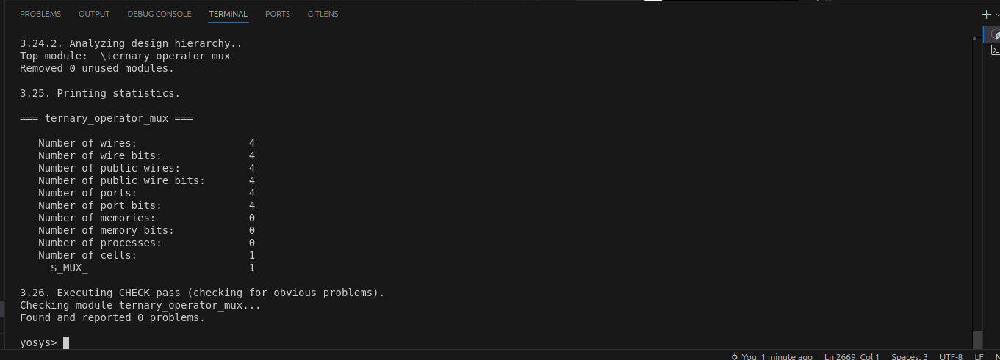<br>

In the below screenshot, we can observe the graphical representation of the synthesized design,

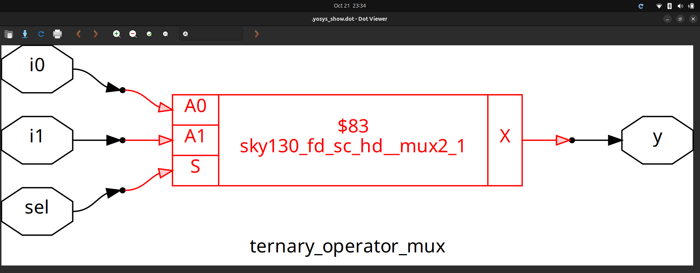<br>

<details>
<summary>
ternary_operator_mux.v
</summary>

```
/* Generated by Yosys 0.44+60 (git sha1 0fc5812dc, g++ 13.2.0-23ubuntu4 -fPIC -O3) */

module ternary_operator_mux(i0, i1, sel, y);
  wire _0_;
  wire _1_;
  wire _2_;
  wire _3_;
  input i0;
  wire i0;
  input i1;
  wire i1;
  input sel;
  wire sel;
  output y;
  wire y;
  sky130_fd_sc_hd__mux2_1 _4_ (
    .A0(_0_),
    .A1(_1_),
    .S(_2_),
    .X(_3_)
  );
  assign _0_ = i0;
  assign _1_ = i1;
  assign _2_ = sel;
  assign y = _3_;
endmodule
```

</details>

Below screenshot shows the simulation of the generated netlist with the same testbench,

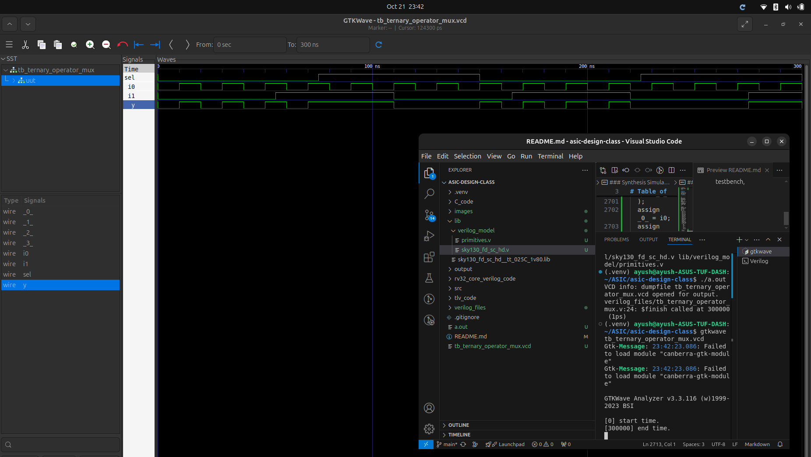<br>

#### good_mux.v

Below is the simulation of the behaviour design using iverilog and gtkwave,
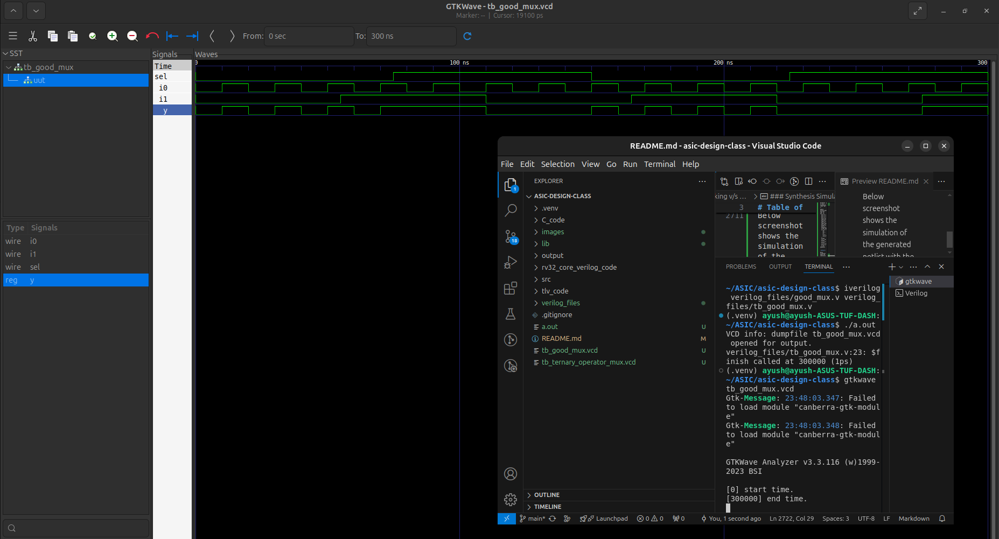<br>

Follow the below commands for Synthesis,

```
read_liberty -lib lib/sky130_fd_sc_hd__tt_025C_1v80.lib 
read_verilog verilog_files/good_mux.v
synth -top good_mux
abc -liberty lib/sky130_fd_sc_hd__tt_025C_1v80.lib
show
```

Following is the post synthesis report for the same design,
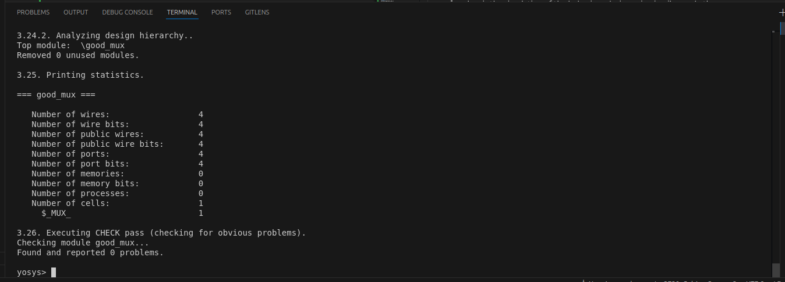<br>

In the below screenshot, we can observe the graphical representation of the synthesized design,
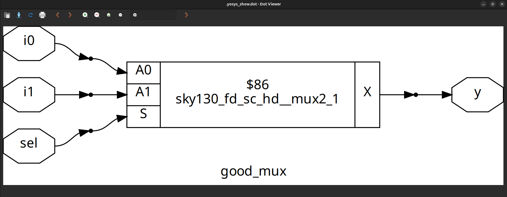<br>

<details>
<summary>
good_mux.v
</summary>

```
/* Generated by Yosys 0.44+60 (git sha1 0fc5812dc, g++ 13.2.0-23ubuntu4 -fPIC -O3) */

module good_mux(i0, i1, sel, y);
  wire _0_;
  wire _1_;
  wire _2_;
  wire _3_;
  input i0;
  wire i0;
  input i1;
  wire i1;
  input sel;
  wire sel;
  output y;
  wire y;
  sky130_fd_sc_hd__mux2_1 _4_ (
    .A0(_0_),
    .A1(_1_),
    .S(_2_),
    .X(_3_)
  );
  assign _0_ = i0;
  assign _1_ = i1;
  assign _2_ = sel;
  assign y = _3_;
endmodule
```

</details>

Below screenshot shows the simulation of the generated netlist with the same testbench,

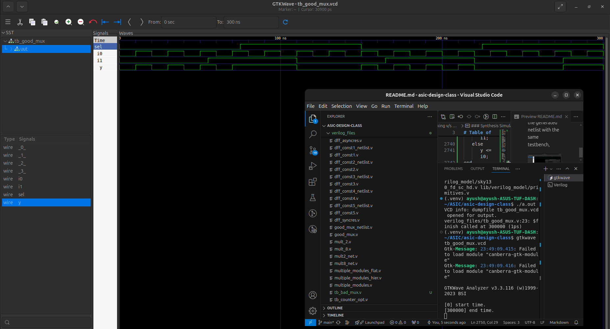<br>

#### bad_mux.v

Below is the simulation of the behaviour design using iverilog and gtkwave,
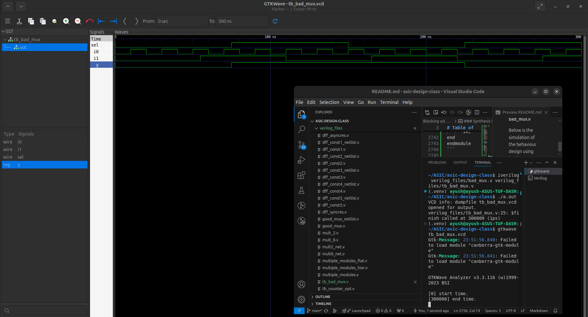<br>

Follow the below commands for Synthesis,

```
read_liberty -lib lib/sky130_fd_sc_hd__tt_025C_1v80.lib 
read_verilog verilog_files/bad_mux.v
synth -top bad_mux
abc -liberty lib/sky130_fd_sc_hd__tt_025C_1v80.lib
show
```

Following is the post synthesis report for the same design,
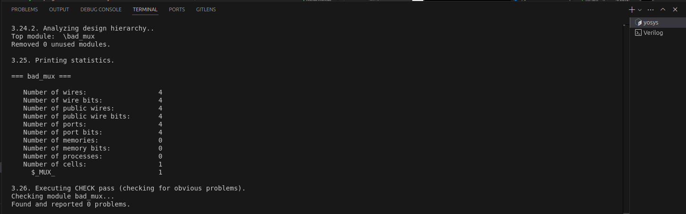<br>

In the below screenshot, we can observe the graphical representation of the synthesized design,
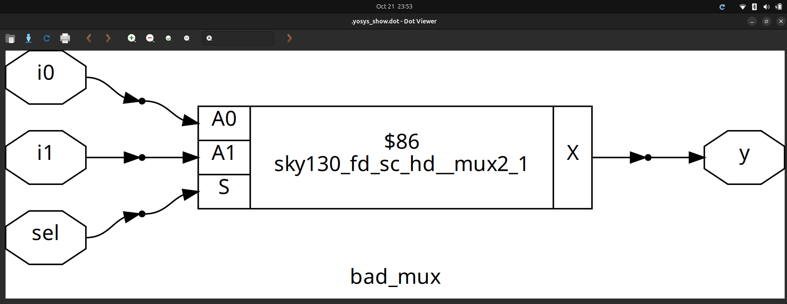<br>

<details>
<summary>
bad_mux.v
</summary>

```
/* Generated by Yosys 0.44+60 (git sha1 0fc5812dc, g++ 13.2.0-23ubuntu4 -fPIC -O3) */

module bad_mux(i0, i1, sel, y);
  wire _0_;
  wire _1_;
  wire _2_;
  wire _3_;
  input i0;
  wire i0;
  input i1;
  wire i1;
  input sel;
  wire sel;
  output y;
  wire y;
  sky130_fd_sc_hd__mux2_1 _4_ (
    .A0(_0_),
    .A1(_1_),
    .S(_2_),
    .X(_3_)
  );
  assign _0_ = i0;
  assign _1_ = i1;
  assign _2_ = sel;
  assign y = _3_;
endmodule
```

</details>

Below screenshot shows the simulation of the generated netlist with the same testbench,

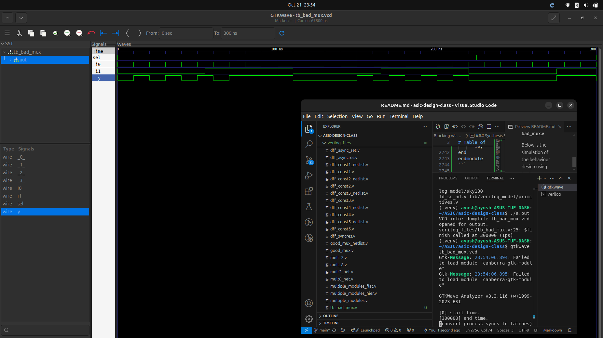<br>

### Simulation Mismatch for Blocking Statements

#### blocking_caveat.v

Follow the below commands to simulate the behavioural model using iverilog and gtkwave,

```
iverilog verilog_files/blocking_caveat.v verilog_files/tb_blocking_caveat.v
./a.out
gtkwave tb_blocking_caveat.vcd
```

Below is the simulation of the behaviour design using iverilog and gtkwave,
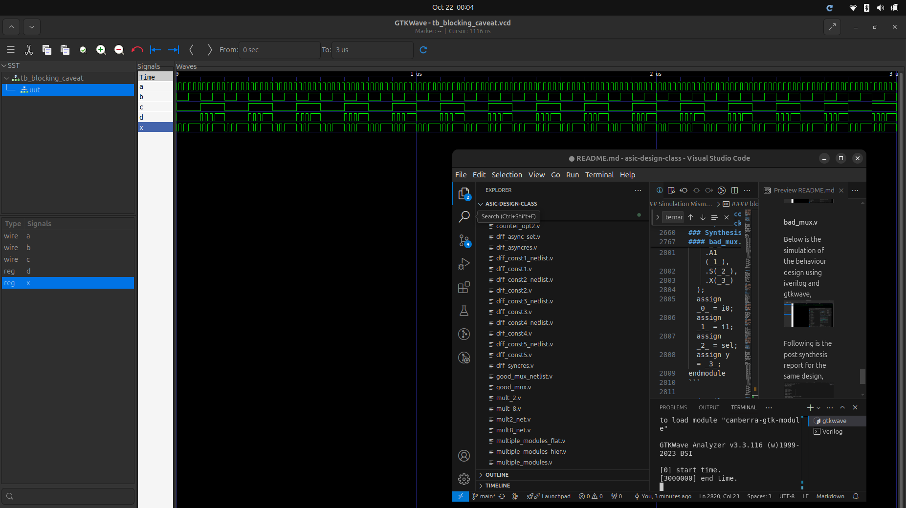<br>

Follow the below commands for Synthesis,

```
read_liberty -lib lib/sky130_fd_sc_hd__tt_025C_1v80.lib 
read_verilog verilog_files/blocking_caveat.v
synth -top blocking_caveat
abc -liberty lib/sky130_fd_sc_hd__tt_025C_1v80.lib
show
```

Following is the post synthesis report for the same design,
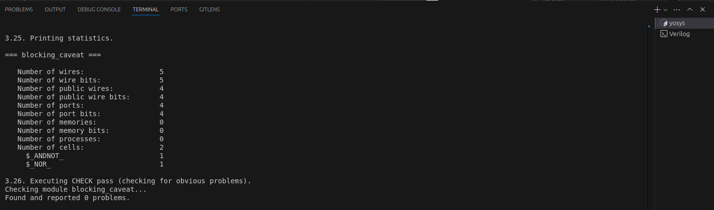<br>

In the below screenshot, we can observe the graphical representation of the synthesized design,
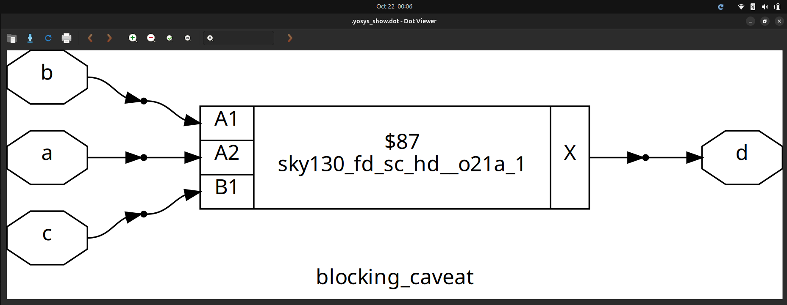<br>

<details>
<summary>
blocking_caveat.v
</summary>

```
/* Generated by Yosys 0.44+60 (git sha1 0fc5812dc, g++ 13.2.0-23ubuntu4 -fPIC -O3) */

module blocking_caveat(a, b, c, d);
  wire _0_;
  wire _1_;
  wire _2_;
  wire _3_;
  wire _4_;
  input a;
  wire a;
  input b;
  wire b;
  input c;
  wire c;
  output d;
  wire d;
  sky130_fd_sc_hd__o21a_1 _5_ (
    .A1(_2_),
    .A2(_1_),
    .B1(_3_),
    .X(_4_)
  );
  assign _2_ = b;
  assign _1_ = a;
  assign _3_ = c;
  assign d = _4_;
endmodule
```

</details>

Follow the below commands to simulate the GLS using iverilog and gtkwave,

```
iverilog verilog_files/blocking_caveat_netlist.v verilog_files/tb_blocking_caveat.v lib/verilog_model/primitives.v lib/verilog_model/sky130_fd_sc_hd.v

./a.out

gtkwave tb_blocking_caveat.vcd
```

Below screenshot shows the simulation of the generated netlist with the same testbench,

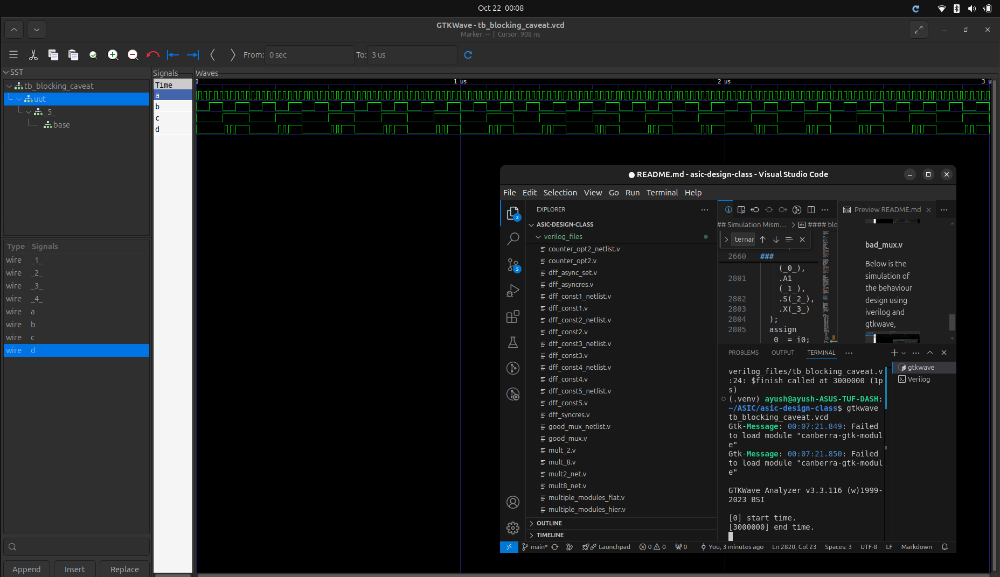<br>

</details>


---

<a name="Lab12"></a>

<details>
<summary>

Lab 12: Risc-V Core Synthesis using Yosys and Post Synthesis BabySoc Simulation

</summary>

In this task, we will synthesize our RISC-V core which was earlier designed in verilog HDL.

```
read_liberty -lib lib/sky130_fd_sc_hd__tt_025C_1v80.lib
read_verilog -I src/include/ -I src/module/ src/module/clk_gate.v src/module/RV_CPU.v
synth -top RV_CPU
dfflibmap -liberty lib/sky130_fd_sc_hd__tt_025C_1v80.lib
abc -liberty lib/sky130_fd_sc_hd__tt_025C_1v80.lib
write_verilog -noattr src/module/RV_CPU_netlist.v
```
Below screenshot shows the synthesis output report,

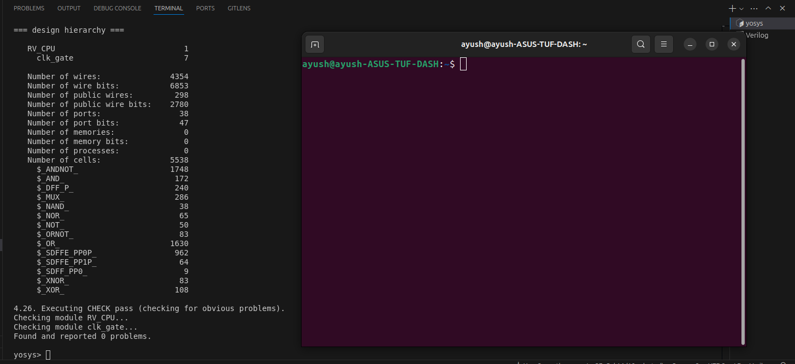<br>


<br>

After generating the netlist, we will be doing the gate level simulation with the BabySoC model. 

The BabySoC model will be having the gate level synthesized CPU core, DAC module and PLL module.

Following are the commands to compile using iverilog and waveform visualization using gtkwave,

```
iverilog -DFUNCTIONAL -DUNIT_DELAY=#1 -DPOST_SYNTH_SIM src/module/RV_CPU_tb.v -I src/module/ -I src/include/ -I lib/verilog_model/
./a.out
gtkwave post_synth_sim.vcd
```

Following screenshot shows the gate level synthesis simulation output in gtkwave,

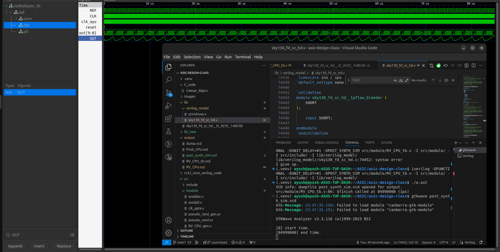<br>

Below screenshot shows the output waveform more zoomed-in,

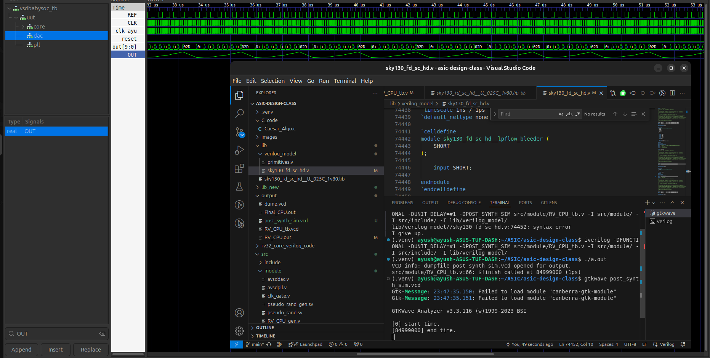<br>


If we compare the above waveforms with the pre synthesis waveforms, we can observe that the results are same.

Below is the screenshot which shows output waveform for simulation before synthesis,

<br>


Following screenshot shows some of the standard cells implemented in the synthesized verilog file,

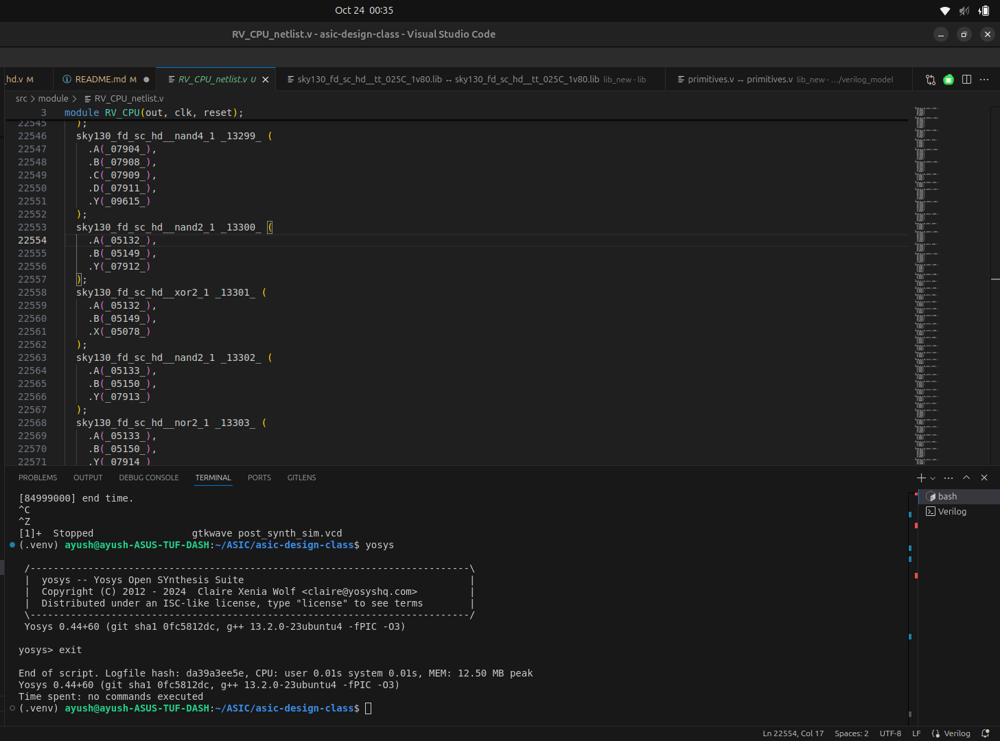<br>

Below screenshot shows the signals of a standard cell,

<br>

</details>

---


<a name="Lab13"></a>

<details>

<summary>
Lab 13: Static Timing Analysis for Synthesized VSDBabySoC using OpenSTA
</summary>


### What is STA?

Static Timing Analysis (STA) is a method used in digital circuit design to verify the timing performance of a circuit without requiring dynamic simulation. It checks whether the circuit meets its timing constraints by analyzing the timing paths in the design. Here are some key aspects of STA:

1. Timing Paths: STA evaluates all possible paths through a circuit from input to output, taking into account the propagation delays of gates and interconnects.

2. Setup and Hold Times: It checks for setup and hold time violations. The setup time is the minimum time before the clock edge that the input data must be stable, while the hold time is the minimum time after the clock edge that the data must remain stable.

3. Clock Constraints: STA incorporates clock definitions, including the clock frequency, period, and any variations (like skew or jitter).

4. Worst-case Scenario: STA assumes worst-case conditions for delay values (like maximum load, temperature, and voltage) to ensure that the circuit will perform correctly under all expected operating conditions.

5. Tools: There are various tools for performing STA, such as Synopsys PrimeTime, Cadence Tempus, and others, which automate the process and provide detailed reports on timing violations.

Overall, STA is crucial for ensuring that digital circuits operate reliably at the intended speeds and for identifying potential timing issues early in the design process.

### Why STA is performed ?

Static Timing Analysis (STA) is performed for several critical reasons in digital circuit design:

1. Timing Verification: STA ensures that the design meets its specified timing constraints. It verifies that data signals can propagate through the circuit within the required time limits, ensuring that outputs are stable and valid when needed.

2. Identify Timing Violations: It helps identify setup and hold time violations, which can lead to incorrect operation of flip-flops and other sequential elements. Detecting these violations is crucial to ensure the reliability of the circuit.

3. Performance Optimization: By analyzing the timing paths, designers can identify critical paths that limit the maximum operating frequency. This information can be used to optimize the design by resizing gates, adjusting the layout, or modifying the clock strategy.

4. Early Detection of Issues: STA allows for early detection of timing issues during the design process, reducing the risk of costly iterations and revisions in later stages, such as post-layout or during fabrication.

5. Power Consumption Analysis: Timing analysis can also help in understanding the impact of clock frequency on power consumption. By ensuring that the design runs at optimal speeds, designers can balance performance and power efficiency.

6. Design Validation: STA provides a level of assurance that the design will work correctly under the specified operating conditions. It validates the design against its intended specifications and requirements.

7. Automation: STA tools can automatically analyze complex designs, making it more efficient than traditional dynamic simulations, especially for large-scale integrated circuits.

8. Support for Variability: STA can incorporate variations in manufacturing processes, temperature, and voltage (PVT variations) to ensure robust performance across different conditions.

In summary, STA is essential for ensuring the functionality, reliability, and performance of digital circuits, enabling designers to create high-quality, efficient designs.

### What is reg2reg Path ?

A reg2reg path (register-to-register path) refers to a timing path in a digital circuit that connects two sequential elements, specifically flip-flops or registers. This path is crucial in the context of Static Timing Analysis (STA) because it represents the flow of data from one register to another through combinational logic.

Reg2reg paths are essential for ensuring proper data flow and synchronization in digital circuits, especially in designs with pipelining or sequential operations. Analyzing these paths helps in verifying that the data processing occurs correctly across clock cycles, thereby ensuring the overall functionality and reliability of the circuit.

#### Key characteristics of reg2reg Path

1. **Sequential Logic**: Reg2reg paths are part of sequential circuits where data is stored in registers and passed from one register to another after being processed by combinational logic.

2. **Setup and Hold Timing**:
   * **Hold Time**: Reg2reg paths are analyzed for setup time constraints to ensure that the data output from the first register (FF1) arrives at the second register (FF2) before the clock edge that triggers FF2.
   * **Hold Time**: These paths are also evaluated for hold time constraints to ensure that the data remains stable at the input of FF2 for a specified period after the clock edge that triggers FF1.

3. **Combinational Logic Delay**: The timing analysis of a reg2reg path includes the propagation delay through the combinational logic that connects the two registers. This delay can vary based on the logic elements and their configuration.

4. **Critical Paths**: Reg2reg paths can often be critical paths if they take longer than other paths in the design, which can limit the maximum operating frequency of the circuit.

5. **Path Analysis**: STA tools evaluate reg2reg paths to check for timing violations, allowing designers to optimize the circuit by adjusting the logic, resizing gates, or modifying the layout.

6. **Clock Domain Crossing**: If the two registers belong to different clock domains, additional considerations for metastability and synchronization are needed, which complicates the reg2reg timing analysis.

### What is clk2reg Path ?

A clk2reg path (clock-to-register path) refers to a timing path in a digital circuit that connects the clock signal to a register (flip-flop). This path is crucial for ensuring that the register operates correctly in response to clock events. Here are the key aspects of clk2reg paths:

1. **Clock Signal Propagation**: The clk2reg path represents the time it takes for the clock signal to reach the register from the clock source, including any delays introduced by clock buffers or routing.

2. **Setup Timing**: In the context of setup timing analysis, the clk2reg path is important for determining when the data signal must arrive at the register relative to the clock edge. The analysis ensures that the clock arrives at the register before the data input becomes stable, meeting the setup time requirement.

3. **Clock Delay**: This path is evaluated for the delay introduced by any clock distribution elements, such as buffers and inverters, that may be part of the clock tree. The total delay impacts the timing of when the register captures the input data.

4. **Critical Paths**: A clk2reg path can become a critical path if the delay through this path is significant enough to affect the maximum frequency of operation for the circuit.

5. **Hold Timing**: Although clk2reg paths are primarily associated with setup time analysis, they can also be relevant for hold time analysis, especially in cases where the clock signal may have some jitter or variations that could affect timing margins.

6. **Clock Diagram Crossing**: If the register is part of a different clock domain, the clk2reg analysis will also involve considerations for synchronization and potential metastability issues.

### STA for the synthesized VSDBabySoC

Here, in this activity we will be generating setup and hold timing reports for our Synthesized RISC-V Core module.

Following are the constraints provided to the STA tool as a sdc file to generate timing reports,

```
set_units -time ns

create_clock [get_pins {pll/CLK}] -name clk -period 10.35
set_clock_uncertainty [expr 0.05 * 10.35] -setup [get_clocks clk]
set_clock_uncertainty [expr 0.08 * 10.35] -hold [get_clocks clk]
set_clock_transition [expr 0.05 * 10.35] [get_clocks clk]
set_input_transition [expr 0.08 * 10.35] [all_inputs]
```

* The clock period has been specified as 10.35 ns.
* The setup uncertainity is 5% of the defined clock period
* The clock transition is defined as 5% of the defined clock period
* The hold uncertainity is set as 8% of the clock period
* The input data transition is set as 8% of the defined clock period

To execute the OpenSTA and obtain the timing reports, run the below command,

```
sta scripts/sta.conf
```

Following are contents of the **sta.conf** file,

```
read_liberty -min ./lib/sta/sky130_fd_sc_hd__tt_025C_1v80.lib
read_liberty -max ./lib/sta/sky130_fd_sc_hd__tt_025C_1v80.lib
read_liberty -min ./lib/avsdpll.lib
read_liberty -max ./lib/avsdpll.lib
read_liberty -min ./lib/avsddac.lib
read_liberty -max ./lib/avsddac.lib
read_verilog ./src/module/vsdbabysoc_synth.v
link_design vsdbabysoc
read_sdc ./src/sdc/sta_post_synth.sdc
```


In the below screenshot, we can observe the timing report for a reg2reg max path,

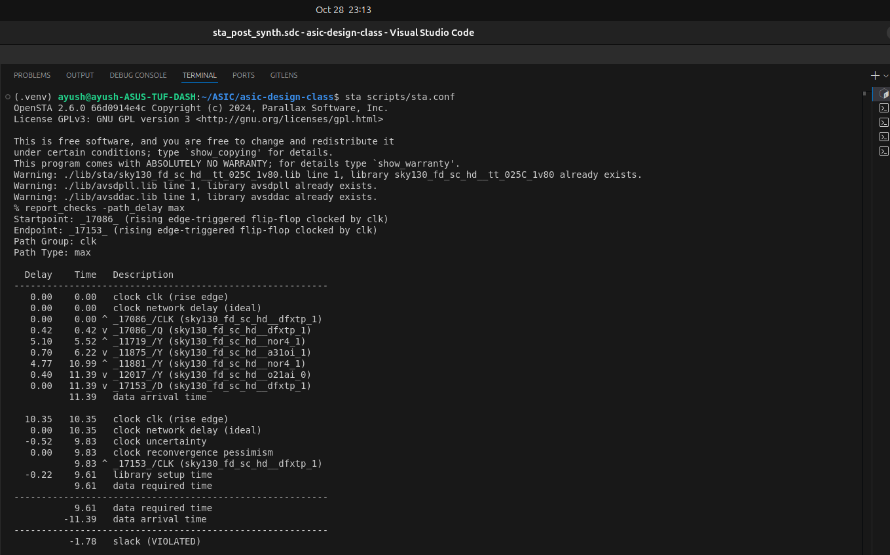<br>

Below screenshot shows the reg2reg min path report,

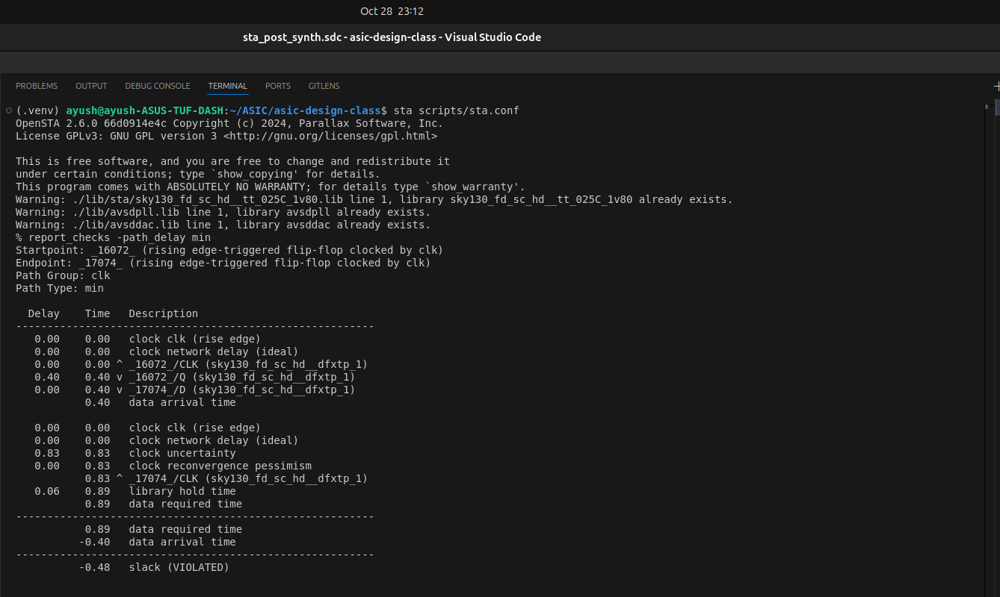<br>


The max path report is for the Setup Slack and the min path report is for the Hold Slack.

We can conclude that the timing constraints are not met for our design by observing the OpenSTA Timing reports.

</details>

---

<a name="Lab14"></a>


## Lab 14: PVT Corner Analysis for Synthesized VSDBabySoC using OpenSTA

Below are the contents of the constraint file,

```
set_units -time ns
set PERIOD 10.35
create_clock [get_pins {pll/CLK}] -name clk -period $PERIOD
set_clock_uncertainty [expr 0.05 * $PERIOD] -setup [get_clocks clk]
set_clock_uncertainty [expr 0.08 * $PERIOD] -hold [get_clocks clk]
set_clock_transition [expr 0.05 * $PERIOD] [get_clocks clk]


set_input_transition [expr $PERIOD * 0.08] [get_ports ENB_CP]
set_input_transition [expr $PERIOD * 0.08] [get_ports ENB_VCO]
set_input_transition [expr $PERIOD * 0.08] [get_ports REF]
set_input_transition [expr $PERIOD * 0.08] [get_ports VCO_IN]
set_input_transition [expr $PERIOD * 0.08] [get_ports VREFH]
```

Below are the contents of the tickle script used to automate the STA procedure for all the library files,

```
set list_of_lib_files(1) "sky130_fd_sc_hd__ff_100C_1v65.lib"
set list_of_lib_files(2) "sky130_fd_sc_hd__ff_100C_1v95.lib"
set list_of_lib_files(3) "sky130_fd_sc_hd__ff_n40C_1v56.lib"
set list_of_lib_files(4) "sky130_fd_sc_hd__ff_n40C_1v65.lib"
set list_of_lib_files(5) "sky130_fd_sc_hd__ff_n40C_1v76.lib"
set list_of_lib_files(6) "sky130_fd_sc_hd__ff_n40C_1v95.lib"
set list_of_lib_files(7) "sky130_fd_sc_hd__ss_100C_1v40.lib"
set list_of_lib_files(8) "sky130_fd_sc_hd__ss_100C_1v60.lib"
set list_of_lib_files(9) "sky130_fd_sc_hd__ss_n40C_1v28.lib"
set list_of_lib_files(10) "sky130_fd_sc_hd__ss_n40C_1v35.lib"
set list_of_lib_files(11) "sky130_fd_sc_hd__ss_n40C_1v40.lib"
set list_of_lib_files(12) "sky130_fd_sc_hd__ss_n40C_1v44.lib"
set list_of_lib_files(13) "sky130_fd_sc_hd__ss_n40C_1v60.lib"
set list_of_lib_files(14) "sky130_fd_sc_hd__ss_n40C_1v76.lib"
set list_of_lib_files(15) "sky130_fd_sc_hd__tt_025C_1v80.lib"
set list_of_lib_files(16) "sky130_fd_sc_hd__tt_100C_1v80.lib"

for {set i 1} {$i <= [array size list_of_lib_files]} {incr i} {
read_liberty -min ./lib/timing/$list_of_lib_files($i)
read_liberty -max ./lib/timing/$list_of_lib_files($i)
read_liberty -min ./lib/avsdpll.lib
read_liberty -max ./lib/avsdpll.lib
read_liberty -min ./lib/avsddac.lib
read_liberty -max ./lib/avsddac.lib
read_verilog ./src/module/vsdbabysoc_synth.v
link_design vsdbabysoc
current_design
read_sdc ./src/sdc/sta_post_synth.sdc
check_setup -verbose
report_checks -path_delay min_max -fields {nets cap slew input_pins fanout} -digits {4} > ./output/sta_output/min_max_$list_of_lib_files($i).txt

exec echo "$list_of_lib_files($i)" >> ./output/sta_output/sta_worst_max_slack.txt
report_worst_slack -max -digits {4} >> ./output/sta_output/sta_worst_max_slack.txt

exec echo "$list_of_lib_files($i)" >> ./output/sta_output/sta_worst_min_slack.txt
report_worst_slack -min -digits {4} >> ./output/sta_output/sta_worst_min_slack.txt

exec echo "$list_of_lib_files($i)" >> ./output/sta_output/sta_tns.txt
report_tns -digits {4} >> ./output/sta_output/sta_tns.txt

exec echo "$list_of_lib_files($i)" >> ./output/sta_output/sta_wns.txt
report_wns -digits {4} >> ./output/sta_output/sta_wns.txt
}
```

Now, to execute the tickle script, follow the below commands

```
sta
source scripts/sta_pvt.tcl
```

<br>

Below table shows the output for different library files,

<br>

<table border="1" class="dataframe">
  <thead>
    <tr style="text-align: right;">
      <th>Library File</th>
      <th>Total Negative Slack (TNS)</th>
      <th>Worst Negative Slack (WNS)</th>
      <th>Worst Setup Slack</th>
      <th>Worst Hold Slack</th>
    </tr>
  </thead>
  <tbody>
    <tr>
      <th>sky130_fd_sc_hd__ff_100C_1v65.lib</th>
      <td>0.0000</td>
      <td>0.0000</td>
      <td>1.2096</td>
      <td>-0.5468</td>
    </tr>
    <tr>
      <th>sky130_fd_sc_hd__ff_100C_1v95.lib</th>
      <td>0.0000</td>
      <td>0.0000</td>
      <td>3.5661</td>
      <td>-0.6055</td>
    </tr>
    <tr>
      <th>sky130_fd_sc_hd__ff_n40C_1v56.lib</th>
      <td>-459.7101</td>
      <td>-3.4574</td>
      <td>-3.4574</td>
      <td>-0.4861</td>
    </tr>
    <tr>
      <th>sky130_fd_sc_hd__ff_n40C_1v65.lib</th>
      <td>-44.7922</td>
      <td>-1.0120</td>
      <td>-1.0120</td>
      <td>-0.5264</td>
    </tr>
    <tr>
      <th>sky130_fd_sc_hd__ff_n40C_1v76.lib</th>
      <td>0.0000</td>
      <td>0.0000</td>
      <td>0.9883</td>
      <td>-0.5620</td>
    </tr>
    <tr>
      <th>sky130_fd_sc_hd__ff_n40C_1v95.lib</th>
      <td>0.0000</td>
      <td>0.0000</td>
      <td>3.0702</td>
      <td>-0.6047</td>
    </tr>
    <tr>
      <th>sky130_fd_sc_hd__ss_100C_1v40.lib</th>
      <td>-16574.8457</td>
      <td>-23.8885</td>
      <td>-23.8885</td>
      <td>0.1888</td>
    </tr>
    <tr>
      <th>sky130_fd_sc_hd__ss_100C_1v60.lib</th>
      <td>-7998.1904</td>
      <td>-12.5437</td>
      <td>-12.5437</td>
      <td>-0.0884</td>
    </tr>
    <tr>
      <th>sky130_fd_sc_hd__ss_n40C_1v28.lib</th>
      <td>-79316.2578</td>
      <td>-116.1608</td>
      <td>-116.1608</td>
      <td>1.0882</td>
    </tr>
    <tr>
      <th>sky130_fd_sc_hd__ss_n40C_1v35.lib</th>
      <td>-49235.1523</td>
      <td>-71.0647</td>
      <td>-71.0647</td>
      <td>0.6237</td>
    </tr>
    <tr>
      <th>sky130_fd_sc_hd__ss_n40C_1v40.lib</th>
      <td>-37474.4141</td>
      <td>-53.5693</td>
      <td>-53.5693</td>
      <td>0.4006</td>
    </tr>
    <tr>
      <th>sky130_fd_sc_hd__ss_n40C_1v44.lib</th>
      <td>-31499.4082</td>
      <td>-44.9233</td>
      <td>-44.9233</td>
      <td>0.2634</td>
    </tr>
    <tr>
      <th>sky130_fd_sc_hd__ss_n40C_1v60.lib</th>
      <td>-14843.1445</td>
      <td>-21.9157</td>
      <td>-21.9157</td>
      <td>-0.0671</td>
    </tr>
    <tr>
      <th>sky130_fd_sc_hd__ss_n40C_1v76.lib</th>
      <td>-8296.2363</td>
      <td>-12.9160</td>
      <td>-12.9160</td>
      <td>-0.2850</td>
    </tr>
    <tr>
      <th>sky130_fd_sc_hd__tt_025C_1v80.lib</th>
      <td>-104.8013</td>
      <td>-1.7810</td>
      <td>-1.7810</td>
      <td>-0.4840</td>
    </tr>
    <tr>
      <th>sky130_fd_sc_hd__tt_100C_1v80.lib</th>
      <td>-56.2416</td>
      <td>-1.0040</td>
      <td>-1.0040</td>
      <td>-0.4859</td>
    </tr>
  </tbody>
</table>

<br>

Following graph shows the worst negative slack measured for different library files,

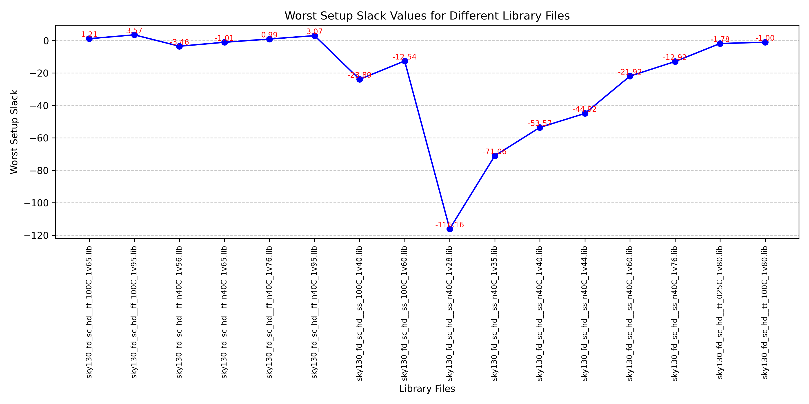<br>

Following graph shows the worst hold slack measured for different library files,

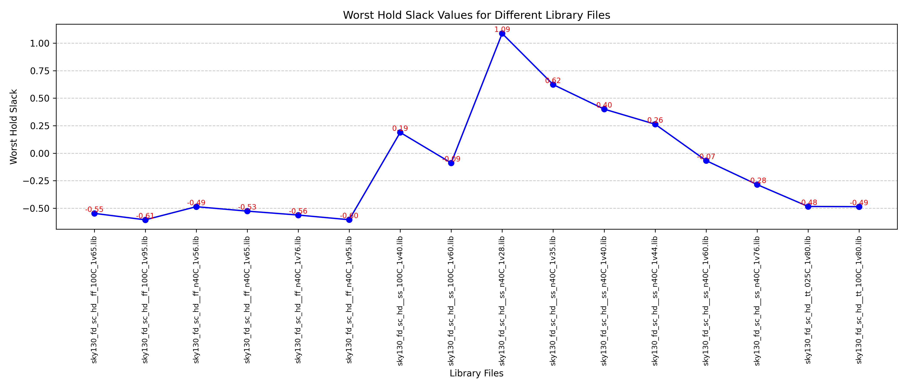<br>

Following graph shows the total negative slack measured for different library files,

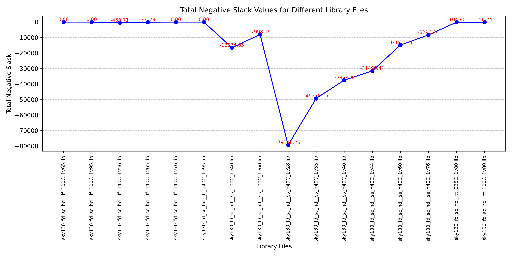<br>

Following graph shows the worst negative slack measured for different library files,

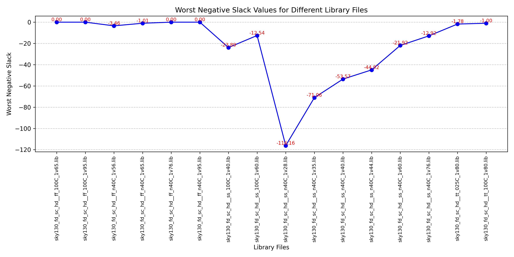<br>

---

<a name="Lab15"></a>


## Lab 15: Advanced Physical Design using OpenLane

### Day-1

<details>
<summary>Introduction</summary>

With the introduction of open-source technology for chip creation, many RTL designs and EDA Tools were made available for free. The Skywater 130nm PDK fills the gap in a whole Open source chip development from Skywater Technologies and Google.

There were a number of EDA Tools with distinct functions throughout the design cycle. The design flow was not clear, and the Skywater pdk was only compatible with industrial equipment.

These problems were addressed by [OpenLane](https://github.com/The-OpenROAD-Project/OpenLane), which offered a fully automated and tidy RTL to GDSII flow. OpenLane is not a product; rather, it is a flow made up of a number of EDA tools, automation scripts, and Skywater-pdks that have been optimized for use with open-source EDA tools.    
</details>

<details>
<summary> Overall Design Flow</summary>

An RTL design is created for a design specification using HDLs like Verilog or VHDL, or it can be created using high-level synthesis tools like SystemC, MATLAB HDL Coder, Bluespec, etc.

The process of converting the RTL Netlist into a manufactured IC then starts, and is known as the Physical Design Flow.

Floor planning, which entails placing preplaced cells, power planning, etc., comes first in the physical design process. The placement of logical synthesis comes next.

So that the clock's skew is at a minimal or under the necessary threshold, we now perform CTS (Clock Tree Synthesis). Following CTS, all of the assembled components are routed.

A process known as "Static Timing Analysis" is used between each and every step in the physical design flow, from logic synthesis through routing, to analyze the design at each stage and confirm that it is actually right.

Magic is an open source application to view the layouts for every stage. You can extract a tiny netlist, run a SPICE simulation, and compare the results with the post-layout Simulation using ngspice.

Physical Design begins with Floor planning - placing the preplaced cells, power planning etc., secondly Placement 

<br>
  
</details>

<details>
  <summary>OpenLane Flow</summary>

#### 1.  Synthesis 
The RTL Level Design is then synthesized using a Logic Synthesizer. We use Yosys which is an Open Source Logic Synthesizer. The RTL Netlist is then  converted into a synthesised netlist where there are details about the standard cells and its implementations. Yosys takes the RTL design and timing .libs and verilog models of standard cells and converts  into  a  RTL Netlist. abc does the tehnology mapping to the required skywater-pdk variants 

##### 1.1 Synthesis Strategies
Different strategies can be used to synthesize for the either the least area or the best timing. To analyse this, synthesis exploration utility generates a report showing the effect on delays/timing/area et.,

##### 1.2 Deign Exploration Utility 
This is used to suit the design configuration and generate reports with different metrics to select the best. This is also used for regression testing

##### 1.3 Design For Test - DFT Insertion
This is an optional step carried out by Fault. It is used to test the design 

#### 2. Floor Planning and Power Planning
This is done by OpenROAD flow. The macros and IPs are placed in the core before proceding further. This is called as pre-placement. Floor planning is done separately for the macros and it is called macro floor planning. They are placed in such a way that they are closer to the inputs/outputs/other macros where more connections are present. Then to prevent the loading effects de-coupling capacitors are placed so that the logic states are well within the noise margin. 

When several blocks tap power from a single source, there is a problem of Voltage Droop at the Vdd and Ground Bounce at the Vss which can again push the logic out of the required noise margin into the undefined state. To mitigate this Vdd and Vss are placed as horizontal and vertical strips in the chip so that the blocks can tap power from the nearest source. 

#### 3. Placement
There are two types of placement.  The other required logic is placed optimally.
Placement is of two steps
- Global Placement- finds the optimal position for each cells. These positions are not necessarly correct, cells may overlap
- Detialed Placement - After Global placement is done minimal alterations are done to correct the issues

#### 4. Clock Tree Synthesis 
To ensure minimum skew the Clock is routed optimally through the circuit using different algorithms. This is done in the OpenROAD flow. This is done by TritonCTS.

#### 5. Fake Antenna and diode swapping
Long wires acts as antennas and cause accumulation of charges during the fabrication process damaging the transistor. To avoid this bridging is used to pass the wire through different layers or an antenna diode cell is added to leak away the charges
- OpenLane approach - Insert Fake Diode to every cell input during placement. This matches the footprint of the library of the antenna diode. The Antenna Checker is run to check for violations, if there are violations then the fake diode is swapped with a real one.
- OpenROAD approach - In the global route step, the antenna violation is addressed automatically by inserting an antenan diode
OpenLane allows the user to chose either of the above approaches

####  5. Routing
This step is used to implement the interconnect using the different metal layers specified in the PDK. There are two steps

 - Global Routing - This is done inside the OpenROAD flow (FastRoute)
 - Detailed Routing - This is performed using TritonRoute outside the OpenROAD flow after the global routing. Before performing this step the **Logic Equivalence Check** is performed by Yosys, since OpenROAD does some optimisations the circuit.  

#### 6. RC Extraction
From the .def file, the parasitic extraction is done to generate the .spef file (Standard Prasitic Exchange Format) which produces an accurate analog model of the circuit by including the parasitic effects due to wires, parasitic capacitances, etc.,

#### 7. STA
At this stage again OpenSTA is used to perform the Static Timing Analysis.  

#### 8. Sign-off Steps
- Design Rule Check (DRC) is performed by Magic
- Layout Versus Schematic (LVS) is performed by Netgen

#### 9. GDSII Extraction
The routed .def file is used my Magic to generate the GDSII file

</details>

<details>
<summary>Execution of 'picorv32a' using OpenLane flow</summary>

Follow the below commands to execute the OpenLane synthesis and floorplan flow,

```
docker
package require openlane 0.9
prep -design picorv32a
./flow.tcl -interactive
run_synthesis
```

OpenLane invokes the following

- `Yosys` - RTL Synthesis and maps to yosys generic cells
- `abc` - Technology mapping with the Skywater130 PDK. Here `sky130_fd_sc_hd` Skywater Foundry produced High density standard cells are used.
- `OpenSTA` - This does the Static Timing Analysis on the netlist generated after synthesis and generated the timing reports 

View the synthesis statistics

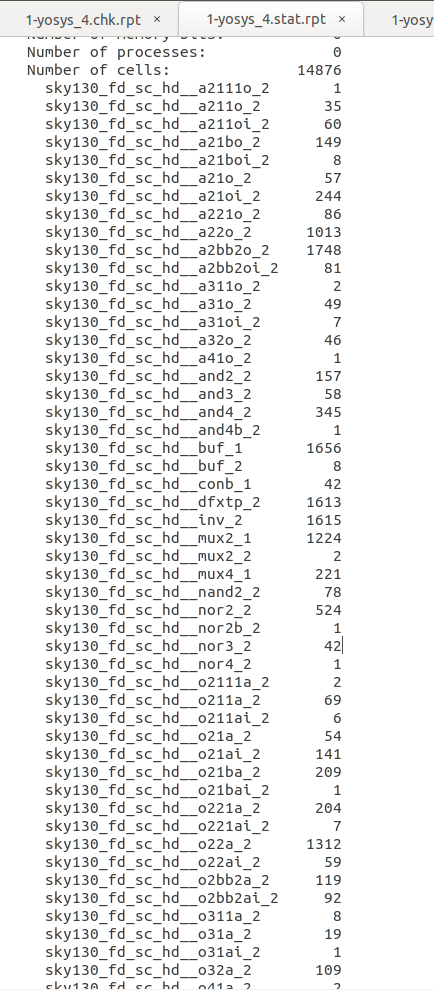<br>

##### Key concepts

###### Flops ratio 

- The flop ratio is defined as the ratio of the number of flops to the total number of cells
- Here flop ratio is **1613/14876 = 0.1084** (i.e: 10.84%) [From the synthesis statistics]

</details>

### Day-2: Good floorplan vs. Bad floorplan and introduction to library cells

<details>
<summary>Chip Floor Planning Consideration</summary>
  
#### Utilisation Factor

- The ratio of area occupied by the cells in the netlist to the total area of the core
- Best practice is to set the utilisation factor less than 50% so that there will be space for optimisations, routing, inserting buffers etc.,

#### Aspect Ratio

- Aspect ratio is the ratio of height to the width of the die.
- Aspect Ratio of 1 indicates that the die is a square die

#### Floorplanning

Floorplanning involves the following stages

#### Pre-Placed cells

- Whenever there is a complex logic which is repeated multiple times or a design given by a third-party it can be perceived as abstract black box with input and output ports, clocks etc ., 
- These modules can be either macros or IP
    - Macro  - It is a module such as CPU Core which are developed by the entity fabicating the chip
    - IP - It is an "Intellectual Propertly" which the entity fabricating the chip gets as a package from a third party or even packaged Hard IPs developed by the same entity. Common examples of IPs are SRAM, PLL, Protocol Converters etc.,

- These Macros and IPs are placed in the core at first before placing the standard cells  and power planning
- These are optimally such that the cells which are more connected to each other are placed nearby and oriented for input and ouputs

#### Decoupling Capacitors to the pre placed cells
- The power lines can have some RLC component causing the voltage to drop at the node where it enters the Blocks or the ground of the cell can be at a higher potential than ideally 0V
- When this happens, there is a chance such that the logic transitions are not to the upper or lower noise margins but to the forbidden state causing the circuit to misbehave
- This is prevented by adding a capacitor in parallel with the power and ground node of the block such that the capacitor decouples the block from the power source whenever there is a logic transition

#### Power Planning

- When there are several cells or blocks drawing power from the same power rail and sinking power to the same ground pin the following effects are observed
    - Whenever there is alogic transition from 1 to 0 in a large number of cells then there is a Voltage Droop in the power lines as Voltage Drops from Vdd
    - Whener there is a logic transition from 0 to 1 in a large number of cells simultaneously causes the ground potential to raise above 0V calles as Ground Bump
    - These effects pose a risk of driving the logic state out of the specified noise margin.
    - To avoid this the Vdd and Gnd are placed as a grid of horizontal and vertical tracks and the cell nearer to an intersection can tap power or sink power to the Vdd or Gnd intersection respectively

#### Pin Placement
 - The input, output and Clock pins are placed optimally such that there is less complication in routing or optimised delay
 - There are different styles of pin placement in openlane like `random pin placement` , `uniformly spaced` etc.,

</details>

<details>

<summary>Floorplan run on OpenLANE & review layout in Magic</summary>

**Floorplan envrionment variables or switches:**
1. ```FP_CORE_UTIL``` - core utilization percentage
2. ```FP_ASPECT_RATIO``` - the cores aspect ratio
3. ```FP_CORE_MARGIN``` - The length of the margin surrounding the core area
4. ```FP_IO_MODE``` - defines pin configurations around the core(1 = randomly equidistant/0 = not equidistant)
5. ```FP_CORE_VMETAL``` - vertical metal layer where I/O pins are placed
6. ```FP_CORE_HMETAL``` - horizontal metal layer where I/O pins are placed
 
***Note: Usually, the parameter values for vertical metal layer and horizontal metal layer will be 1 more than that specified in the files***

**Importance files in increasing priority order:**
1. ```floorplan.tcl``` - System default settings
2. ```config.tcl```
3. ```sky130A_sky130_fd_sc_hd_config.tcl```
 
 To run the picorv32a floorplan in openLANE:
 
 ```
 run_floorplan
 
 ```

Post the floorplan run, a .def file will have been created within the ```results/floorplan``` directory. We may review floorplan files by checking the ```floorplan.tcl.``` The system defaults will have been overriden by switches set in conifg.tcl and further overriden by switches set in ```sky130A_sky130_fd_sc_hd_config.tcl.```

To view the floorplan, Magic is invoked after moving to the results/floorplan directory:


```
magic -T /home/vsduser/Desktop/work/tools/openlane_working_dir/pdks/sky130A/libs.tech/magic/sky130A.tech lef read ../../tmp/merged.lef def read picorv32a.floorplan.def

```

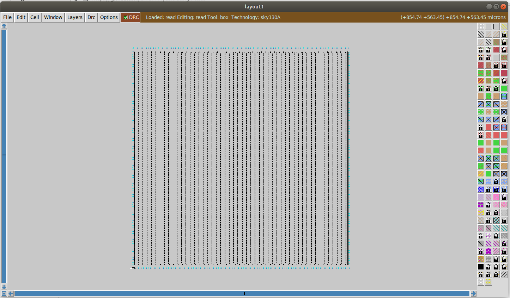<br>

One can zoom into Magic layout by selecting an area with left and right mouse click followed by pressing "z" key.

Various components can be identified by using the what command in tkcon window after making a selection on the component.

Zooming in also provides a view of decaps present in picorv32a chip.

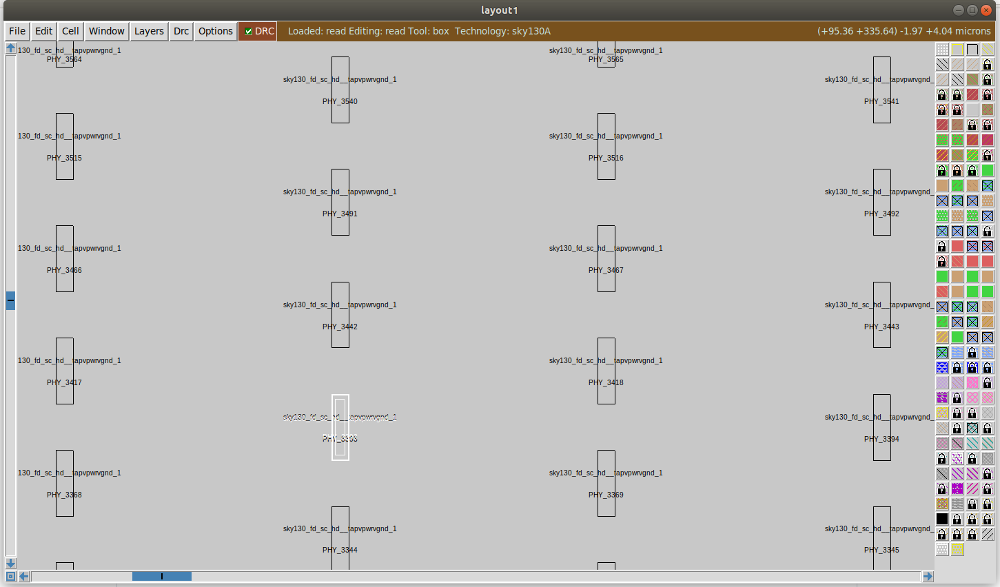<br>

The standard cell can be found at the bottom left corner.

You can clearly see I/O pins, Decap cells and Tap cells. Tap cells are placed in a zig zag manner or you can say diagonally


**Floorplaning DEF**

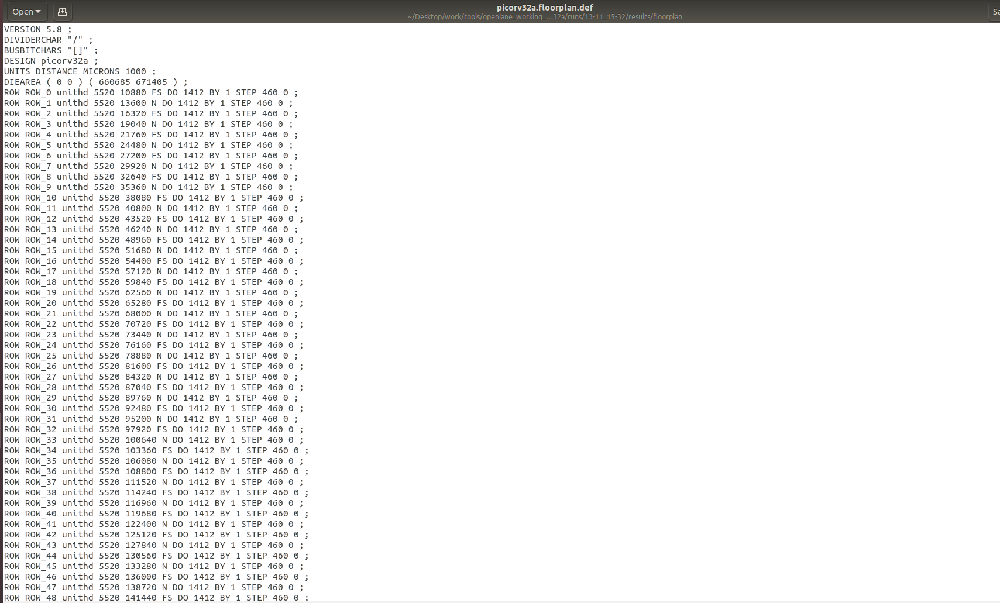<br>

According to floorplan def 1000 Unit Distance = 1 micron Die width in unit distance

= 660685 − 0

= 660685 Die height in unit distance = 671405 − 0

= 671405 Distance in microns

= Value in unit distance / 1000 Die width in microns

= 660685/1000 = 660.685 microns Die height in microns

= 671405/1000 = 671.405 microns Are os die in microns

= 660.685 ∗ 671.405 = 443587.212425 square microns
  

**Power Planing DEF**

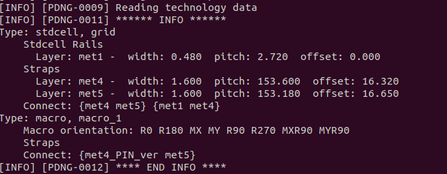<br>

#### Placement

Placement in ASIC design is the step where standard cells (like logic gates and flip-flops) are positioned on the chip layout based on the floorplan. This stage directly affects the chip’s performance, timing, area, and power efficiency. Placement can be divided into two main stages: global placement and detailed placement.

-> Congestion aware placement

Congestion-aware placement refers to the process of positioning cells on the chip layout while considering potential routing congestion. The goal is to place cells in such a way that the interconnects (wires) connecting them can be routed efficiently, without excessive overlap or interference that could lead to design rule violations, signal delays, or even physical errors.

-> Timing aware placement

Timing-aware placement focuses on ensuring that the cells are placed in a way that optimizes the chip’s timing performance. The objective is to minimize the delay along critical signal paths (often referred to as critical paths) to meet the required timing constraints (setup and hold times).


-> Command
```ruby
# Congestion aware placement by default
run_placement
```

-> Opening the DEF file

```ruby
# path containing generated placement def
cd Desktop/work/tools/openlane_working_dir/openlane/designs/picorv32a/runs/<your_path>/results/placement/

# Command to load the placement def in magic tool
magic -T /home/vsduser/Desktop/work/tools/openlane_working_dir/pdks/sky130A/libs.tech/magic/sky130A.tech lef read ../../tmp/merged.lef def read picorv32a.placement.def &
```


-> Legalized placement of standard cells

we can see the power rails for standard cells as well as the legalized placed standard cells


</details>


### Day-3

<details>

<summary> Introduction to VSD Inverter and Layout Visualization using Magic Tool </summary>

Following are the steps to clone the VSD Std. Cell Design Repo and view the layout of the inverter using magic tool,

```
git clone https://github.com/nickson-jose/vsdstdcelldesign.git
cd vsdstdcelldesign
cp /home/vsduser/Desktop/work/tools/openlane_working_dir/pdks/sky130A/libs.tech/magic/sky130A.tech .
magic -T sky130A.tech sky130_ayush_inv.mag &
```

Below screenshot shows the layout of the inverter,

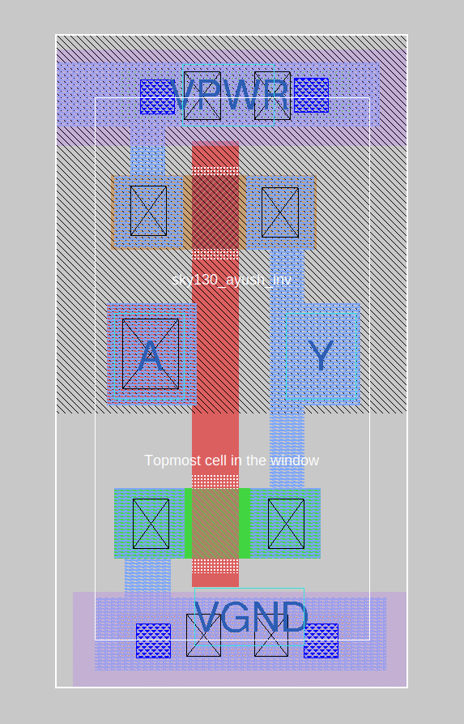<br>


Follow the below commands in the magic tool tkcon window to extract the custom inverter layout into spice netlist,

```
pwd
extract all
ext2spice cthresh 0 rthresh 0
ext2spice
```

Below screenshot shows the extracted spice parameters,

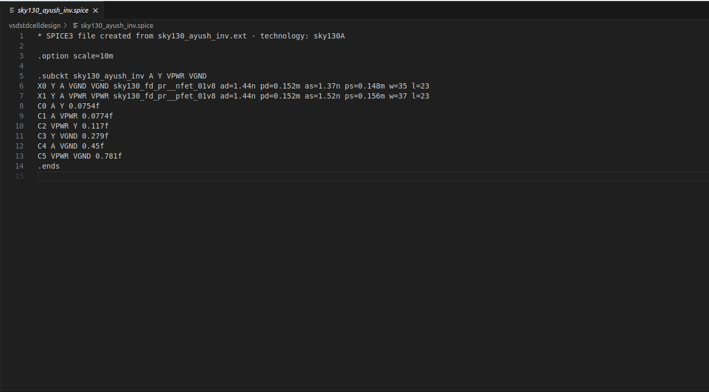<br>

</details>


<details>
  <summary>Inception of Layout and CMOS Fabrication Process </summary>

  #### 16-Mask CMOS Fabrication

  16-Mask CMOS Fabrication encompasses several critical phases for crafting integrated circuits.<br />

  1. Substrate Selection.<br />
       This is the most initial phase of the process where the subrstrate is chosen.Here we are chosing a p-substrate.<br />
<br>

  2. Active region creation.<br />
      This is done to isolate the active regions for transistors, the process begins with the deposition of SiO2 and Si3N4 layers, followed by photolithography and silicon nitride etching.This is also known as LOCOS (Local Oxidation of Silicon),where oxide is grown in certain regions. The Si3N4 layer is removed using hot H2SO4.<br />
      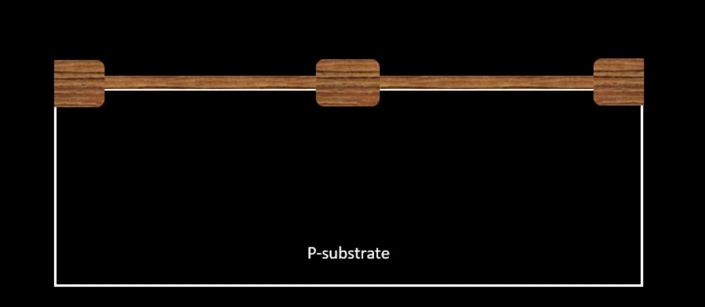<br>

  3. N-Well and P-Well Formation.<br />
     The N-well and P-well regions are created separately.Ion implanation by Boron for P-well and by Phosphorous for N-well formation.High-temperature furnace processes drive-in diffusion to establish well depths, known as the tub process.<br />
     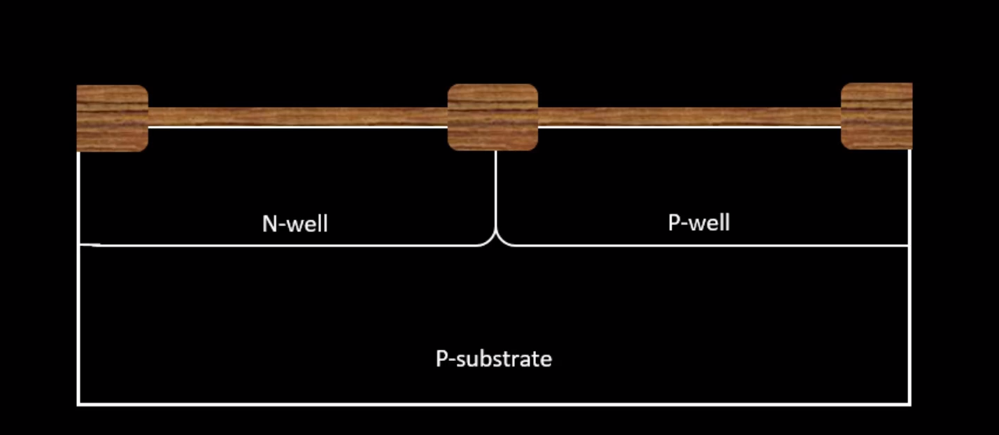<br>

  4. Gate Formation.<br />
     The gate is a very important CMOS transistor terminal that controls threshold voltages for transistor switching. NMOS and PMOS gates formed by photolithography techniques.Important parameters for gate formation include oxide capacitance and doping concentration.<br />
     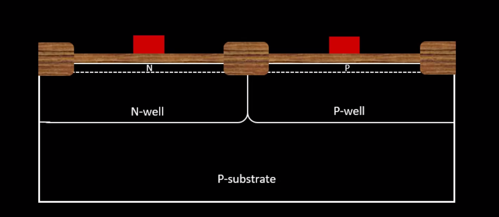<br>


  5. Lightly dopped Drain(LDD).<br />
     LDD formed to avoid the hot electron effect.<br />
    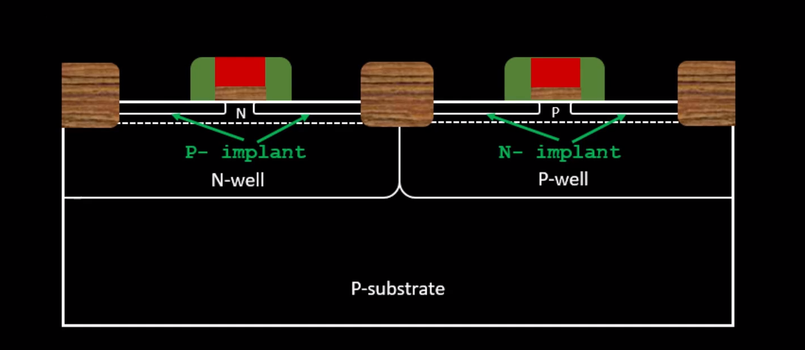<br>


  6. Source and Drain Formation.<br />
      Screen oxide added to avoid channelling during implants followed by Aresenic implantation and high temperature annealing.<br />
    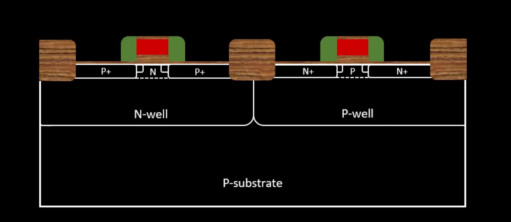<br>

  7. Local Interconnect Formation.<br />
     Removal of screen oxide by HF etching and deposition of Ti for low resistant contacts is done.Heat treatment results in chemical reactions, producing low-resistant titanium silicon dioxide for interconnect contacts and titanium nitride for top-level connections, enabling local communication.
     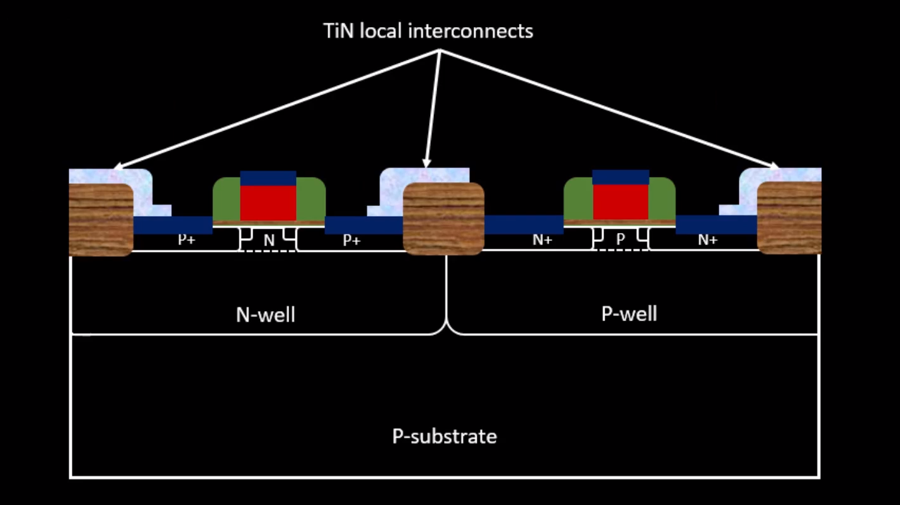<br>

  8. Higher Level Metal Formation.<br />
     Chemical Mechanical Polishing (CMP) is utilized by doping silicon oxide with Boron or Phosphorus to achieve surface planarization.This is followed up by TiN and Tungsten deposition.An aluminum (Al) layer is added and subjected to photolithography and CMP.This is the first interconnect and addditional interconnect layers can be added on top to reach higher level of metal layers.<br />
     At the end a dielectric layer usually Si3N4 is added ontop to protect the chip.<br />
     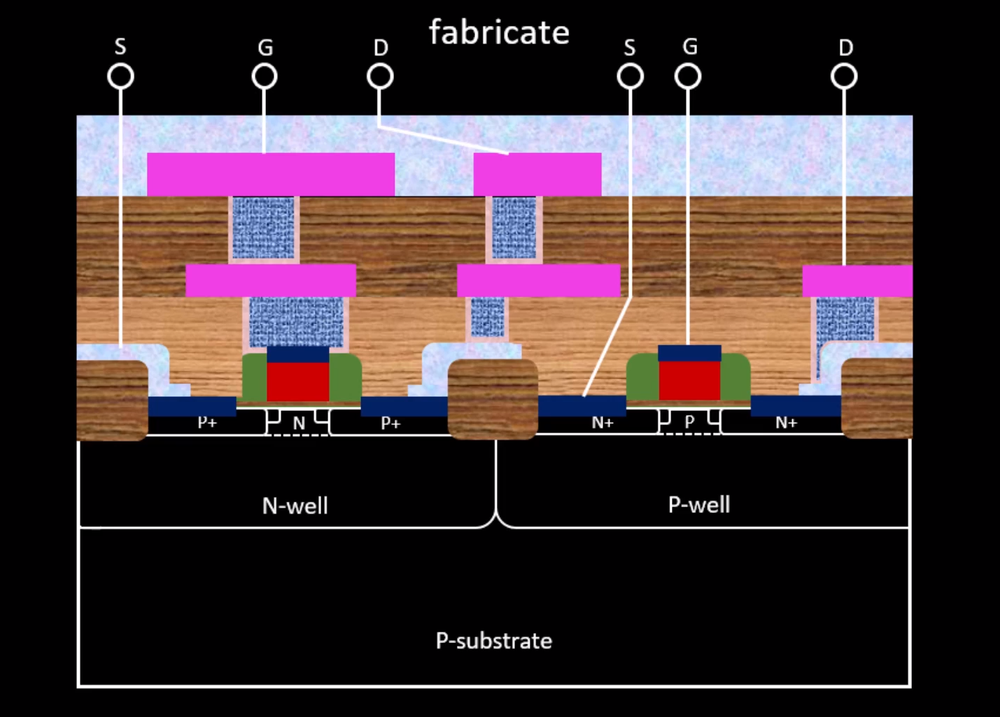<br>

</details>

<details>
<summary>Complete SPICE Deck for Inverter</summary>

Here we go into the created spice file and make changes to it and simulate.<br />
  In the spicefile the nmos and pmos model details were defined along with the sub circuit details and the other parasitic capacitance information also.<br />

  We are going to be doing a transient analysis so we make the following changes to it.<br />
  1. VGND to VSS 0V
  2. Supply voltage VPWR to GND.
  3. Sweeping a pulse input.
  4. We add library files and change the scale to 0.01u
  5. Add a transient analysis with nessasary stoptime and precision as shown below.

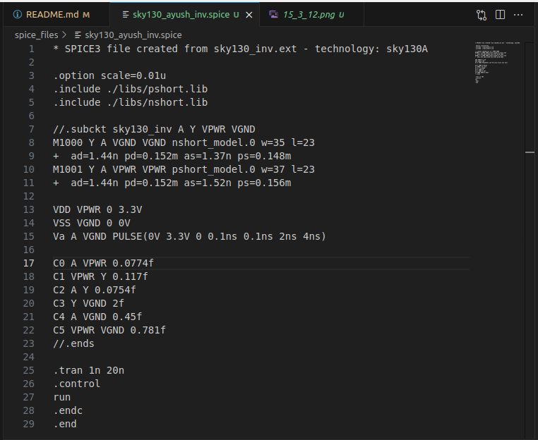<br>

Following is the command to execute the Spice deck using the Ngspice software

```
ngspice spice_files/sky130_ayush_inv.spice
```

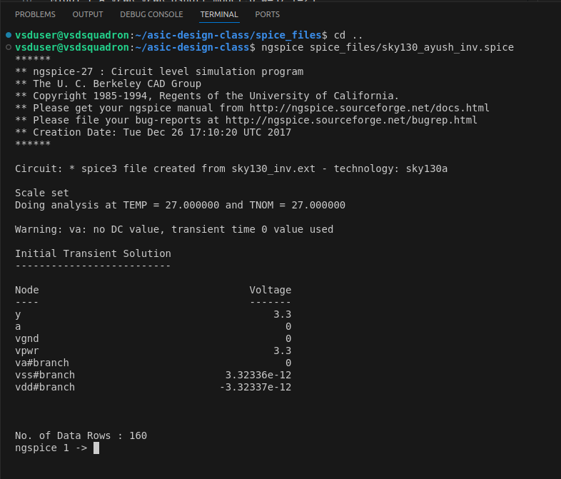<br>

Following commmand is to see the waveform for the transient analysis,

```
plot y vs time a
```
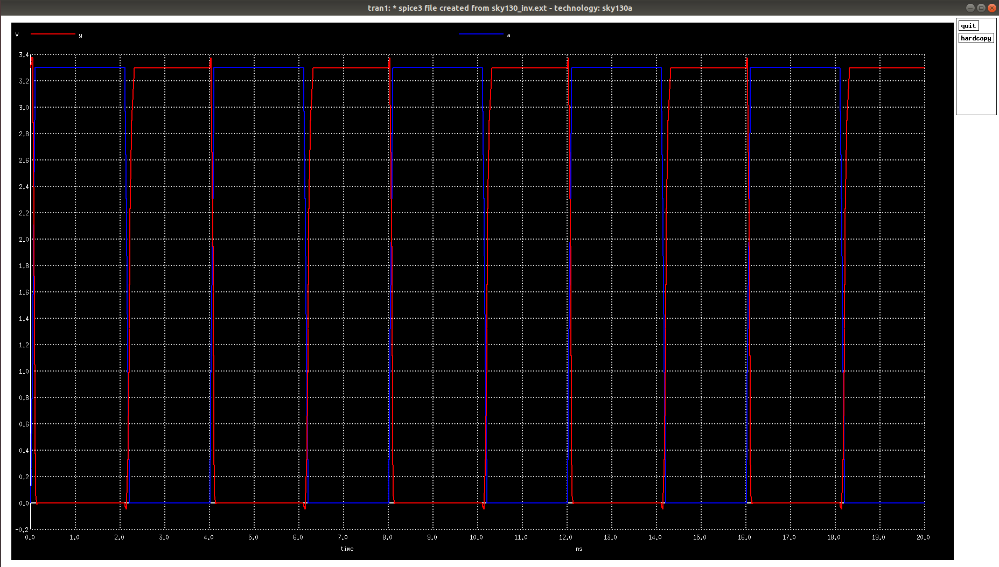<br>

#### Inverter Standard Cell Characterization

There are four timing parameters used to characterize the inverter standard cell:
1. Rise transition - Time taken for the output to rise from 20% to 80% of max value
2. Fall Transition: Time taken for the output to fall from 80% to 20% of max value
3. Cell Rise delay: difference in time(50% output rise) to time(50% input fall)
4. Cell Fall delay: difference in time(50% output fall) to time(50% input rise) 
<br />

-> Rising Transition

-> 20% rising output

<br>

-> 80% rising output

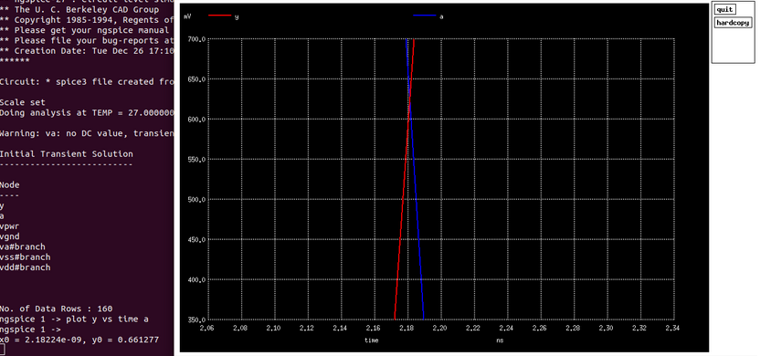<br>

```
Rise Transistion = 2.24 - 2.18 = 0.065ns
```

-> Falling Transition

-> 20% falling output

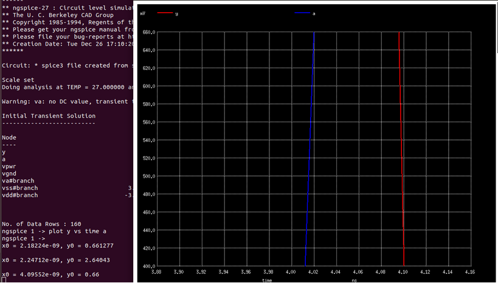<br>

-> 80% falling output

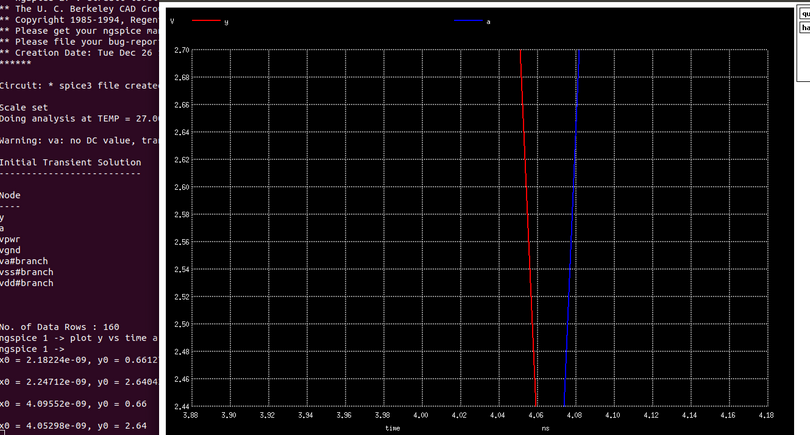<br>

```
Fall Transistion = 4.09 - 4.05 = 0.04 ns 
```

-> Cell Rise Delay

-> 50% from input falling

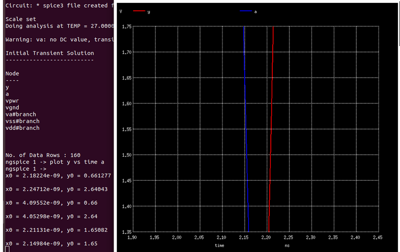<br>

-> 50% from output rising

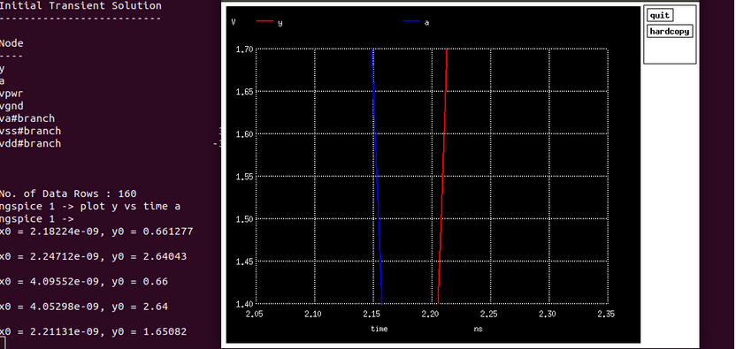<br>

```
Rising delay =  2.21 - 2.15 = 0.06 ns
```

-> Cell Fall Delay

-> 50% from input rising

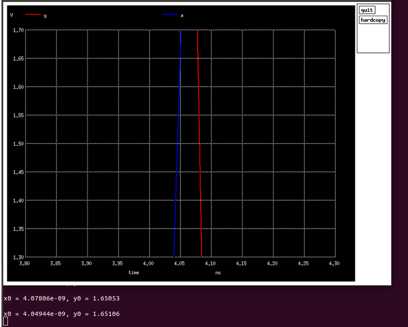<br>

-> 50% from output falling

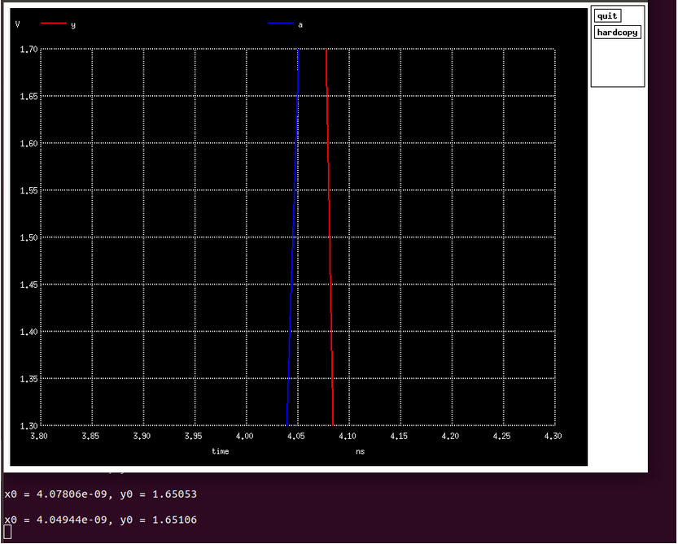<br>

```
Falling delay =  4.08 - 4.05 = 0.03 ns
```


</details>

<details>

<summary> LAB exercise and DRC Challenges </summary>

#### Introduction of Magic and Skywater DRC's

Here the following are done:
- In-depth overview of Magic DRC engine
- Introduction to Google/Skywater DRC rules
- Lab to warm up : Fixing a simple rule error
- Lab of main excersise : Fixing or creating a complex error

To know anything about magic use the following link:

```
http://opencircuitdesign.com/magic/
```
Majorly check out magic tutorails and magic command summary in the Using magic tab.<br />
Also do check out the technlogy file manual in the technology files tab.<br />

#### Sky130s pdk intro and Steps to download labs

To view the documentation of Skywater pdks use the link below:

```
https://skywater-pdk.readthedocs.io/en/main/
```

We can view the rules associated with it there.<br />

We are downloading the packaged files to our local pc using the **wget** command. It stands for Web get . The following command is used.<br />

``` wget http://opencircuitdesign.com/open_pdks/archive/drc_tests.tgz ```

After this, extract it using the below command.

```
 tar xfz drc_tests.tgz
```
Once it is done. A drc_test folder is created in the directory which extraction is done.<br />
cd to that folder and run Magic.For better graphic use, the command below is used:

```
magic -d XR
```
To load a mag file we can load it using File > Open > .mag from the magic window .<br />

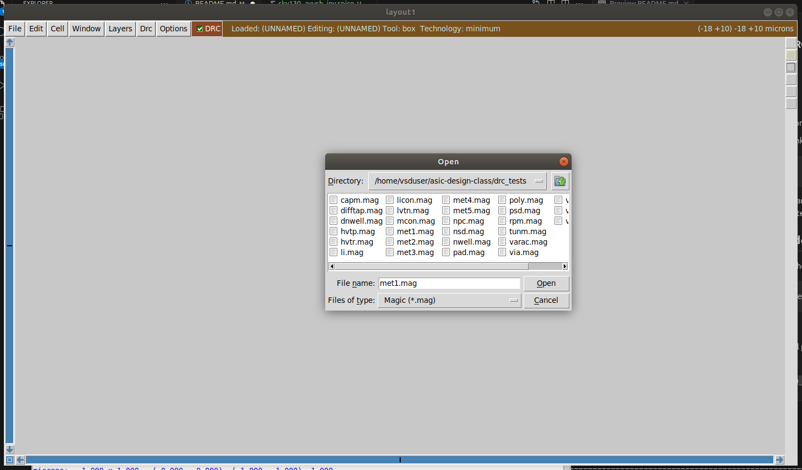<br>

Or we can use the terminal comand:

```
magic -d XR <filename>.mag
```

Select a particular block to check the DRC check. using ```drc why``` .<br />
We will use the following command in the tkcon window to see metal cut down.

```
cif see VIA2
```
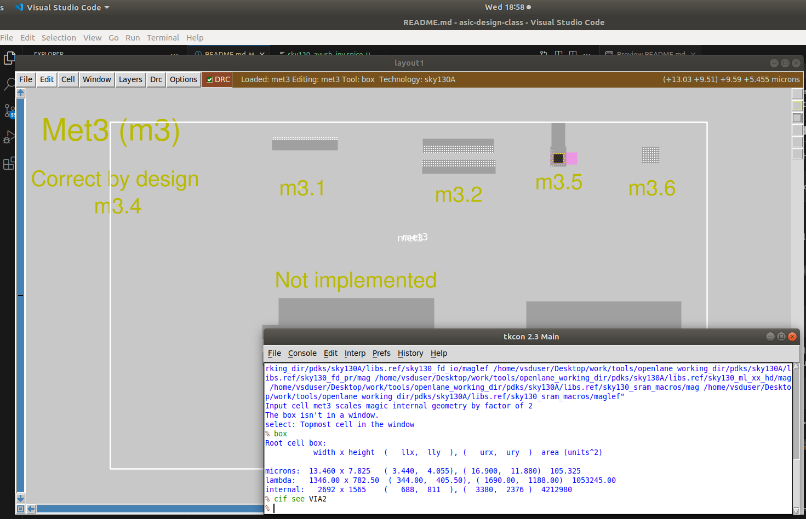<br>


#### Load Sky130 tech rules for drc challenges 

First load the poly file by ``load poly.mag`` on tkcon window.

Finding the error by mouse cursor and find the box area, Poly.9 is violated due to spacing between polyres and poly.

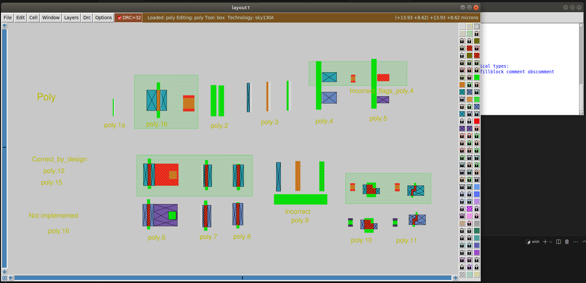<br>

We find that distance between regular polysilicon & poly resistor should be 22um but it is showing 17um and still no errors . We should go to sky130A.tech file and modify as follows to detect this error.


In line

```
spacing npres *nsd 480 touching_illegal \
	"poly.resistor spacing to N-tap < %d (poly.9)"
```
change to

```
spacing npres allpolynonres 480 touching_illegal \
	"poly.resistor spacing to N-tap < %d (poly.9)"
```
Also,
```
spacing xhrpoly,uhrpoly,xpc alldiff 480 touching_illegal \

	"xhrpoly/uhrpoly resistor spacing to diffusion < %d (poly.9)"
```

change to 

```
spacing xhrpoly,uhrpoly,xpc allpolynonres 480 touching_illegal \

	"xhrpoly/uhrpoly resistor spacing to diffusion < %d (poly.9)"

```
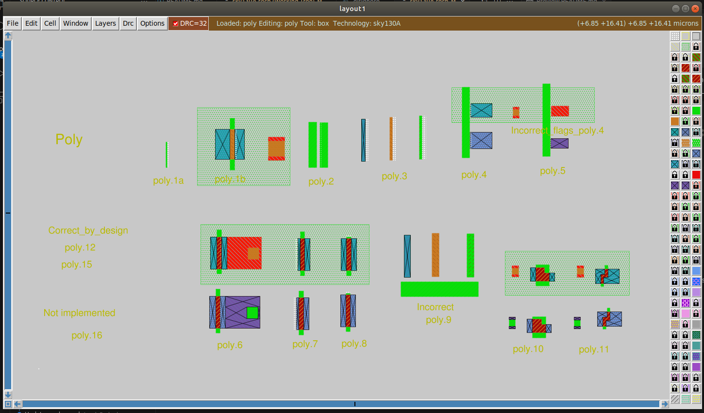<br>


</details>

### Day-4 : Pre-layout timing analysis and importance of good clock tree

<details>
<summary>Timing modelling using delay tables</summary>

#### Grid into track info

Track is a path on which metal layers are drawn for routing.It is used to define the height of the standard cell.

Guidelines to be followed while making a standard cell:
1. Input and output ports must lie on the intersection on Horizontal annd vertical tracks.
2. Width of standard cell must be in the odd multiple of track pitch & Height in the odd multiple of track height pitch.

The information to get the grids is defined in ```tracks.info```.
cd to the particular location and open the file.<br />

```
cd Desktop/work/tools/openlane_working_dir/pdks/open_pdks/sky130/openlane/sky130_fd_sc_hd/tracks.info
```
The content of the file are:

```
li1 X 0.23 0.46  //0.46um is the width  
li1 Y 0.17 0.34  //0.34um is the height 
met1 X 0.17 0.34
met1 Y 0.17 0.34
met2 X 0.23 0.46
met2 Y 0.23 0.46
met3 X 0.34 0.68
met3 Y 0.34 0.68
met4 X 0.46 0.92
met4 Y 0.46 0.92
met5 X 1.70 3.40
met5 Y 1.70 3.40
```

<br>

We input the below command in the tkcon window to get grid on magic.<br>

```
grid 0.46um 0.34um 0.23um 0.17um
```

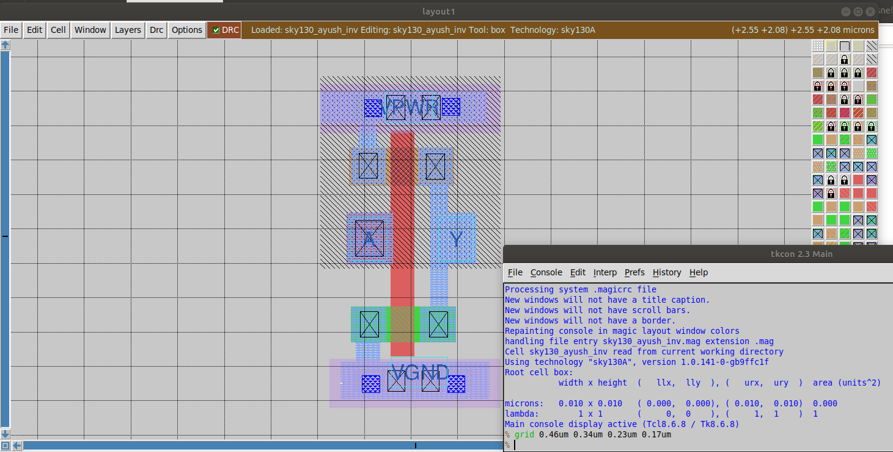<br>

#### Conversion of magic layout to standard cell LEF file

Extraction of the LEF file for the cell comes next when the layout is completed. To help the placer and router tool, specific characteristics and definitions must be defined for the cell's pins. Ports are the macro's declared PINs, and in LEF files, a cell containing ports is written as a macro cell. Our goal is to extract LEF in a predetermined format from a configuration (in this case, a straightforward CMOS inverter). The first step is to define each port and assign the appropriate class and use characteristics to each port.

Below are steps to define a port :

First, open the.mag file for the design in the Magic Layout window. Next, select Edit >> Text to bring up a dialogue window. Use locali for port y & a, use metal 1 for vdd & gnd as shown in figures below.

<br>

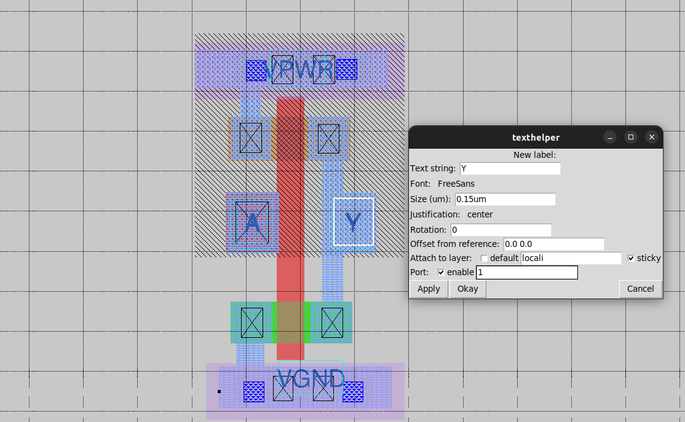<br>

<br>

<br>

Define the purpose of ports as follows in tkcon window:

```
port A class input
port A use signal

port Y class output
port Y use signal

port VPWR class inout
port VPWR use power

port VGND class inout
port VPWR use ground
```

Generate lef file using following command

```
lef write <name>
```

This generates sky130_ayush_inv.lef file.

#### Steps to include custom cell in ASIC design

We have created a custom standard cell in previous steps of an inverter. Copy lef file, sky130_fd_sc_hd_typical.lib, sky130_fd_sc_hd_slow.lib & sky130_fd_sc_hd_fast.lib to src folder of picorv32a from libs folder vsdstdcelldesign.

Then modify the conf.tcl as follows.

```

# Design
set ::env(DESIGN_NAME) "picorv32a"

set ::env(VERILOG_FILES) "$::env(DESIGN_DIR)/src/picorv32a.v"

set ::env(CLOCK_PORT) "clk"
set ::env(CLOCK_NET) $::env(CLOCK_PORT)

set ::env(GLB_RESIZER_TIMING_OPTIMIZATIONS) {1}

set ::env(LIB_SYNTH) "$::env(OPENLANE_ROOT)/designs/picorv32a/src/sky130_fd_sc_hd__typical.lib"
set ::env(LIB_SLOWEST) "$::env(OPENLANE_ROOT)/designs/picorv32a/src/sky130_fd_sc_hd__slow.lib"
set ::env(LIB_FASTEST) "$::env(OPENLANE_ROOT)/designs/picorv32a/src/sky130_fd_sc_hd__fast.lib"
set ::env(LIB_TYPICAL) "$::env(OPENLANE_ROOT)/designs/picorv32a/src/sky130_fd_sc_hd__typical.lib"

set ::env(EXTRA_LEFS) [glob $::env(OPENLANE_ROOT)/designs/$::env(DESIGN_NAME)/src/*.lef]

set filename $::env(DESIGN_DIR)/$::env(PDK)_$::env(STD_CELL_LIBRARY)_config.tcl
if { [file exists $filename] == 1} {
	source $filename
}
```

To integrate standard cell in openlane flow, perform following commands:

```
set lefs [glob $::env(DESIGN_DIR)/src/*.lef]
add_lefs -src $lefs
```

#### Run openlane flow synthesis with newly inserted custom inverter cell

```
docker
# Now that we have entered the OpenLANE flow contained docker sub-system we can invoke the OpenLANE flow in the Interactive mode using the following command
./flow.tcl -interactive

# Now that OpenLANE flow is open we have to input the required packages for proper functionality of the OpenLANE flow
package require openlane 0.9

# Now the OpenLANE flow is ready to run any design and initially we have to prep the design creating some necessary files and directories for running a specific design which in our case is 'picorv32a'
prep -design picorv32a

# Adiitional commands to include newly added lef to openlane flow
set lefs [glob $::env(DESIGN_DIR)/src/*.lef]
add_lefs -src $lefs

# Now that the design is prepped and ready, we can run synthesis using following command
run_synthesis
```

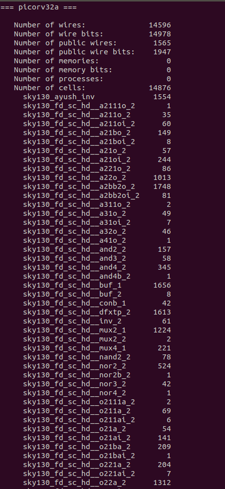<br>

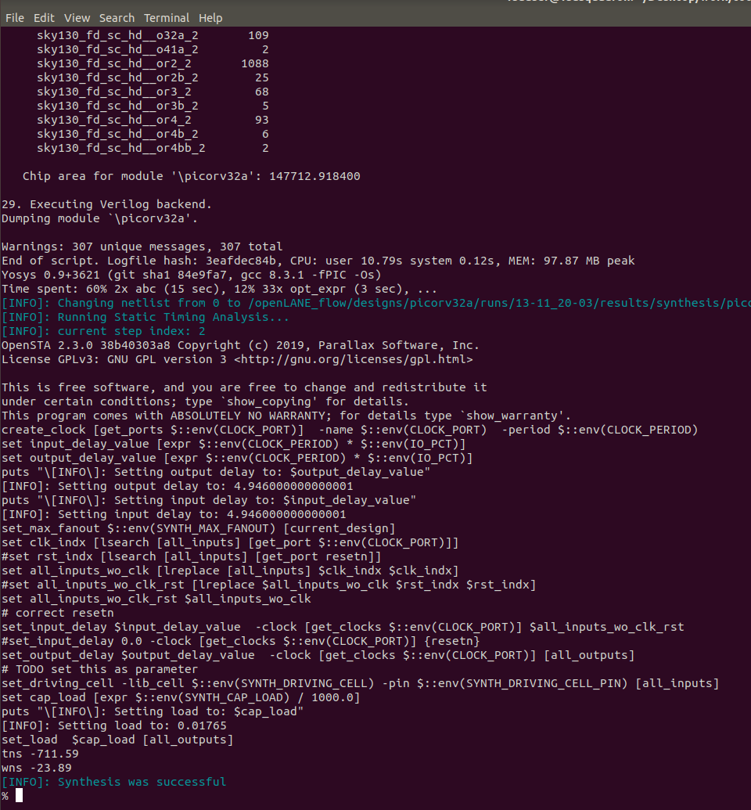<br>

#### Remove/reduce the newly introduced violations with the introduction of custom inverter cell by modifying design parameters

Commands to view and change parameters to improve timing and run synthesis

```
# Now once again we have to prep design so as to update variables
prep -design picorv32a -tag 13-11_20-03 -overwrite

# Addiitional commands to include newly added lef to openlane flow merged.lef
set lefs [glob $::env(DESIGN_DIR)/src/*.lef]
add_lefs -src $lefs

# Command to display current value of variable SYNTH_STRATEGY
echo $::env(SYNTH_STRATEGY)

# Command to set new value for SYNTH_STRATEGY
set ::env(SYNTH_STRATEGY) "DELAY 3"

# Command to display current value of variable SYNTH_BUFFERING to check whether it's enabled
echo $::env(SYNTH_BUFFERING)

# Command to display current value of variable SYNTH_SIZING
echo $::env(SYNTH_SIZING)

# Command to set new value for SYNTH_SIZING
set ::env(SYNTH_SIZING) 1

# Command to display current value of variable SYNTH_DRIVING_CELL to check whether it's the proper cell or not
echo $::env(SYNTH_DRIVING_CELL)

# Now that the design is prepped and ready, we can run synthesis using following command
run_synthesis
```

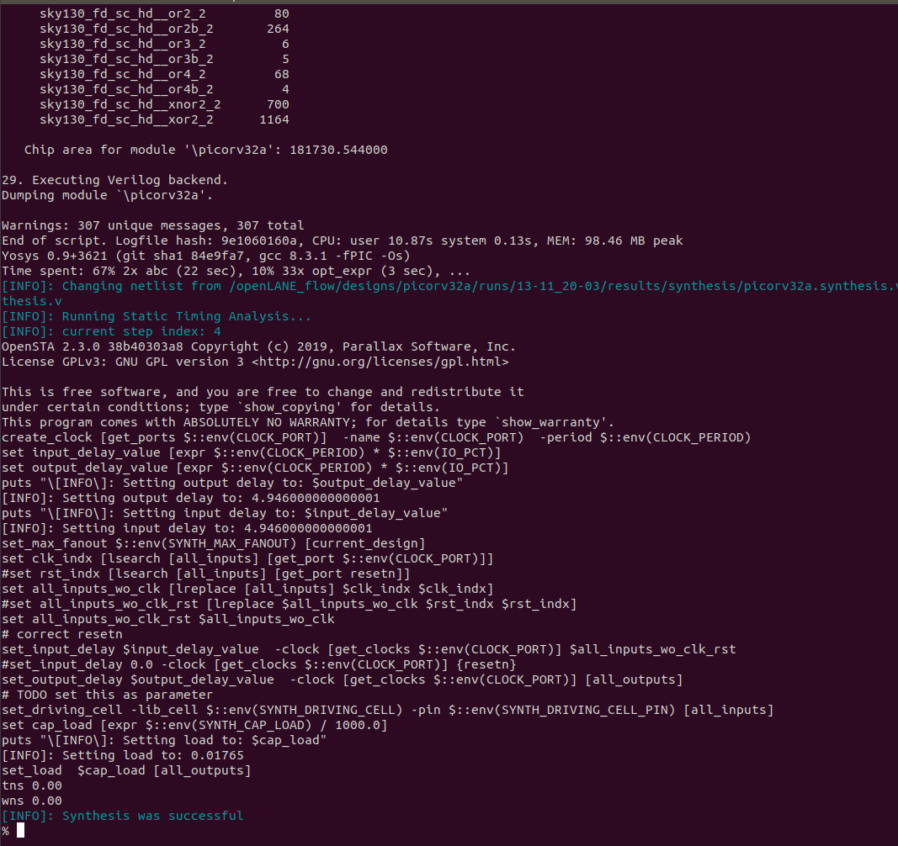<br>

#### Run floorplan and placement and verify the cell is accepted in PnR flow

Now that our custom inverter is properly accepted in synthesis we can now run floorplan using following command

```
run_floorplan
```

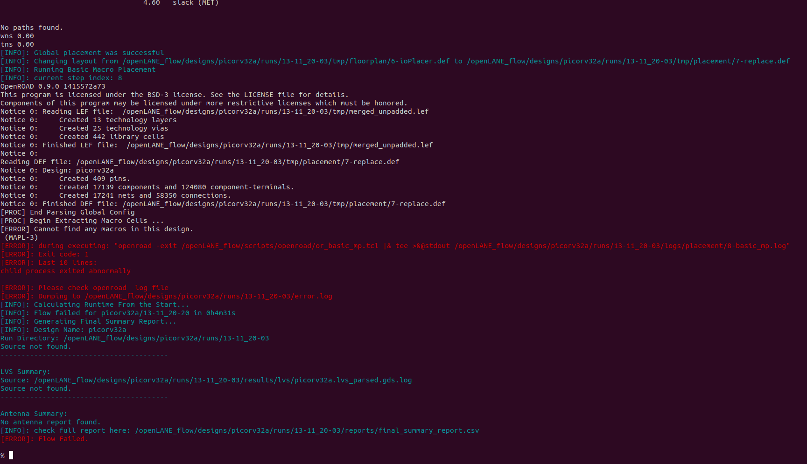<br>

Facing errors above, so need to run floorplan commands individually

```
# Follwing commands are alltogather sourced in "run_floorplan" command
init_floorplan
place_io
tap_decap_or
```

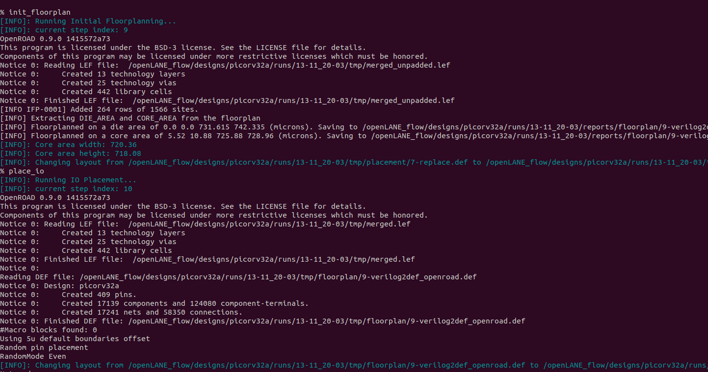<br>

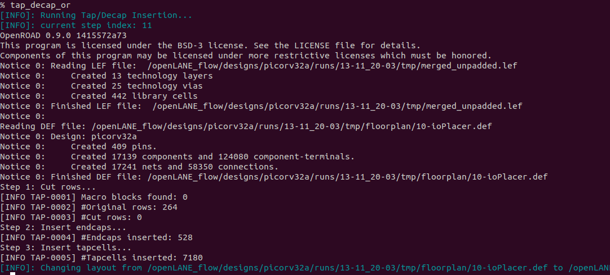<br>

Post floorplan, we need to execute the below command for placement

```
run_placement
```

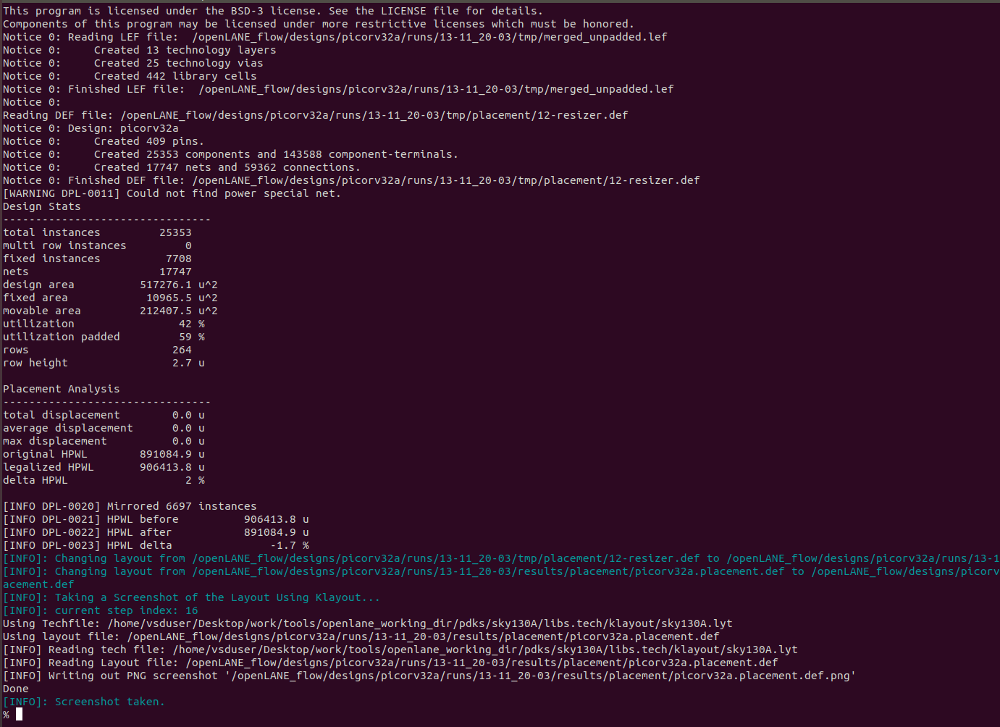<br>

Commands to load placement def in magic in another terminal

```
# Change directory to path containing generated placement def
cd Desktop/work/tools/openlane_working_dir/openlane/designs/picorv32a/runs/13-11_20-03/results/placement/

# Command to load the placement def in magic tool
magic -T /home/vsduser/Desktop/work/tools/openlane_working_dir/pdks/sky130A/libs.tech/magic/sky130A.tech lef read ../../tmp/merged.lef def read picorv32a.placement.def &
```
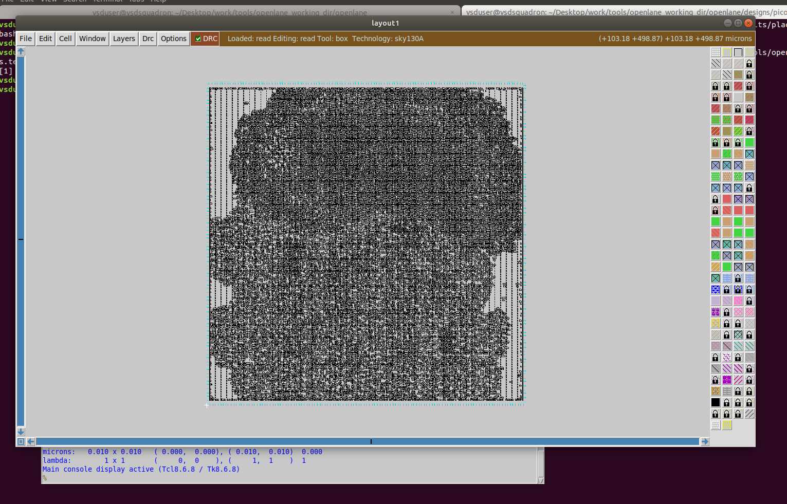<br>

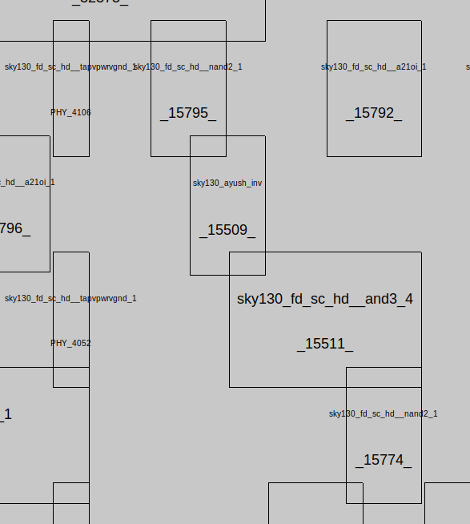<br>

Command for tkcon window to view internal layers of cells

```
expand
```

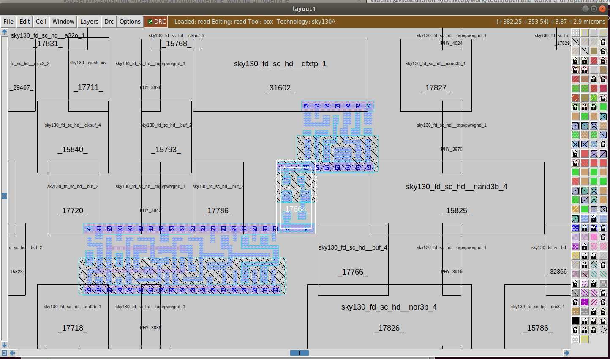<br>

</details>

<details>
<summary>Post-Synthesis timing analysis with OpenSTA tool</summary>

Since we are having 0 wns after improved timing run we are going to do timing analysis on initial run of synthesis which has lots of violations and no parameters were added to improve timing

Commands to invoke the OpenLANE flow include new lef and perform synthesis

```
cd Desktop/work/tools/openlane_working_dir/openlane
docker

./flow.tcl -interactive

package require openlane 0.9

prep -design picorv32a

set lefs [glob $::env(DESIGN_DIR)/src/*.lef]
add_lefs -src $lefs

set ::env(SYNTH_SIZING) 1

run_synthesis
```

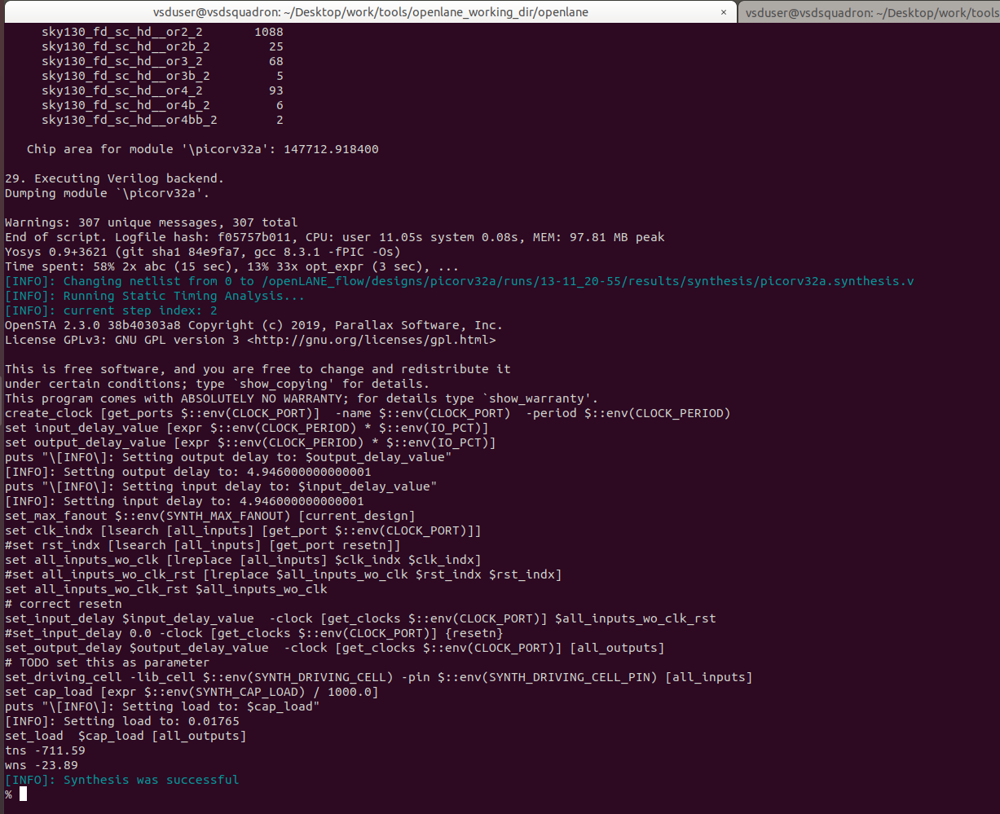<br>

Let's create .conf file for STA analysis,

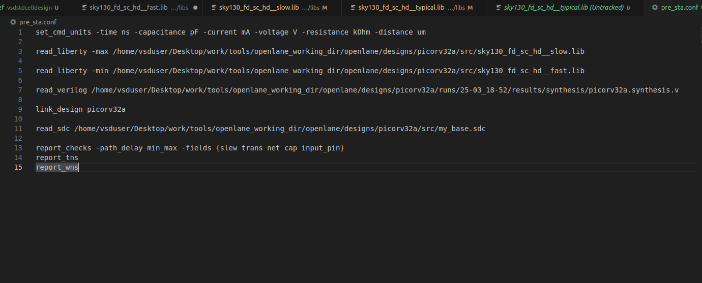<br>

my_base.sdc

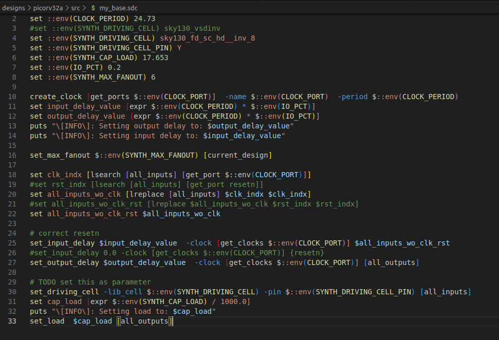<br>

Commands to run STA in another terminal

```
cd Desktop/work/tools/openlane_working_dir/openlane
sta pre_sta.conf
```
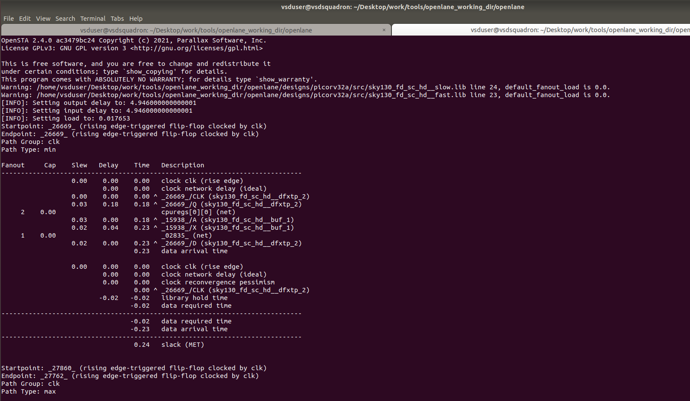<br>

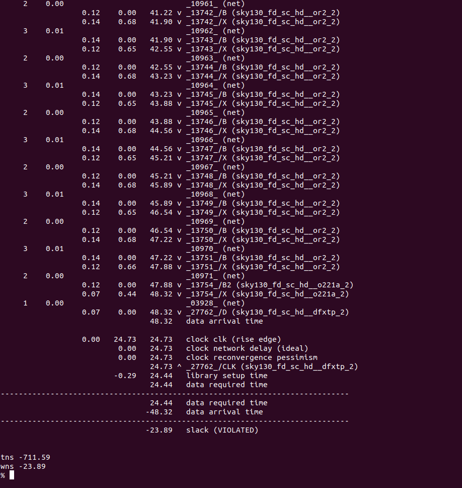<br>

Since more fanout is causing more delay we can add parameter to reduce fanout and do synthesis again

Commands to include new lef and perform synthesis

```
# Now the OpenLANE flow is ready to run any design and initially we have to prep the design creating some necessary files and directories for running a specific design which in our case is 'picorv32a'
prep -design picorv32a -tag 13-11_20-55 -overwrite

# Adiitional commands to include newly added lef to openlane flow
set lefs [glob $::env(DESIGN_DIR)/src/*.lef]
add_lefs -src $lefs

# Command to set new value for SYNTH_SIZING
set ::env(SYNTH_SIZING) 1

# Command to set new value for SYNTH_MAX_FANOUT
set ::env(SYNTH_MAX_FANOUT) 4

# Command to display current value of variable SYNTH_DRIVING_CELL to check whether it's the proper cell or not
echo $::env(SYNTH_DRIVING_CELL)

# Now that the design is prepped and ready, we can run synthesis using following command
run_synthesis
```

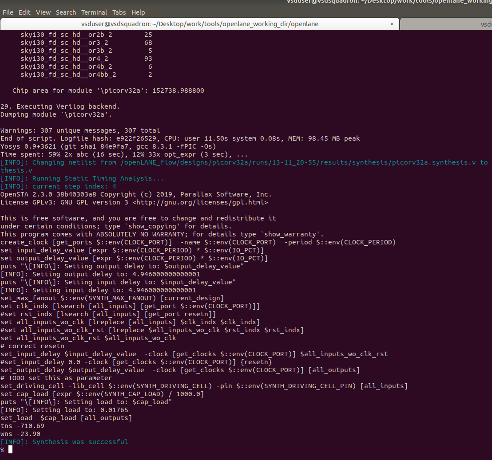<br>

Commands to run STA in another terminal

```
# Change directory to openlane
cd Desktop/work/tools/openlane_working_dir/openlane

# Command to invoke OpenSTA tool with script
sta pre_sta.conf
```
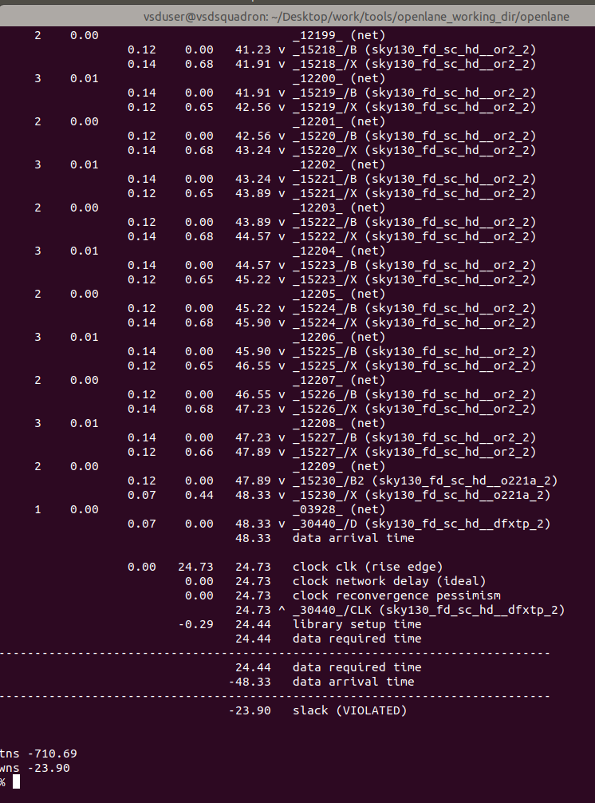<br>

#### Make timing ECO fixes to remove all violations

```
# Reports all the connections to a net
report_net -connections _13751_

# Checking command syntax
help replace_cell

# Replacing cell
replace_cell _17924_ sky130_fd_sc_hd__or3_4

# Generating custom timing report
report_checks -fields {net cap slew input_pins} -digits 4
```
We can see that the slack has reduced

<br>

We need to similarly replace other cells to reduce the slack.

Since we want to follow up on the earlier 0 violation design we are continuing with the clean design to further stages

Commands load the design and run necessary stages

```
# Now once again we have to prep design so as to update variables
prep -design picorv32a -tag 13-11_20-55 -overwrite

# Addiitional commands to include newly added lef to openlane flow merged.lef
set lefs [glob $::env(DESIGN_DIR)/src/*.lef]
add_lefs -src $lefs

# Command to set new value for SYNTH_STRATEGY
set ::env(SYNTH_STRATEGY) "DELAY 3"

# Command to set new value for SYNTH_SIZING
set ::env(SYNTH_SIZING) 1

# Now that the design is prepped and ready, we can run synthesis using following command
run_synthesis

# Follwing commands are alltogather sourced in "run_floorplan" command
init_floorplan
place_io
tap_decap_or

# Now we are ready to run placement
run_placement

# Incase getting error
unset ::env(LIB_CTS)

# With placement done we are now ready to run CTS
run_cts
```
<br>
<br>
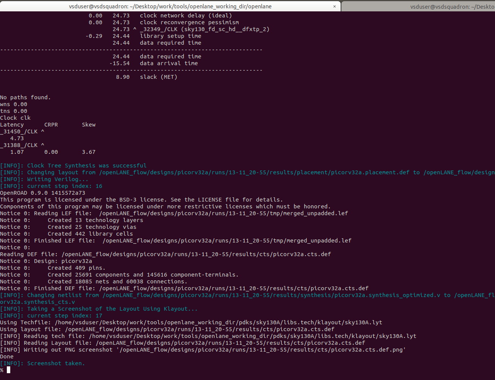<br>

</details>

<details>
<summary>Post-CTS OpenROAD timing analysis</summary>

Commands to be run in OpenLANE flow to do OpenROAD timing analysis with integrated OpenSTA in OpenROAD

```

# Command to run OpenROAD tool
openroad

# Reading lef file
read_lef /openLANE_flow/designs/picorv32a/runs/13-11_20-55/tmp/merged.lef

# Reading def file
read_def /openLANE_flow/designs/picorv32a/runs/13-11_20-55/results/cts/picorv32a.cts.def

# Creating an OpenROAD database to work with
write_db pico_cts.db

# Loading the created database in OpenROAD
read_db pico_cts.db

# Read netlist post CTS
read_verilog /openLANE_flow/designs/picorv32a/runs/13-11_20-55/results/synthesis/picorv32a.synthesis_cts.v

# Read library for design
read_liberty $::env(LIB_SYNTH_COMPLETE)

# Link design and library
link_design picorv32a

# Read in the custom sdc we created
read_sdc /openLANE_flow/designs/picorv32a/src/my_base.sdc

# Setting all cloks as propagated clocks
set_propagated_clock [all_clocks]

# Check syntax of 'report_checks' command
help report_checks

# Generating custom timing report
report_checks -path_delay min_max -fields {slew trans net cap input_pins} -format full_clock_expanded -digits 4

# Exit to OpenLANE flow
exit
```
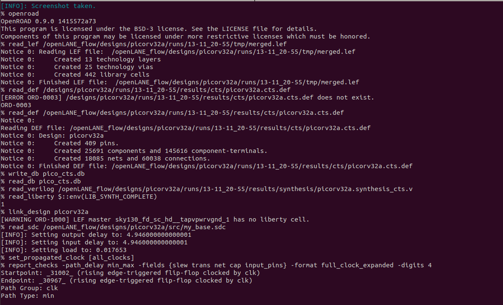<br>
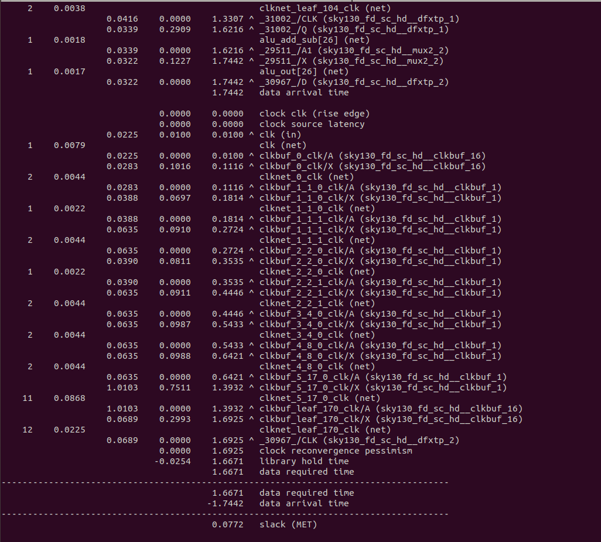<br>
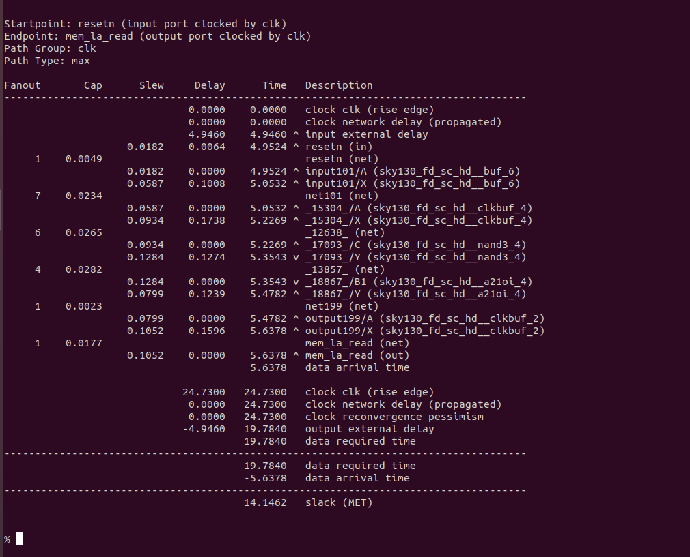<br>

#### Explore post-CTS OpenROAD timing analysis by removing 'sky130_fd_sc_hd__clkbuf_1' cell from clock buffer list variable 'CTS_CLK_BUFFER_LIST'

Commands to be run in OpenLANE flow to do OpenROAD timing analysis after changing ```CTS_CLK_BUFFER_LIST```

```
# Checking current value of 'CTS_CLK_BUFFER_LIST'
echo $::env(CTS_CLK_BUFFER_LIST)

# Removing 'sky130_fd_sc_hd__clkbuf_1' from the list
set ::env(CTS_CLK_BUFFER_LIST) [lreplace $::env(CTS_CLK_BUFFER_LIST) 0 0]

# Checking current value of 'CTS_CLK_BUFFER_LIST'
echo $::env(CTS_CLK_BUFFER_LIST)

# Checking current value of 'CURRENT_DEF'
echo $::env(CURRENT_DEF)

# Setting def as placement def
set ::env(CURRENT_DEF) /openLANE_flow/designs/picorv32a/runs/24-03_10-03/results/placement/picorv32a.placement.def

# Run CTS again
run_cts

# Checking current value of 'CTS_CLK_BUFFER_LIST'
echo $::env(CTS_CLK_BUFFER_LIST)

# Command to run OpenROAD tool
openroad

# Reading lef file
read_lef /openLANE_flow/designs/picorv32a/runs/13-11_20-55/tmp/merged.lef

# Reading def file
read_def /openLANE_flow/designs/picorv32a/runs/13-11_20-55/results/cts/picorv32a.cts.def

# Creating an OpenROAD database to work with
write_db pico_cts1.db

# Loading the created database in OpenROAD
read_db pico_cts.db

# Read netlist post CTS
read_verilog /openLANE_flow/designs/picorv32a/runs/13-11_20-55/results/synthesis/picorv32a.synthesis_cts.v

# Read library for design
read_liberty $::env(LIB_SYNTH_COMPLETE)

# Link design and library
link_design picorv32a

# Read in the custom sdc we created
read_sdc /openLANE_flow/designs/picorv32a/src/my_base.sdc

# Setting all cloks as propagated clocks
set_propagated_clock [all_clocks]

# Generating custom timing report
report_checks -path_delay min_max -fields {slew trans net cap input_pins} -format full_clock_expanded -digits 4

# Report hold skew
report_clock_skew -hold

# Report setup skew
report_clock_skew -setup

# Exit to OpenLANE flow
exit

# Checking current value of 'CTS_CLK_BUFFER_LIST'
echo $::env(CTS_CLK_BUFFER_LIST)

# Inserting 'sky130_fd_sc_hd__clkbuf_1' to first index of list
set ::env(CTS_CLK_BUFFER_LIST) [linsert $::env(CTS_CLK_BUFFER_LIST) 0 sky130_fd_sc_hd__clkbuf_1]

# Checking current value of 'CTS_CLK_BUFFER_LIST'
echo $::env(CTS_CLK_BUFFER_LIST)
```

<br>
<br>
<br>

</details>

### Day-5 : Final steps for RTL2GDS using tritonRoute and openSTA

<details>
<summary>Perform generation of Power Distribution Network (PDN) and explore the PDN layout</summary>

```
cd Desktop/work/tools/openlane_working_dir/openlane
docker

# Now that we have entered the OpenLANE flow contained docker sub-system we can invoke the OpenLANE flow in the Interactive mode using the following command
./flow.tcl -interactive

# Now that OpenLANE flow is open we have to input the required packages for proper functionality of the OpenLANE flow
package require openlane 0.9

# Now the OpenLANE flow is ready to run any design and initially we have to prep the design creating some necessary files and directories for running a specific design which in our case is 'picorv32a'
prep -design picorv32a

# Addiitional commands to include newly added lef to openlane flow merged.lef
set lefs [glob $::env(DESIGN_DIR)/src/*.lef]
add_lefs -src $lefs

# Command to set new value for SYNTH_STRATEGY
set ::env(SYNTH_STRATEGY) "DELAY 3"

# Command to set new value for SYNTH_SIZING
set ::env(SYNTH_SIZING) 1

# Now that the design is prepped and ready, we can run synthesis using following command
run_synthesis

# Following commands are alltogather sourced in "run_floorplan" command
init_floorplan
place_io
tap_decap_or

# Now we are ready to run placement
run_placement

# Incase getting error
unset ::env(LIB_CTS)

# With placement done we are now ready to run CTS
run_cts

# Now that CTS is done we can do power distribution network
gen_pdn
```

<br>

Commands to load PDN def in magic in another terminal

```
# Change directory to path containing generated PDN def
cd Desktop/work/tools/openlane_working_dir/openlane/designs/picorv32a/runs/13-11_22-29/tmp/floorplan/

# Command to load the PDN def in magic tool
magic -T /home/vsduser/Desktop/work/tools/openlane_working_dir/pdks/sky130A/libs.tech/magic/sky130A.tech lef read ../../tmp/merged.lef def read 14-pdn.def &
```
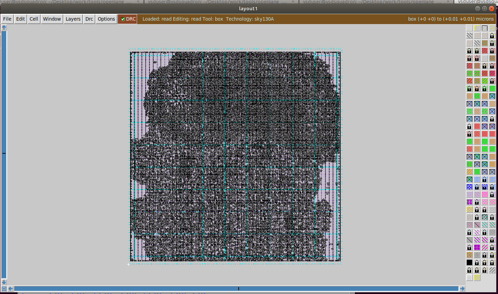<br>

<br> 

</details>

<details>
<summary>Perfrom detailed routing using TritonRoute and explore the routed layout</summary>

Commands to perform routing

```
# Check value of 'CURRENT_DEF'
echo $::env(CURRENT_DEF)

# Check value of 'ROUTING_STRATEGY'
echo $::env(ROUTING_STRATEGY)

# Command for detailed route using TritonRoute
run_routing
```

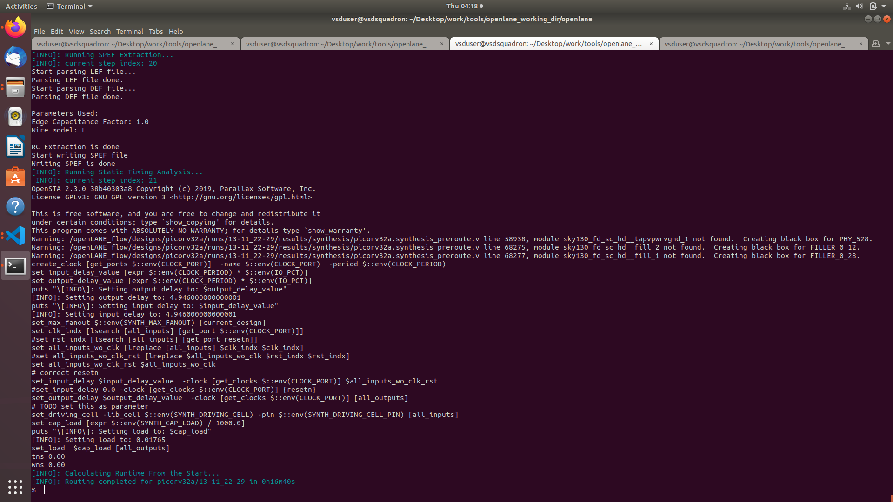<br> 

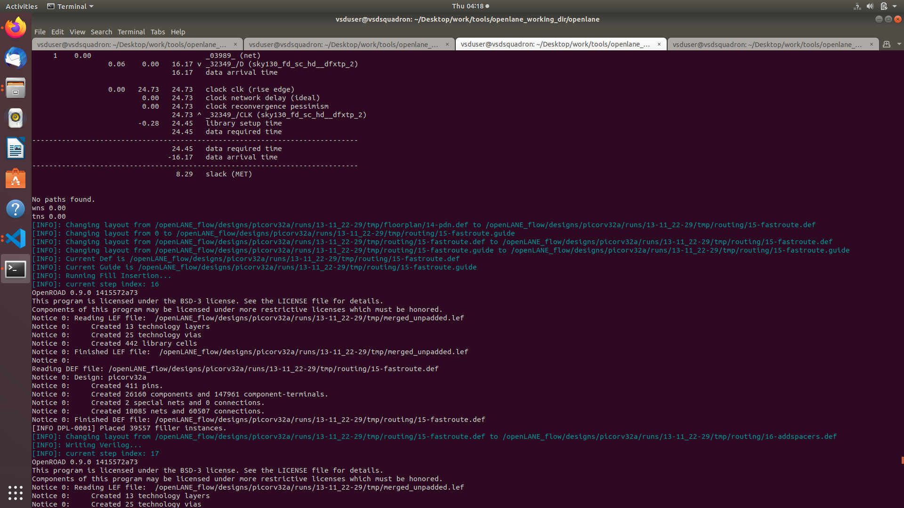<br> 

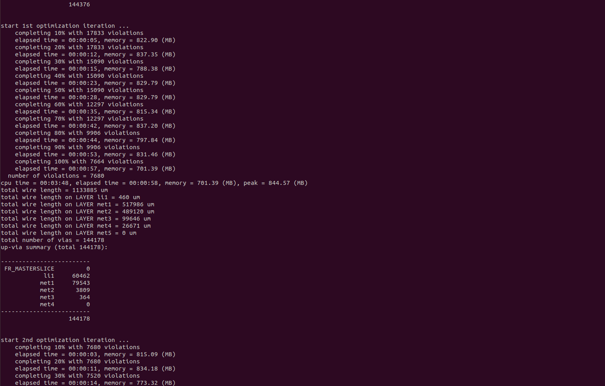<br>

Commands to load routed def in magic in another terminal

```
# Change directory to path containing routed def
cd Desktop/work/tools/openlane_working_dir/openlane/designs/picorv32a/runs/13-11_22-29/results/routing/

# Command to load the routed def in magic tool
magic -T /home/vsduser/Desktop/work/tools/openlane_working_dir/pdks/sky130A/libs.tech/magic/sky130A.tech lef read ../../tmp/merged.lef def read picorv32a.def &
```
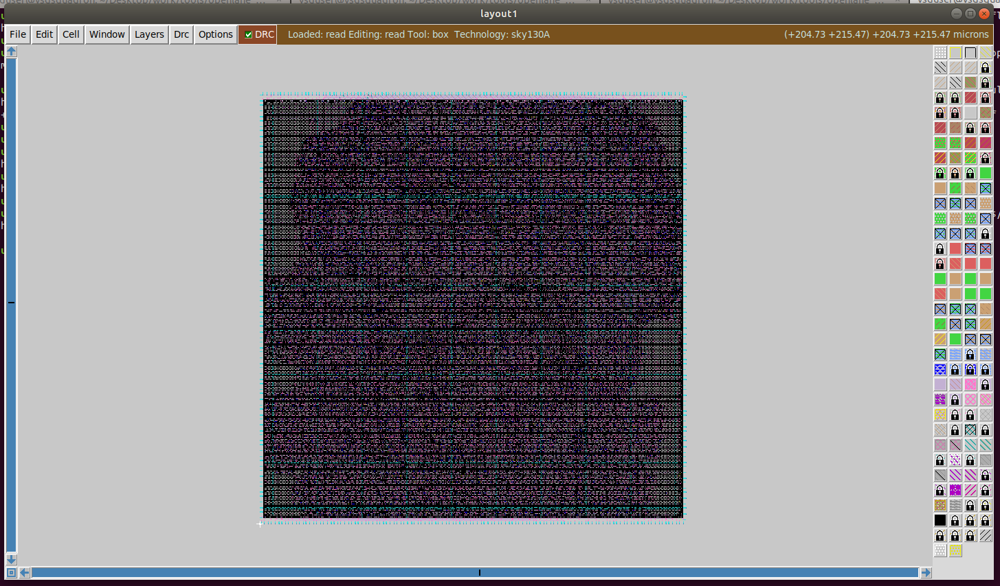<br>

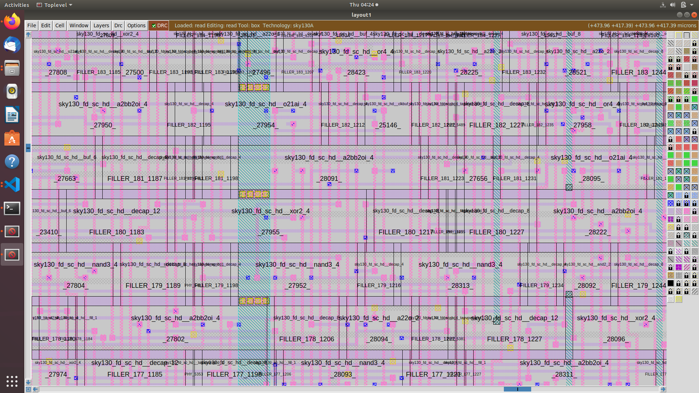<br>

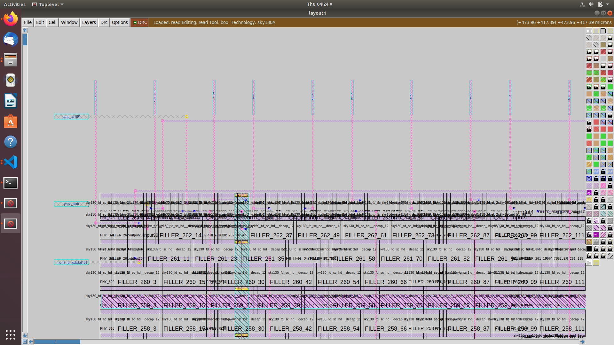<br>

</details>

<details>
<summary>Post-Route parasitic extraction using SPEF extractor</summary>

Commands for SPEF extraction using external tool

```
# Change directory
cd Desktop/work/tools/openlane_working_dir/openlane/scripts/spef_extractor/

# Command extract spef
python3 main.py --lef_file /home/vsduser/Desktop/work/tools/openlane_working_dir/openlane/designs/picorv32a/runs/13-11_22-29/tmp/merged.lef --def_file /home/vsduser/Desktop/work/tools/openlane_working_dir/openlane/designs/picorv32a/runs/13-11_22-29/results/routing/picorv32a.def
```
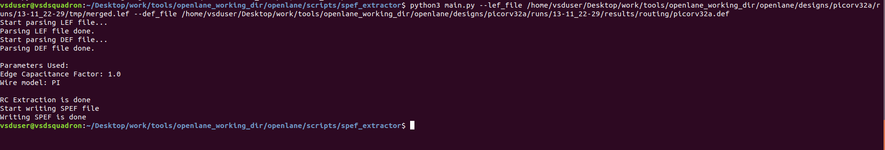<br>
</details>

<details>
<summary>Post-Route OpenSTA timing analysis with the extracted parasitics of the route</summary>

```
# Command to run OpenROAD tool
openroad

# Reading lef file
read_lef /openLANE_flow/designs/picorv32a/runs/13-11_22-29/tmp/merged.lef

# Reading def file
read_def /openLANE_flow/designs/picorv32a/runs/13-11_22-29/results/routing/picorv32a.def

# Creating an OpenROAD database to work with
write_db pico_route.db

# Loading the created database in OpenROAD
read_db pico_route.db

# Read netlist post CTS
read_verilog /openLANE_flow/designs/picorv32a/runs/13-11_22-29/results/synthesis/picorv32a.synthesis_preroute.v

# Read library for design
read_liberty $::env(LIB_SYNTH_COMPLETE)

# Link design and library
link_design picorv32a

# Read in the custom sdc we created
read_sdc /openLANE_flow/designs/picorv32a/src/my_base.sdc

# Setting all cloks as propagated clocks
set_propagated_clock [all_clocks]

# Read SPEF
read_spef /openLANE_flow/designs/picorv32a/runs/13-11_22-29/results/routing/picorv32a.spef

# Generating custom timing report
report_checks -path_delay min_max -fields {slew trans net cap input_pins} -format full_clock_expanded -digits 4

# Exit to OpenLANE flow
exit
```
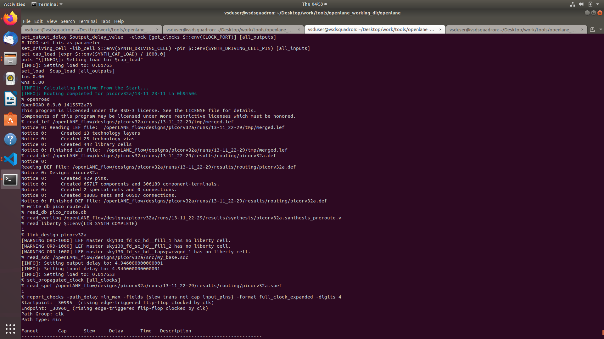<br>
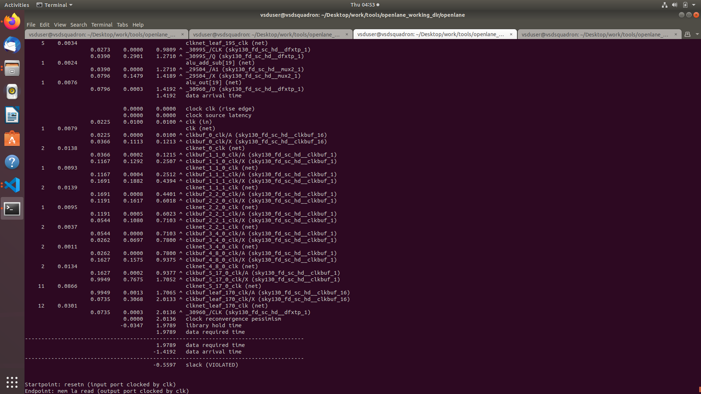<br>
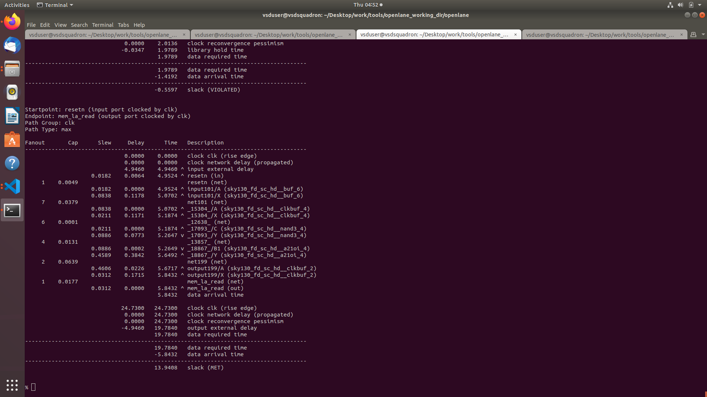<br>

</details>


---